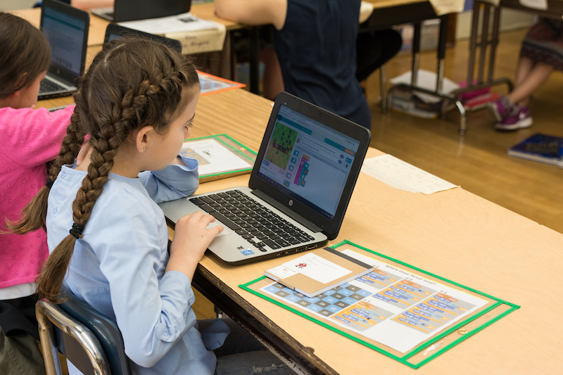

## getCoding 3-5

The 3-5 series features project and product based curricula designed to introduce and reinforce applied learning in projects motivated by the product design cycle. The lessons in these units are couched in the context of an overarching product that the student is working on developing. Students will create games, apps, and collaborative worlds.

## Curriculum
- [3rd Grade](../3-5/grade-3/index.html)
- 4th Grade (Coming Soon!)

## Overview: Escape the Maze
In this 27-lesson course, students master computational thinking skills and the fundamentals of coding to build an interactive maze game with multiple obstacles, enemies, and levels. These lessons incorporate unplugged and online activities that build connections between coding concepts and apply them to projects. Along with hard skills in coding, students learn the processes and mindsets of a computer programmer. Students learn to approach failure as an opportunity, collaborate with peers on writing and reviewing code, and tap into their own creativity without reservations. At the end of the course students apply their knowledge of the software design process to plan an unplugged event - a class-wide Arcade Day - in which they share their final maze projects and celebrate their development as a coder.

## Purpose
1. Empower students to use computational practices to analyze problems, build solutions, and be creative.
2. Empower students to apply computational practices to understand and change the world.

## Big Goals
1. Students will utilize computational thinking to read their world and will utilize their coding skills to write their world.
2. Students will experience failure as a learning opportunity to master core concepts and the process of creation.
3. Students will collaboratively build software and assess its effectiveness for users.

## Big Ideas
1. Software is built by composing simple, common coding building blocks.
2. Reusable and robust software is readable, modular, and testable.
3. Impactful software is built iteratively and collaboratively through stages of planning, enacting, and assessing.
4. When code breaks, we fearlessly, creatively, and systematically debug it.

## Essential Questions
1. How can we use coding building blocks to design something new or break something down?
2. When your code breaks or when you get stuck, what can you do?
3. How do you write code that other programmers can use?
4. How do you adapt your software to meet the needs of your users?
