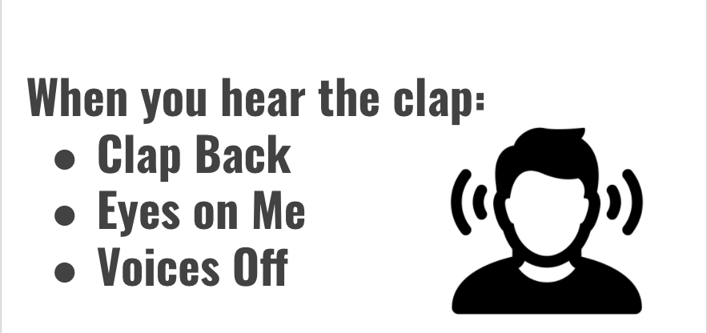
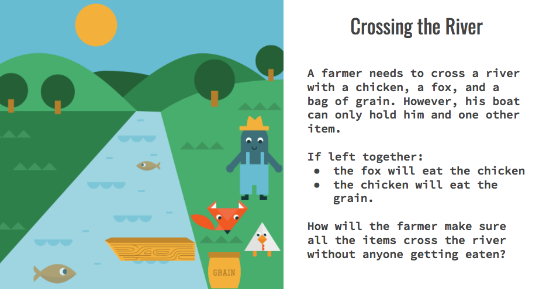
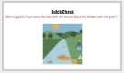
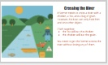
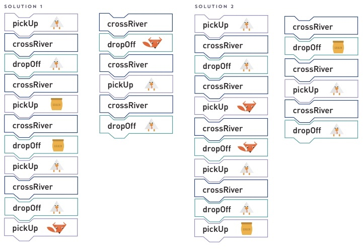
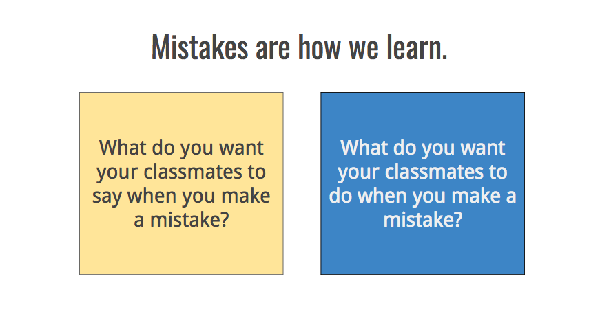

<header class='header' title='I am a Coder' subtitle='Lesson 01'/>

<notable>
<iconp src='/icons/activity.png'>### Overview</iconp>
Students work in groups to tackle a challenging problem-solving puzzle and start to discuss on how mistakes are learning opportunities and get us closer to solutions. The pre and post lesson resources reinforce the theme that failure is part of the learning process. Create a low stakes environment for students to feel comfortable sharing a wrong solution.

<iconp src='/icons/objectives.png'>### Objectives</iconp>
- I know that making mistakes is part of being a coder. I learn when I understand my mistakes and try again.

<iconp src='/icons/agenda.png'>### Agenda</iconp>
1. Introductions (optional)
1. Engage: What is Code (5 min)
1. Explore: River Crossing (25 min)
1. Explain: Solution Sharing (5 min)
1. Elaborate: Debrief (10 min)

##### Room Design

<note>
<iconp src='/icons/materials.png'>### Materials</iconp>
###### Teacher Materials:
- [ ] Projector
- [ ] [Slide Show][slide-show]
- [ ] [Magnetic Code Blocks][Tcode-blocks]
- [ ] [Magnetic Characters][Tcharacters]
- [ ] [Pre and Post Lesson Resources][pre-post]

###### Student Materials:
- [ ] Name Tents & Markers
- [ ] Sticky Notes, 2 Colors
- [ ] [Code Blocks][code-blocks]
- [ ] Felt Strip
- [ ] [Character Handout][characters]

<iconp src='/icons/vocab.png'>### Vocabulary</iconp>
- **Code** - A set of instructions designed to be carried out by a computer.

###### Symbols Key
<iconp ml='1.65em' type='question'>question</iconp>
<iconp ml='1.65em' type='answer'>answer</iconp>
</note>

<pagebreak/>
## 1. Introductions (optional)

- [ ] **Introductions:** students create a name tent. They write their name on one side and what they want to be on the other. “When I grow up I want to be a(n) ....”

<note> **Slides:** </note>

- [ ] **Attention Getting Signal:** Teach students your attention getting signal and practice.

<note></note>

## 2. Engage: What is Code (5 min)
Participation: Whole Class, Unplugged

- [ ] **Define** code and present each of the examples on “Code is Everywhere."

<iconp type="question">What is code?</iconp>
<iconp type="answer">A set of instructions designed to be carried out by a computer. It is the instructions someone wrote to make your website, app, or game run.</iconp>

> > “Code is everywhere. Computer programs are running code to help run our world. Code is what creates the website or computer programs we use. Being a coder is about creating, not just consuming.”

<note>
</note>
<pagebreak/>

## 3. Explore: River Crossing (25 min)
Participation: Whole Class ->  Small Group, Unplugged

- [ ] **Challenge** students to tackle these problems with a productive failure mindset.
> >  “Today we’re going to become coders as we tackle a difficult challenge. We are not going to find the solution on our first try. When coders make a mistake it is called a bug. So today we are going to encounter lots of bugs. That is a normal part of coding. We will keep coding and debugging until we have a solution that works."

 

- [ ] **Reveal the Mission**
> > "A farmer needs to a chicken, a fox, and a bag of grain to the other side of the river. However, his boat is small and can only hold him and one other item. He can't leave the fox and the chicken together along because the fox will eat the chicken. He can't leave the chicken and grain along because the chicken will eat the grain. How will the farmer make sure all the items cross the river without anyone getting eaten?"

**Checks for Understanding:**
<iconp type="question"> What happens if the chicken and the fox are left alone together? </iconp>
<iconp type="answer"> The fox will eat the chicken.</iconp>
<iconp type="question"> What will the chicken eat if it's left alone?</iconp>
<iconp type="answer"> The grain</iconp>
<iconp type="question"> If the farmer is with them, will the chicken still eat the grain?</iconp>
<iconp type="answer"> No </iconp>

<note>

</note>

<pagebreak/>

- [ ] **Model** a round of problem solving with the magnetic characters on the board as a whole class.

<note type="tip">Keep a tally on the board of how many solutions we try and throw away - debugging moments. This aims to help students see wrong answers as debugging moments, moments of progress.</note>

- [ ] **Group tackle:** In small groups students tackle the challenge using the materials at their desks. Pause every 3-5 minutes to troubleshoot as a whole class and reveal hints as needed.
	- Hint 1: The chicken has to cross the river first.
	- Hint 2: A character can cross the river more than once.
	- Hint 3: The farmer has to take either the chicken or the other item back across the river on his fourth trip.

<note type="tip">Students should punch out the character icons and code blocks to help them create a scene and a line of code.
</note>

<pagebreak/>

## 4. Explain: Solution Sharing (5 min)
Participation: Whole Class

- [ ] **Solution Sharing:** Call up a group to share out their solution while acting out the code with the magnetic characters on the board.

<note type="tip">Do not tell students the solution. Instead have them role play their solutions to mimic the debugging process. Emphasize that students have the power to identify their bugs and rework their own solutions.
 
</note>

<pagebreak/>

## 5. Elaborate: Debrief (10 min)
Participation: Whole Class

- [ ] **Reflection:** Students reflect on how it feels to be wrong in order to set norms for how they will treat themselves and others when they encounter bugs.

> > “As coders, we are going to be wrong sometimes. It is part of the process of creating good code. It is about how we act and what we do when we make a mistake that defines the kind of coder we are. On your sticky notes answer these two questions:"

<iconp type="question">What do you want your classmates to say to you when you make a mistake?</iconp>
<iconp type="question">What do you want your classmates to do when you make a mistake?</iconp>

<note>

</note>

 

- [ ] **Closing:** Collect sticky notes on the board. Group together similar ideas and read out loud. Students can give a thumbs up to ideas with which they agree. Acknowledge the work students have accomplished.

> > “You have such great ideas, coders! This is going to remind us how we should treat ourselves and each other when we encounter bugs in our code. Bugs happen all the time, but they can be fixed! We learn by understanding the mistakes we make and then trying again. Thank you for sharing your ideas with us today.”

</notable>

[slide-show]: https://docs.google.com/presentation/d/15ayO8DbbLpKE8sAk4XguSR4K9KH7c23RGo9G3mGNbN8/edit?usp=sharing
[Tcode-blocks]: https://drive.google.com/file/d/0B2wBzr9vcXjPVFJSdmpISXlaU2c/view?usp=sharing
[Tcharacters]: https://drive.google.com/file/d/0B2wBzr9vcXjPRDdsaHhzMVpKT3M/view?usp=sharing
[solution]: https://drive.google.com/file/d/0B2wBzr9vcXjPaXZMS1ZDaUVJanM/view?usp=sharing
[pre-post]: https://docs.google.com/document/d/1FJadnUWO4exzRNfrZ7wbNUuTBXjgFHvgwgLV9D8neek/edit?usp=sharing
[handout]: https://drive.google.com/open?id=1KtK75TuiA325kNRi_n6fS5FQMISY1oownFKKqG5Qz18
[code-blocks]: https://drive.google.com/file/d/0B2wBzr9vcXjPVFJSdmpISXlaU2c/view?usp=sharing
[characters]: https://drive.google.com/file/d/0B2wBzr9vcXjPNjhKX19SdGs1OXc/view?usp=sharing
