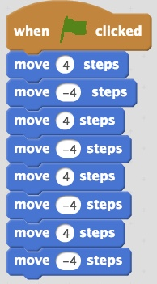
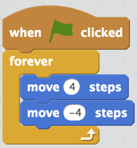

<header class='header' title='Enemies Everywhere' subtitle='Lesson 10 Part 2'/>

<notable>
<iconp src='/icons/activity.png'>### Overview</iconp>
This lesson assumes you are completing it in the same period as the ICC review. As a class we write the code for an enemy to patrol the maze while applying their knowledge of loops. This process begins on the unplugged maze and then moves into coding in Scratch.

<iconp src='/icons/objectives.png'>### Objectives</iconp>
- I can use the editor, block palette, and stage in Scratch to code my program.
- I can code a loop that makes an enemy patrol my maze.

<iconp src='/icons/agenda.png'>### Agenda</iconp>
1. Engage: Why (5 min)
1. Explore: Code the First Enemy (5 min)
1. Explain: Code Along (15 min)
1. Elaborate: Code it in Scratch (20 min)

<note>
<iconp src='/icons/materials.png'>### Materials</iconp>
###### Teacher Materials:
- [ ] [Slide Show][slide-show]
- [ ] Teacher Scratch Blocks
- [ ] Projector
- [ ] Foam Tiles

###### Student Materials:
- [ ] Scratch Studio
- [ ] Computers
</note>

### Room Design

<note>
<iconp src='/icons/vocab.png'>### Vocabulary</iconp>

- **Loop:** A sequence of instructions that is continually repeated until a certain condition is reached.
- **Editor:** A program designed for editing computer code by coders.

</note>

<pagebreak/>
## 1.  Engage: Why (5 min)
Participation: Whole Class, Unplugged

- [ ] **Motivate:** Frame the purpose of this lesson. Show students the original Escape the Maze game.

<iconp type='question'>What did we want to improve upon first in our game?</iconp>
<iconp type='answer'>Make the enemies move instead of stay still.</iconp>

> > “Yes! We are going to write the code for one of the enemies to patrol the maze. We’ve been practicing reading and writing code to improve on the game and make it more challenging. Today we will make it happen!”

<note> **Slides:** </note>

## 2. Explore: Code the First Enemy (5 min)
Participation: Whole Class, Unplugged

- [ ] **Question Driven:** Prompt students with questions to write the first enemy’s code with magentic coding blocks as they act it out on the unplugged maze.

<note type="tip"> Use sticky notes to mark which tiles the enemy is moving between.

 Here we are following the process of writing a loop:
1. Identify the repeating element of a pattern and how many times it repeats.
1. Place the repeating section of code within the loop’s block.
1. Place the number of times the pattern repeats as the loop’s argument.

</note>

> > “I need one student to come up to the unplugged maze and act as our Bot, moving back and forth like the enemy that you see in the slide.”

> > “I need a second student to be our Coder, and place the magnetic code blocks on the board as we write the code together.”

> > “I want to write code that makes this enemy move back and forth.”

<iconp type='question'>What pattern do you see in the enemy’s movement?</iconp>
<iconp type='answer'>The enemy is moving backwards and forwards.</iconp>

<iconp type='question'>How would we write the code that makes our enemy patrol this part of the maze?</iconp>
<iconp type='answer'>Remind students that in Scratch we use a negative number to move backwards.</iconp>
                  

<iconp type='question'>What pattern do you see in the code we wrote?</iconp>
<iconp type='answer'>Move 4, Move -4 repeats. Circle the repeating pattern.</iconp>

<iconp type='question'>What loop could we use to represent the pattern and shorten our code?</iconp>
<iconp type='answer'>Nest two move blocks in a repeat 4 loop.   </iconp>

<iconp type='question'>How would we change our code if we wanted the enemy to continue to patrol the maze until game play ends?</iconp>
<iconp type='answer'>Change the repeat loop to a forever loop.
 </iconp>

## 3. Explain: Code Along (15 min)
Participation: Whole Class, Online

- [ ] **Code Along:** Play the video to add the enemy code in Scratch. Pause at appropriate times to allow students to answer the questions.  

> > ”We just wrote the code to control one of the enemies. So now let’s put the code into our game! Follow along with the video to login to your Scratch account and put the code into your own version of the maze.”

<note></note>

## 4. Elaborate: Code it in Scratch (20 min)
Participation: Independent, Online

- [ ] **Challenge:** Allow students to experiment coding different enemies. We will follow a more formal process in Lesson 11.

> > “Once you’ve gotten that first enemy working, think back to all the code you wrote in Lessons 7 & 8. Can you write the code to make a different enemy spin? Can you make one travel in a square?”

<note>
</note>

</notable>

[slide-show]: https://docs.google.com/presentation/d/1r3CuSiro-WklEfXQ6Cr6gKTN3XW0Bl4jA6IMXEkakZA/edit?usp=sharing
