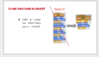
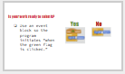
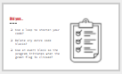

<header class='header' title='Enemies Everywhere Continued' subtitle='Lesson 11'/>

<notable>
<iconp src='/icons/activity.png'>### Overview</iconp>
Students will begin their Game Plan to plan how each enemy will move in their Escape the Maze project. They will then write the code in the Scratch editor to make each enemy move using loops.

<iconp src='/icons/objectives.png'>### Objectives</iconp>
- I can use the editor, block palette, and stage in Scratch to code my program.
- I can code a loop that makes an enemy patrol my maze.

<iconp src='/icons/agenda.png'>### Agenda</iconp>
1. Engage: Kids Code (5 min)
1. Explore: Game Plan (5 min)
1. Explain: Code Along (10 min)
1. Elaborate: Enemies on Patrol (20 min)
1. Evaluate: Submit Your Work (5 min)

<note>
<iconp src='/icons/materials.png'>### Materials</iconp>
###### Teacher Materials:
- [ ] [Slide Show][slide-show]
- [ ] [Scratch Studio Starter Code][starter-code]
- [ ] Projector
- [ ] [Scratch Example of Finished Code][exemplar]

###### Student Materials:
- [ ] Computers
- [ ] [Lesson 8 Handouts][handout]
- [ ] [Game Plan][plan]
- [ ] Pencils

</note>
### Room Design

<note>
<iconp src='/icons/vocab.png'>### Vocabulary</iconp>

- **Loop:** A sequence of instructions that is repeated until a condition is reached.
- **Sprite:** An object that can perform an action.
- **Editor:** A program designed for editing computer code by coders.

</note>

## 1. Kids Code (5 min)

- [ ] Showcase young student programmer and encourage them to share projects they work on independently.

> > “Kids all around are coding and creating. You’re never too young to start! Here is an example of a young coder. If you code a project on your own, we would like to feature your project/app at the start of our class. You can access Scratch or Code.org at home too.”

<note></note>

- [ ] Vocabulary Review: If students had difficulty identifying the loop block, use this as an opportunity to review what the loop structure looks like in Scratch.

<iconp type='question'>Which block is the loop block?</iconp>
<iconp type='question'>Which of these blocks of code are loop blocks?</iconp>
<iconp type='question'>Which section of code contains a loop block?</iconp>

## 2. Explore: Game Plan (5 min)

- [ ] **Plan:** Students plan how each enemy will move in their game.

> > “Game designers do not just start coding without first creating a design or plan for their game. Let’s take a few minutes to put together a plan for your version of Escape the Maze. On the Game Plan there is space for us to plan how each Sprite is going to move or act in the game. For today we are only going to look at the Enemies and we are only going to look at the left column of Forever loops. Last lesson we wrote the code to make Enemy 1 move back and forth forever. So I will write that in my plan.

> > Now I want to plan how each of the other enemies will move. Here are some ideas of code we’ve already written:
> > - Spin
> > - Move in a square
> > - Grow and Shrink
> > - Move in a rectangle
> > - Flap wings while moving back and forth
> > - Move back and forth and spin on each end

> > Take a minute to write your plan for each enemy before we start to code.”   

<note></note>

## 3. Explain: Code Along (10 min)

- [ ] **Code Along:** Play the video to show students how to navigate to the Scratch studio and continue to code from their Game Plan. 

> > “This is the code you wrote in lesson 8 to make the enemies patrol your maze. Today we are going to put our code into Scratch.”

<note></note>

## 4. Elaborate: Enemies on Patrol (20 min)

- [ ] **Making:** Students get on Scratch and write the code for the enemies they planned in their Game Plan.

> > “Now it is your turn. Continue to code the loops you planned in your Game Plan.”

<note> </note>
 

- [ ] **Extension:** students who finish coding all 5 enemies can add more enemies or add more code blocks such as Sound and Looks blocks. Students can reflect on the following questions to guide their planning.

<iconp type="question">What enemies have I played against in other games and what did they do?</iconp>
<iconp type="question">What makes an enemy fun? How will my enemy move? </iconp>
<iconp type="question">How difficult will my enemy be?</iconp>

<pagebreak/>
## 5. Evaluate: Submit Your Work (5 min)

- [ ] **Rubric:** Share with students what you are looking for when viewing their code and remind them to produce work they can take pride in.

> > “Before we wrap up, let’s take a few minutes to look over our work. You want to take pride in the code you produce. Did you:
- use a loop to shorten your code and make it continue throughout the game?
- delete any extra code blocks that haven’t been used?
- use an event block so your program initiates when the green flag is clicked?”

<note>

</note>
- [ ] **Evaluate:** After the lesson the teacher should view student progress in the studio and target individuals who need assistance in further programming. It is ok if students did not code all 6 enemies, but they should have the code for at least one enemy they wrote on their own. You can view an example of what the finished code might look like here.

<note>

</note>
</notable>

[slide-show]: https://docs.google.com/presentation/d/1fdFUCvEZMqRLqZ-2s5JmR7jYWQPmQlxgaiiYnoNU-IY/edit#slide=id.p
[starter-code]: https://scratch.mit.edu/projects/138905189/
[exemplar]: https://scratch.mit.edu/projects/138901128/
[handout]: https://drive.google.com/file/d/0B2wBzr9vcXjPbmZZRHVNVTcwM2M/view?usp=drive_web
[code-an-artist]: https://studio.code.org/gallery/art
[video]: https://drive.google.com/open?id=0B2wBzr9vcXjPSTJCWmdDdDFFbXc
[plan]: https://drive.google.com/file/d/0B2wBzr9vcXjPN3hPQmItMndvQ1k/view
