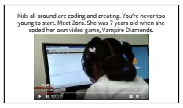
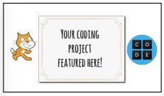
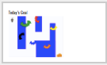
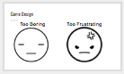
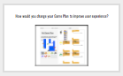
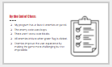
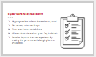

<header class='header' title='Strategic Enemies' subtitle='Lesson 12'/>

<notable>
<iconp src='/icons/activity.png'>### Overview</iconp>
In this lesson we begin to talk about user experience in the context of designing enemies that increase the level of difficulty of the game without making it impossible to win. Students apply their knowledge of writing loops to improve on their enemies' code.

<iconp src='/icons/objectives.png'>### Objectives</iconp>
- I can use the editor, block palette, and stage in Scratch to code my program.
- I can code a loop that makes an enemy patrol my maze.

<iconp src='/icons/agenda.png'>### Agenda</iconp>
1. Engage: Kids Code (5 min)
1. Explore: User Experience (5 min)
1. Explain: Set the Challenge (5 min)
1. Elaborate: Prototype (20 min)
1. Evaluate: Submit Your Code (10 min)

<note>
<iconp src='/icons/materials.png'>### Materials</iconp>
###### Teacher Materials:
- [ ] Projector
- [ ] [Slide Show][slide-show]
- [ ] [Scratch Studio][starter-code]
- [ ] [Scratch Sample Games][games]

###### Student Materials:
- [ ] Computers
- [ ] [Game Plans][plan]
- [ ] Pencils

</note>

### Room Design

<note>
<iconp src='/icons/vocab.png'>### Vocabulary</iconp>

- **Sprite:** An object that can perform an action.
- **Editor:** A program designed for editing computer code by coders.

</note>

<pagebreak/>
## 1. Kids Code (5 min)
Participation: Whole Class Unplugged

- [ ] **Engage:** Showcase young student programmer and show [video][video].

> > “Kids all around are coding and creating. You’re never too young to start! Meet Zora. She was 7 years old when she coded her own video game, Vampire Diamonds.”

<note></note>

- [ ] **Challenge** students to be the next programmer we feature.

> > “If you code a project on your own, we would like to feature your project/app at the start of our class. Code something in Scratch or Code.org or any coding platform and show it to your getCoding teacher.”

<note></note>

## 2. Explore: User Experience (5 min)
Participation: Whole Class Unplugged

- [ ] **Introduce goal** of today to finish this project benchmark:

> > “Today you will decide which enemies you want to patrol your maze. By the end of class you will submit your project. Next week we will start to learn how to make our enemies do something when you run into them.”

<note>  </note>

- [ ] **Empathize:** Invite three students to play three versions of the Escape the Maze game on the projector: v.1 is too difficult to win, v2 is too easy, and v3 is difficult but possible to win.

> > “When game developers are designing their game, they need to think about who they are designing it for and what they want their players’ experience to be.  If they make it too hard, the player may get frustrated with a game that can’t be beat and not want to play. If they make it too easy, the player may get bored and not want to play. Let’s look at some examples.”

<iconp type='question'>What did you think of each game?</iconp>
<iconp type='question'>What makes certain enemies fun to play against?</iconp>
<iconp type='answer'>Speed, size, placement (how difficult it is to pass them)</iconp>
<iconp type='question'>What makes certain enemies not fun to play against?</iconp>
<iconp type='answer'>When there are too many and the game is impossible to beat</iconp>

<note>

</note>

- [ ] **Define:** Process the findings from your empathy work in order to form a user point of view that you will address with your design.

<iconp type='question'> ? What should we keep in mind while looking at the enemies you are coding in your game?</iconp>
<iconp type='answer'>Speed, size, placement (how difficult it is to pass them), When there are too many and the game is impossible to beat.</iconp>

<note></note>

## 3) Explain: Set the Challenge (5 min)
Participation: Whole Class Unplugged

- [ ] **Ideate:** Students look back at their game plan to reexamine the plan for their enemies and incorporate the elements of user experience that we explored as a class.

> > “Look back at your Game Plan from our last lesson. How many enemies are you going to have in your game? Is there anything you want to change about each enemy that will improve the user experience? Make those notes now.”

<note></note>

- [ ] **Set the Challenge:** Show them the rubric for the finished product (see #5).

> > “By the end of class today you will submit your project with your completed enemies. Here is what I will be looking for when I review your projects:
- Program has at least four enemies on patrol.
- Enemy code uses loops.
- There aren’t extra code blocks.
- Program initiates when green flag is clicked.
- Enemies improve the user experience by making the game more challenging but not impossible.”

<note></note>

## 4) Elaborate: Prototype (20 min)
Participation: Independent, Online

- [ ] **Prototype:** Play the video to show how to return to their projects from last lesson. Students then will continue to modify their enemies in their projects to reflect the new notes about user experience.

> > “Follow along to login to Scratch and navigate to your Escape the Maze project. You will have the rest of class to modify your enemies’ code to improve the user experience. Remember an enemy should be challenging, but not impossible to get around.”

<note type="tip">As you walk around the room, remind students to use their game plans

</note>

## 5) Evaluate: Submit Your Code (10 min)
Participation: Independent, Online

- [ ] **Evaluate:** Review with students what you are looking for when viewing their code.

> > “Before we wrap up, let’s take a few minutes to look over our work.
- Program has at least four enemies patrolling the maze.
- Enemy code uses loops to represent repetitive actions.
- There aren’t extra code blocks that haven’t been used
- Program initiates when green flag is clicked
- Enemies improve the user experience by making the game more challenging but not impossible.”

<note>**Teacher’s Note:** After the lesson the teacher should view student progress in the studio and target individuals who need assistance in further programming. It is ok if students did not code all 6 enemies, but they should have the code for at least one enemy they wrote on their own.
</note>

</notable>

[slide-show]: https://docs.google.com/presentation/d/12rTQypYg6Uu9IdH9xTiW805XbIbeQ7gQvjcurvdlksE/edit?usp=sharing
[starter-code]: https://scratch.mit.edu/projects/140446409/#
[games]: https://scratch.mit.edu/studios/3714046/
[handout]: https://docs.google.com/document/d/1zRRcYYC3x9WjOi9JlQ2XyDq4CGB8bBCkixxZyBd-EiY/edit?usp=sharing
[video]: https://drive.google.com/file/d/0B2wBzr9vcXjPdEppeUN2aV9KbFk/view
[plan]: https://drive.google.com/file/d/0B2wBzr9vcXjPN3hPQmItMndvQ1k/view
