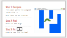
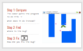

<header class='header' title='Debugging Loops' subtitle='Lesson 13'/>

<notable>
<iconp src='/icons/activity.png'>### Overview</iconp>
Students are introduced to the debugging protocol and practice applying it to a series of debugging challenges in Scratch.

<iconp src='/icons/objectives.png'>### Objectives</iconp>
- When my code fails, I use the debugging protocol to debug my code.

<iconp src='/icons/agenda.png'>### Agenda</iconp>
1. Engage/Explore/Explain: Debugging (30 min)
1. Evaluate: Socrative (15 min)

<note>
<iconp src='/icons/materials.png'>### Materials</iconp>
###### Teacher Materials:
- [ ] Projector
- [ ] [Socrative Test][soc]
- [ ] [Slide Show][slide-show]

###### Student Materials:
- [ ] Pencils
- [ ] Computers
- [ ] [Scratch Studio][scratch]

</note>

## Room Design

<note>
<iconp src='/icons/vocab.png'>### Vocabulary</iconp>

- **Debug** - Finding and fixing errors in code.
- **Conditional** - Asks a true/false (boolean) statement, and runs a chunk of code if the answer is true.

###### Symbols Key

<iconp ml='1.65em' type='question'>question</iconp>
<iconp ml='1.65em' type='answer'>answer</iconp>
- [ ] action item
</note>

<pagebreak/>
## 1. Engage/Explore/Explain: Debugging (30 min)
Participation: Independent, Online

- [ ] **Debugging:** Students login to Scratch and navigate to the debugging studio in “My Class”. For each challenge show students a gif of what the coder wanted the enemy to do. Coders will follow the 3 steps as they debug the code. Discuss solutions as a whole class before continuing to the next challenge. You can either show them the video solution or write the solution yourself in Scratch.

> > “Often when we are writing code it does not work the way we wanted it to. When this happens we need to debug. I have prepared 5 challenges for you to debug today. Let’s login to Scratch and follow the 3 steps to debug these: Compare, Find, Fix.”

<note>**Slides:** 
</note>

- [ ] **Challenge 1**

<iconp type="question"> What does the coder want their program to do? What does it do instead?</iconp>
<iconp type="answer"> It moves forward and then moves backwards very slowly.</iconp>
<iconp type="question"> Ask students to find & fix the bug in their Scratch editor. </iconp>

	Solution: Add a wait 1 second block after each move block.

<note></note>
 

- [ ] **Challenge 2**

<iconp type="question"> What does the coder want their program to do? What does it do instead?</iconp>
<iconp type="answer"> Instead of growing and shrinking, the enemy only grows.</iconp>
<iconp type="question"> Ask students to find & fix the bug in their Scratch editor. </iconp>

	Solution: Change the argument in the second “change size” block to a negative number and add wait blocks.

<note></note>
 

- [ ] **Challenge 3**

<iconp type="question"> What does the coder want their program to do? What does it do instead?</iconp>
<iconp type="answer"> Instead of showing and hiding, it looks like the enemy doesn't do anything.</iconp>
<iconp type="question"> Ask students to find & fix the bug in their Scratch editor. </iconp>

	Solution: Add wait blocks between the show and hide.

<note></note>
 

- [ ] **Challenge 4**

<iconp type="question"> What does the coder want their program to do? What does it do instead?</iconp>
<iconp type="answer"> Instead of changing color repeatedly, it changes color ten times and stops.</iconp>
<iconp type="question"> Ask students to find & fix the bug in their Scratch editor. </iconp>

	Solution: Change the repeat loop to a forever loop.

<note></note>
 

- [ ] **Challenge 5**

<iconp type="question"> What does the coder want their program to do? What does it do instead?</iconp>
<iconp type="answer"> Instead of zigzagging, it glides between 2 points.</iconp>
<iconp type="question"> Ask students to find & fix the bug in their Scratch editor. </iconp>

	Solution: Add more glide blocks and adjust the arguments.

<note></note>

- [ ] **Explain:** the debugging protocol.

> > “Those 3 steps are steps that as a coder you should follow anytime your code isn’t doing what you wanted it to do:
> > 1. Compare: What do you want your program to do? What is it doing instead?
> > 2. Find: Where is the bug?
> > 3. Fix

<note></note>

## 2. Evaluate: Socrative (15 min)
Participation: Independent Online

- [ ] **Exit Challenge:** Students navigate to Socrative and answer the questions on SOC-26868660

<note> </note>

</notable>

[slide-show]: https://docs.google.com/presentation/d/1Eec7LHx-FHCNuWsjHybv7zEyPI2Zl4VURQbbhiTS3SU/edit?usp=sharing
[soc]: https://b.socrative.com/teacher/#import-quiz/26868660
[scratch]: https://scratch.mit.edu/studios/3755751/
