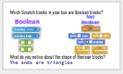

<header class='header' title='Boolean' subtitle='Lesson 14'/>

<notable>
<iconp src='/icons/activity.png'>### Overview</iconp>
Students are introduced to “boolean” and practice identifying true/false statements.

<iconp src='/icons/objectives.png'>### Objectives</iconp>
- I can identify Boolean as true/false statements.

<iconp src='/icons/agenda.png'>### Agenda</iconp>
1. Engage: Kids Code (5 min)
1. Explore: True/False (10 min)
1. Explain: Define (15 min)
1. Elaborate: Boolean Code (10 min)
1. Evaluate: Exit Challenge (5 min)

<note>
<iconp src='/icons/materials.png'>### Materials</iconp>
###### Teacher Materials:
- [ ] Projector
- [ ] [Slide Show][slide-show]
- [ ] [Answer Key][answer-key]

###### Student Materials:
- [ ] Computers
- [ ] [Exit Challenges][exit-challenge]
- [ ] [Boolean Cards][boolean-cards]
- [ ] Pencils
- [ ] Code Blocks

</note>

## Room Design

<note>

<iconp src='/icons/vocab.png'>### Vocabulary</iconp>

- **Boolean:** A statement that can be "true" or "false".

</note>

<pagebreak/>
## 1. Kids Code (5 min)
Participation: Whole Class Unplugged

- [ ] **Showcase** young student programmer and students to be the next programmer we feature.

> > “Kids all around are coding and creating. You’re never too young to start! If you code a project on your own, we would like to feature your project/app at the start of our class. Code something in Scratch or Code.org or any coding platform and show it to your getCoding teacher.”

<note>
</note>

 
- [ ] **Motivate** students by connecting today’s lesson to their Escape the Maze game.

> > “Last week when we played the three versions of our Escape the Maze game, what happened when the hero touched an enemy? The hero was sent back to the start! In order to write this code, we first need to learn about boolean code. We will be learning about boolean, the foundation to programming enemies that react when the hero touches them.”

## 2. Explore: True/False (10 min)
Participation: Small Group Unplugged

- [ ] **True/False:** Students hold up True or False to respond to questions.

<note type="tip">Have students hold their card up against their collarbone.

</note>

> > “Answer each statement by holding up ‘True’ or ‘False’ on your card.”

- You have a dog.
- All bugs are purple.
- You are the youngest in your family.
- Your favorite color is blue.
- 4 + 5 = 8
- You like to draw.
- The sun is green.
- Kittens grow up to be cats.

- [ ] **Contrasting Cases:** Students come up with their own definition of boolean by looking at the two lists of statements.

<iconp type="question">Here is a list that I am calling "Boolean" and here is a list that I am calling "Not Boolean". What do you think Boolean means?</iconp>
<iconp type="answer">Don't give students the answer! Ask them to defend their answers using examples from both lists. You can also hint for them to think about the previous activity with the T/F cards. They should be able to identify that all the Boolean statements can be answered with True or False, but Not Boolean cannot.</iconp>

|Boolean Statements|Not Boolean Statements|
|----------------------|------------------------|
| 4 + 5 = 8         | Say hello.             |
| You are the youngest in your family.| Spin in a circle and touch your toes. |
| 10 is greater than 2 | Draw a circle.         |
| The sun is green.    | Repeat 5 times.        |
| I have a dog.        | Wait for 1 second.     |

<note>
 </note>

<pagebreak/>

## 3. Explain: Define (15 min)
Participation: Small Group Unplugged

- [ ] **Define** boolean - students write the definition in their idea journals.

> > “On a blank page in your idea journal let’s write the definition of Boolean. Boolean - A statement that can either be "true" or "false".”

<note></note>

- [ ] **Contrasting Cases:** Review the contrasting cases from above.

> > “You answered each of the statements on the left with “True” or “False”. It doesn’t make sense to answer the non-boolean statements with true/false. If I say “Draw a circle”, you would respond by drawing a circle. If you responded “false”, I would be very confused.”

<note></note>
 
- [ ] **Popcorn:** Students hold up Boolean or Not Boolean cards to respond to questions. Pop around the room to different students asking them to explain if each statement is a boolean statement or not. It is important to have them say the word “boolean” to cement the term.

<iconp type="question"> Is this a boolean statement or not? If you’re not sure, try to answer true/false first.</iconp>

| Statement | Answer |
|------------------------------|----------|
| What did you eat for breakfast? |	Not Boolean |
| I own a pet.| Boolean |
| I am wearing a purple shirt. |	Boolean |
| Move 10 Steps |	Not Boolean |
| 8 + 4 = 12	|	 	Boolean |
| 9 is greater than 15. 	|	Boolean |
| Run in a circle. 	|		Not Boolean |
| 5 x 3 = 		|		Not Boolean |

<note>
</note>

- [ ] **Check for Understanding:**

<iconp type="question">Patty is taking a Boolean test. How do we know? </iconp>
<iconp type="answer">All the questions can be answered with “True” or “False”. </iconp>

<note></note>

<pagebreak/>

## 4. Elaborate: Boolean Code (10 min)    
Participation: Small Group, Partners, Unplugged

- [ ] **Contrasting Cases:** Give students a series of Scratch blocks and have them work in partners to identify which are examples of Boolean statements.

> > “In your box you have a series of code blocks. Sort your blocks into two piles: those that are boolean blocks and those that are not. Use your cards to label each group. If you’re having trouble, try answering the statements with true/false.”

<iconp type="question"> What do you notice about the shape of boolean blocks? </iconp>
<iconp type="answer">The ends of boolean blocks have points like triangles.</iconp>

<note></note>

## 5. Evaluate: Exit Challenge (5 min)
Participation: Small Group, Independent, Unplugged

- [ ] **Exit Challenge:** Students answer the [exit challenge][exit-challenge] on paper using pencil independently and turn it in.

> > “Try these three challenges independently to test your new knowledge of booleans!”

<note></note>

</notable>

[slide-show]: https://docs.google.com/presentation/d/1fwufcIayqgfsEaQF5h9J3KRzOMAnN1lbgIPTAhyKGOc/edit?usp=sharing
[answer-key]: https://docs.google.com/document/d/1VCO5Z0fPzbgoiQgkzvngx9JP_BMw0xfmHmjADoLOyaY/edit?usp=sharing
[exit-challenge]: https://docs.google.com/document/d/1Ep32lyMTvf5f5oCggVSgyIqNUWsAeefzj6zFtGm04J4/edit
[boolean-cards]: https://docs.google.com/document/d/1ENgpq-WdFCHz869IwJ9gVTF9bnf_TYze7dyVgDiy6uE/edit
