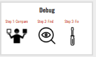
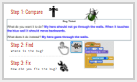
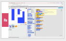
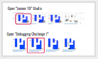
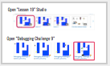
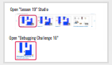
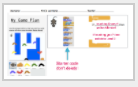
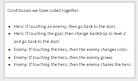

<header class='header' title='Debugging Conditionals' subtitle='Lesson 17'/>

<notable>
<iconp src='/icons/activity.png'>### Overview</iconp>
Students continue to build their debugging skills by reading a bug ticket and using the debugging protocol to tackle a series of challenges within the Escape the Maze game. They then add conditionals to their Game Plan for their final project.

<iconp src='/icons/objectives.png'>### Objectives</iconp>
- I can write an if-then statement to execute a sequence if a test is true.
- When my code fails, I use the debugging protocol to debug my code.

<iconp src='/icons/agenda.png'>### Agenda</iconp>
1. Engage: Kids Code (5 min)
1. Explore/Explain: Debugging Challenges (30 min)
1. Elaborate: Plan Your Conditionals (10 min)

<note>
<iconp src='/icons/materials.png'>### Materials</iconp>
###### Teacher Materials:
- [ ] Projector
- [ ] [Slide Show][slide-show]
- [ ] [Debugging Studio][studio]

###### Student Materials:
- [ ] Computers
- [ ] [Game Plan][handout]
- [ ] Pencils

</note>

## Room Design

<note>

<iconp src='/icons/vocab.png'>### Vocabulary</iconp>
- **Debug** Finding and fixing errors in code.
- **Conditional** Asks a boolean statement, and runs a chunk of code if the answer is true.

</note>

<pagebreak/>
## 1. Engage: Kids Code (5 min)
Participation: Whole Class Unplugged

- [ ] **Showcase** a project from your class.  If you do not have a student project to showcase you can show Yamato’s project from Selma Avenue Elementary. Challenge students to be the next programmer we feature.

> > “If you code a project on your own, we would like to feature your project/app at the start of our class. Code something in Scratch or Code.org or any coding platform and show it to your getCoding teacher.”

<note>**Slides:** </note>

##  2. Explore: Debugging Challenges (30 min)
Participation: Whole Class Online

- [ ] **Set the Challenge:** Students login to Scratch and navigate to the debugging studio in “My Class”. For each challenge read the Bug Ticket together. Coders will follow the 3 steps as they debug the code. Focus discussion on step 2: "Find" and logically identifying where the bug must be in the code. There is a video to help students fix the bug after they have discussed and tried it themselves.

> > “As we write more complex code, our bugs get more challenging.  Often when a coder encounters a bug they write a Bug Ticket. I have 5 more challenges for you to debug today and for each I have provided you with the Bug Ticket. Let’s login to Scratch and follow the 3 steps to debug: 1. Compare, 2. Find, 3. Fix.”

<note>
</note>

 

- [ ]**Challenge 6:**

<iconp type="question"> Compare: What does the coder want their program to do? What does it do instead?</iconp>
	<iconp type="answer"> “My mouse goes through the walls. It is supposed to move backwards when it bumps into a wall.”</iconp>
 <iconp type="question"> Find: Where is the bug in their code?</iconp>
	<iconp type="answer"> The hero’s starter code -> the chunk that controls the wall</iconp>
 <iconp type="question"> Fix: How did you fix the bug?</iconp>
	Solution: “Move 10” needs to be “Move -10”

<note>

</note>

- [ ]**Challenge 7:**

<iconp type="question"> Compare: What does the coder want their program to do? What does it do instead?</iconp>
	<iconp type="answer">“I want my enemy to change colors if it touches the hero. But instead my hero is changing color.”</iconp>
 <iconp type="question"> Find: Where is the bug in their code? </iconp>
	<iconp type="answer">The hero’s code -> the conditional </iconp>
 <iconp type="question"> Fix: How did you fix the bug? </iconp>
	Solution: The conditional needs to be moved from the hero to the enemy.

<note>

</note>
<pagebreak/>
- [ ]**Challenge 8:**

<iconp type="question"> Compare: What does the coder want their program to do? What does it do instead?</iconp>
	<iconp type="answer">“I want my hero to go back to the start when it touches an enemy. But instead my hero goes somewhere else.”</iconp>
 <iconp type="question"> Find: Where is the bug in their code? </iconp>
	<iconp type="answer">The hero’s code -> the go to block</iconp>
 <iconp type="question">Fix: How did you fix the bug? </iconp>
	Solution: The "go to" coordinates need to be x: -205, y: 147

<note>

</note>

- [ ]**Challenge 9:**

<iconp type="question"> Compare: What does the coder want their program to do? What does it do instead?</iconp>
	<iconp type="answer">“I want my hero to go back to the start when it touches an enemy. But it only goes back to the start for enemy 1.”</iconp>
 <iconp type="question"> Find: Where is the bug in their code?</iconp>
	<iconp type="answer">“The hero’s code -> the conditionals </iconp>
 <iconp type="question">Fix: How did you fix the bug? </iconp>
	Solution: Move the last 4 conditionals out of the first conditional.

<note>

</note>
<pagebreak/>
- [ ]**Challenge 10:**

<iconp type="question"> Compare: What does the coder want their program to do? What does it do instead?</iconp>
	<iconp type="answer">“I want my bat to go back to its original size when I press the reset key, but it doesn’t work.”</iconp>
 <iconp type="question"> Find: Where is the bug in their code? </iconp>
	<iconp type="answer">The enemy’s code -> missing reset code</iconp>
 <iconp type="question">Fix: How did you fix the bug? </iconp>
	Solution: Add the reset code, you can look at the other enemy to see what it should look like, but you will have to change the coordinates

<note>

</note>

## 4. Elaborate: Plan Your Conditionals (10 min)

- [ ] **Plan:** Students plan the conditionals they will add to their game.

> > “Game designers do not just start coding without first creating a design or plan for their game. Let’s take a few minutes to return to our Escape the Maze game plans. On the Game Plan there is space for us to plan how each Sprite is going to interact with others through conditionals. We are going to fill out the right column with the “If________, then_______” statements. Last lesson we practiced writing some of these conditionals in Scratch. Here are some ideas of code we’ve already written:
- Hero: If touching an enemy, then go back to the start.
- Hero: If touching the goal, then change backdrop to level 2 and go back to the start.
- Enemy: If touching the hero, then the enemy changes color.
- Enemy: If touching the hero, then the enemy grows.
- Enemy: If touching the hero, then the enemy chases the hero.

> > Take a minute to write your plan for each sprite. In our next lesson you will start to write this code!”  

<note>

</note>

</notable>

[slide-show]: https://docs.google.com/presentation/d/1M_YWoWbDw0JhgFS17fq_8e73WQdM5363brbsHQYjtVM/edit?usp=sharing
[handout]: https://drive.google.com/file/d/0B2wBzr9vcXjPN3hPQmItMndvQ1k/view?usp=sharing
[studio]: https://scratch.mit.edu/studios/3833131/
