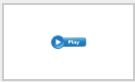
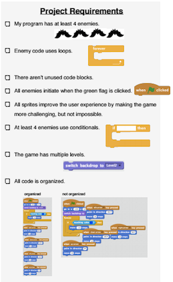
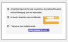
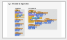

<header class='header' title='Write Conditionals' subtitle='Lesson 18'/>

<notable>
<iconp src='/icons/activity.png'>### Overview</iconp>
Students apply their knowledge of conditionals to write code in their Escape the Maze projects that cause the hero and enemies to interact.

<iconp src='/icons/objectives.png'>### Objectives</iconp>
- I can read an if-then statement to execute a sequence if a test is true.
- I can write a conditional (if-then) to make my maze hero and enemies interact.

<iconp src='/icons/agenda.png'>### Agenda</iconp>
1. Engage: Kids Code (5 min)
1. Explain: Code Along (5 min)
1. Elaborate: Code (30 min)
1. Evaluate: Project Checklist (5 min)

<note>
<iconp src='/icons/materials.png'>### Materials</iconp>
###### Teacher Materials:
- [ ] Projector
- [ ] [Slide Show][slide-show]

###### Student Materials:
- [ ] Computers
- [ ] [Game Plans][plan]

</note>

## Room Design

<note>

<iconp src='/icons/vocab.png'>### Vocabulary</iconp>

- **Conditional** Asks a boolean statement, and runs a chunk of code if the answer is true.

</note>

<pagebreak/>
## 1. Engage: Kids Code (5 min)

- [ ] **Showcase:** Choose a student from your class to show off their current Escape the Maze project or a personal project.

<note>**Slides:** </note>

## 2. Explain: Code Along (5 min)

- [ ] **Code Along:** Play the code along video to show students how to navigate to their project and code the conditionals from their game plan.

> > "In our last lesson you wrote in your game plan how you want to use conditionals in your Escape the Maze project. Today you are going to have most of the lesson to code those conditionals in your game. Let's follow along to navigate to our projects."

 
<note></note>

## 3. Elaborate: Code (30 min)

- [ ] **Make:** Students add the conditionals code to their projects following their plan and the code we demoed in the Code Along.

> > “Now that you have seen the power of conditionals, it is your turn to write conditionals into your Escape the Maze project. Don’t forget to use your game plan.”

<note></note>
<pagebreak/>

## 4. Evaluate: Project Checklist (5 min)

- [ ] **Evaluate:** Students check their projects against the rubric checklist and ensure their project is in the Lesson studio.

> > “Let’s read through the project checklist on the back of your game plan to see how we are doing with our projects. You will have more time to work on the project so you are not expected to be done today. Check off each item if you have completed it.”

<note>

</note>

</notable>

[slide-show]: https://docs.google.com/presentation/d/11yK7r4SqfhVqMo9GnLnQQ2_ne3xjztH12CUGBof0GvU/edit?usp=sharing
[plan]: https://drive.google.com/file/d/0B2wBzr9vcXjPN3hPQmItMndvQ1k/view?usp=sharing
