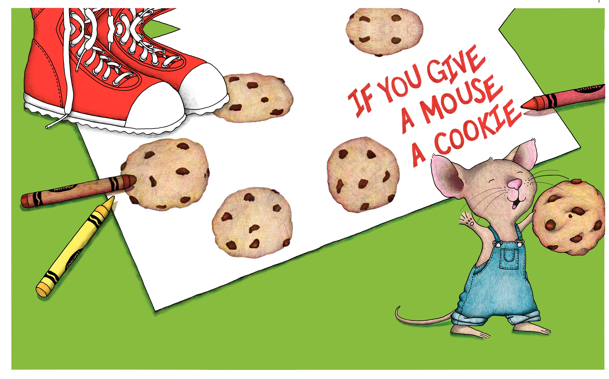
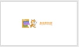
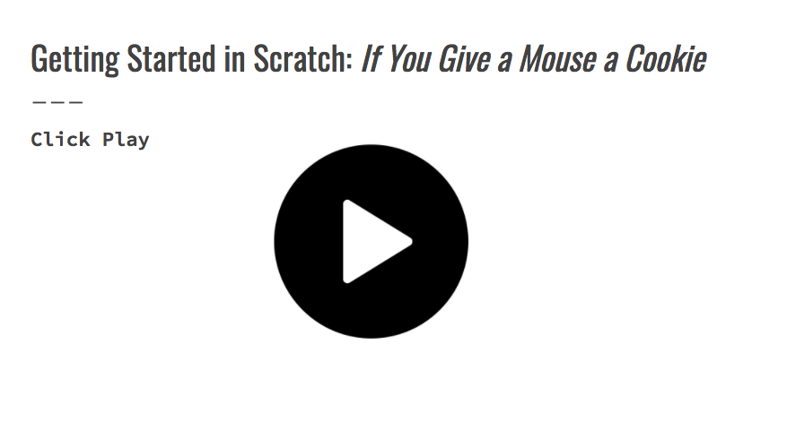
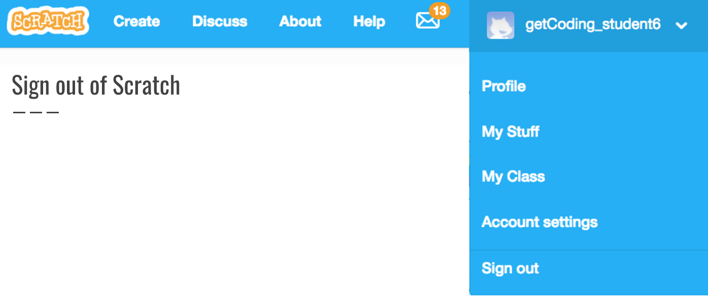

<header class='header' title='If You Give a Mouse a Cookie' subtitle='Lesson 02'/>

<notable>
<iconp src='/icons/activity.png'>### Overview</iconp>
Students get comfortable using the Scratch editor and writing a sequence in code by translating If You Give a Mouse a Cookie to a Scratch game.

<iconp src='/icons/objectives.png'>### Objectives</iconp>
- I can code a sequence of actions in the order I want them performed.
- I can use the editor, block palette, and stage in Scratch to code my program.

<iconp src='/icons/agenda.png'>### Agenda</iconp>
1. Engage: *If You Give a Mouse a Cookie* (5 min)
1. Explore/Explain: Code Along (20 min)
1. Elaborate: Independent Coding (20 min)
1. Extension: Further Exploring Scratch (5-60 min)

<note>
<iconp src='/icons/materials.png'>### Materials</iconp>
###### Teacher Materials:
- [ ] Projector
- [ ] [Slide Show][slide-show]
- [ ] [Scratch Studio][scratch]
- [ ] [Scratch Tutorials][tutorial]

###### Student Materials:
- [ ] Pencils
- [ ] Computers
- [ ] Scratch Logins

</note>

### Room Design

<note>

<iconp src='/icons/vocab.png'>### Vocabulary</iconp>
- **Editor** - A program designed for editing computer code by coders.
- **Sequence** - A set of actions that must be performed in the order they are written.

###### Symbols Key
<iconp ml='1.65em' type='question'>question</iconp>
<iconp ml='1.65em' type='answer'>answer</iconp>
</note>

<pagebreak/>
## 1. Engage: *If You Give a Mouse a Cookie* (5 min)
Participation: Whole Class, Unplugged

- [ ] **Hook:** Read *If You Give a Mouse a Cookie* outloud to the class.

<note>**Slides:** </note>

- [ ] **Plan:** Explain that we are going to practice coding a sequence by following the sequence of the book. Show the step by step plan.

<iconp type="question">Ask students to identify connection between a step and what happened in the story.</iconp>
<note></note>

## 2. Explore/Explain: Code Along (20 min)
Participation: Whole Class, Online

- [ ] **Introduce Scratch:** Introduce students to the coding platform we will be using this year-Scratch. Show the “Getting Started with Scratch Video."

> > “There are lots of different coding languages: Javascript, Python, C++, HTMl, CSS, Java. This year we will be using a language called Scratch. Today you are going to code the sequence of events that happen in *If You Give a Mouse a Cookie* in Scratch.”

<note></note>

- [ ] **Code Along:** Direct students to their log-in stickers. We suggest having students place their login stickers on their workbooks. Play the code along video. Pause the video to allow students to answer the questions.

> > "Let's follow along as we watch the code along."

<note></note>

<pagebreak/>
## 3. Elaborate: Independent Coding (20 min)
Participation: Independent, Online

- [ ] **Challenge** students to continue coding on their own following the sequence of the story. Encourage students to explore other blocks that could build on the storyline if they completed the planned sequence.

> > "Continue to code the rest of the story in Scratch."

	Anticipating Student Misconceptions:
	- Coding in the wrong sprite-Students should be coding in the sprite where the action is occuring.
	- Taking a “say” block instead of “say for 2 sec” block-without a specified time, Scratch will perform the action so quickly that it won’t be seen on the stage.
	- Deleting the starter code-Students should not change or delete the first two blocks because they ensure that whenever the green flag is pressed the mouse returns to its original position.

<note></note>

- [ ] **Closing:** Congratulate coders on their first program!

> > "Congratulations, coders! You just used code to write a computer program!"

<note></note>

## 4. Extension: Further Exploration in Scratch (5-60 min)
Participation: Independent, Online

- [ ] **Extension:** If you want to give your students more practice in Scratch, use the Introductory Tutorials. Play each tutorial video at least twice. The first time have them just watch, the second time have them follow along. Start with “Make your sprite move forward.”

</notable>

[slide-show]: https://docs.google.com/presentation/d/1uJD-NpNnVgcb0qX0Hv_3LYX14yf1aRKRQzzB9PJgbCM/edit?usp=sharing
[scratch]: https://scratch.mit.edu/studios/3448945/
[tutorial]: https://scratch.mit.edu/help/videos/#IntroductoryTutorials
