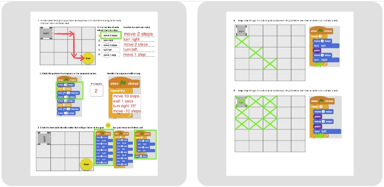
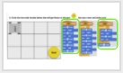

<header class='header' title='I Have a Challenge for You' subtitle='Lesson 20'/>

<notable>
<iconp src='/icons/activity.png'>### Overview</iconp>
Students complete a series of challenges to review the coding skills they’ve built since the start of the course.

<iconp src='/icons/objectives.png'>### Objectives</iconp>
This lesson reviews the objectives from Lessons 1-19.

<iconp src='/icons/agenda.png'>### Agenda</iconp>
1. Engage: I Have a Challenge For You (2 min)
1. Elaborate: Rover (23 min)
1. Elaborate: Socrative (20 min)

<note>
<iconp src='/icons/materials.png'>### Materials</iconp>
###### Teacher Materials:
- [ ] Projector
- [ ] [Slide Show][slide-show]
- [ ] [Socrative Quiz (SOC-27546630)][socrative2]
- [ ] Foam Tiles
- [ ] Large Rover
- [ ] Construction Paper to mark the foam tiles

###### Student Materials:
- [ ] Computers
- [ ] Pencils
- [ ] Rovers
- [ ] [Rover Handout][rover]

</note>

### Room Design

<note>
<iconp src='/icons/vocab.png'>### Vocabulary</iconp>
See all vocabulary from previous lessons
</note>

<pagebreak/>
## 1. Engage: I Have a Challenge for You (2 min)
Participation: Whole class, unplugged

- [ ] **Call and Response:** teach students the call and response. Teacher says: “I have a challenge for you.” Students say: “Bring it, bring it.”

> > “Before we get started I’m going to teach you a call and response. Whenever you hear me say ‘I have a challenge for you’, you will respond ‘Bring it, bring it’. Let’s try it. ‘I have a challenge for you’ … (students respond ‘Bring it, bring it.’)”

 
<note>**Slide:** </note>

- [ ] **Motivate:** introduce our challenges for today.

> > “You have learned so much as coders since September! Today, working in partners, you get a chance to apply all of your coding skills to tackle a series of challenges."

## 2. Elaborate: Rover (23 min)
Participation: Partners, unplugged

- [ ] **Challenge:** Students move Rover around their grids to practice reading and debugging code with loops and conditionals.

> > "Your first challenge today is to move Rover around the grid to practice reading and debugging code with loops and conditionals. With a partner, carefully read and execute the code on your paper. Afterwards I will ask you to share and defend your answers to the class."

<note>
</note>
 
- [ ] **Argumentation:** Use the foam tiles to have students act out code. You can add and subtract foam tiles to match the grid in each problem on the handout. Encourage academic discourse:
	- “I disagree because…”
	- “Show me how you got…”
	- “What line of code…”

**Solutions:**

<note type="tip">#5 is optional if you have time

</note>

## 3. Elaborate: Socrative (20 min)
Participation: Partners, online

- [ ] **Challenge:** Students login to Socrative to complete a series of challenges similar to the ones they will complete independently on the ICC next week. This is not a test and there is no final score. Run this “Teacher Paced” so that you can display and discuss the classes’ answers after each question. Allow students to work in pairs on this challenge and encourage academic discourse.

> > "Your second challenge today is on Socrative. As you answer the challenges today, focus on activating all of your new coding super powers. As a class we will wait until everyone has answered each question before looking at the answer and going onto the next one."

<note type="tip">Budget 1 minute per question. You can use a timer to help keep students on track.  </note>

</notable>

[slide-show]: https://docs.google.com/presentation/d/1uH8It9FzN_5pCnyS5y0HeGN8lIVjiX9nRlDUsWvF1Mo/edit#slide=id.g1d1d70c4b2_0_11
[socrative]: https://b.socrative.com/teacher/#import-quiz/27188219
[rover]: https://docs.google.com/document/d/11BepTZnwHYCglzDXS88IdRC2exZBVqrUj1pQlbOtCzU/edit?usp=sharing
[socrative2]: https://b.socrative.com/teacher/#import-quiz/27546630
