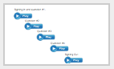
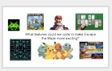
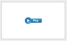

<header class='header' title='Escape the Maze' subtitle='Lesson 04'/>

<notable>
<iconp src='/icons/activity.png'>### Overview</iconp>
Students are introduced to the Escape the Maze project they will be working on throughout the year. They will brainstorm how to improve on the starter version of the game and learn to read the starter code through code along videos while getting more familiar with Scratch.

<iconp src='/icons/objectives.png'>### Objectives</iconp>
- I can read the project starter code in Scratch.
- I can use the editor, block palette, and stage in Scratch to code my program.

<iconp src='/icons/agenda.png'>### Agenda</iconp>
1. Engage/Explore: Escape the Maze (5 min)
1. Explain: Code Along (20 min)
1. Elaborate: Brainstorm (5 min)
1. Evaluate: Socrative (15 min)

<note>
<iconp src='/icons/materials.png'>### Materials</iconp>
###### Teacher Materials:
- [ ] Projector
- [ ] [Slide Show][slide-show]
- [ ] [Socrative Quiz][socrative]
- [ ] [Socrative Tutorial][tutorial]

###### Student Materials:
- [ ] Pencils
- [ ] Computers

</note>

### Room Design

<note>

<iconp src='/icons/vocab.png'>### Vocabulary</iconp>
- **Editor** - A program designed for editing computer code by coders.
- **Starter Code** - Code you build on to improve a program.

###### Symbols Key
<iconp ml='1.65em' type='question'>question</iconp>
<iconp ml='1.65em' type='answer'>answer</iconp>
</note>

<pagebreak/>
## 1. Engage/Explore: Escape the Maze (5 min)
Participation: Whole Class, Online

- [ ] **Challenge:** Dramatically 💥 💃  reveal the project students will be working on this year - Escape the Maze. Call a student up to play the game.

<iconp type="question"> Who here has done a maze before? </iconp>
<iconp type="question"> Who can tell me what a maze is? </iconp>
<iconp type="answer"> A path you need to navigate to get to a goal, has a start and end, sometimes there are dead ends or obstacles </iconp>

> > “There is so much powerful stuff that you can build as a coder: apps, websites, robots. Well this year as you develop your skills as coders, you are going to be working on coding your own video game. The game we will be working on is called Escape the Maze. Let’s open it in Scratch and take a look. I need a volunteer to come up and play the game.”

<iconp type="question"> What is happening in the game? </iconp>
<iconp type="answer"> They are moving the ball through the maze. </iconp>
<iconp type="question"> What happens if the mouse touches the blue? </iconp>
<iconp type="answer"> The ball bounces backwards</iconp>
<iconp type="question"> What does the blue represent?</iconp>
<iconp type="answer"> The walls of the maze.</iconp>
<iconp type="question"> What is the mouse?</iconp>
<iconp type="answer"> The end, finish, goal</iconp>
<iconp type="question"> What happens when the mouse gets to the cheese? </iconp>
<iconp type="answer"> It says "You Win!"</iconp>

<note>**Slides:**

</note>

<pagebreak/>
## 2. Explain: Code Along (20 min)
Participation: Whole Class, Online

- [ ] **Code Along:** Play the code along videos one at a time to navigate students to the maze in Scratch. Between each video, pause to facilitate student discussion to the questions posed in the video. Encourage students to respond to eachother with "I agree because..." or "I disagree because..."

> > “Let’s login to Scratch and look at the code that makes this game work.”

<iconp type="question">What do you think this chunk of code does?</iconp>

<note>

</note>

## 3. Elaborate: Brainstorm (5 min)
Participation: Whole Class, Unplugged

- [ ] **Brainstorm:** The game students played is just the bare bones. Help students brainstorm ideas to improve Escape the Maze that they can code as they build their coder skills.

<iconp type="question"> The game you just saw is just the starter version. As a coder, it will be your job to improve the game and make it your own. What features could we add to Escape the Maze to make it more fun to play? </iconp>
<iconp type="answer"> Record students’ responses on the board as they share and encourage them to write the ideas they like in their workbooks. </iconp>

Continue to prompt students with questions:
<iconp type="question"> What could make the enemies more challenging? </iconp>
<iconp type="question"> What should happen when you get to the end of the maze? </iconp>
<iconp type="question"> What should happen if the mouse runs into one of the enemies? </iconp>
<iconp type="question"> Think about the games you enjoy playing. What features make them challenging? </iconp>

<note>

</note>
<pagebreak/>
## 4. Evaluate: Socrative (15 min)
Participation: Partners, Online

- [ ] **Pair Programming:** Run the Socrative quiz. Play the video to introduce students to Socrative. Students work in pairs to explore the starter code in Scratch. You will need to give students the Room Name.

> > “Now it’s your turn to explore the starter code in Escape the Maze. Let’s follow along with the video to answer some challenges using a new website called Socrative.”

<note>

</note>

- [ ] **Closing:** If there is time you can review students’ answers as a class on Socrative. Make sure students log out of their accounts.

<note>

</note>

</notable>

[slide-show]: https://docs.google.com/presentation/d/1cR3e-XiSHqI6O8H01ng_IoglktZefa-hRPKNsuhlyW8/edit?usp=sharing
[socrative]: https://b.socrative.com/teacher/#import-quiz/28414624
[tutorial]: https://drive.google.com/file/d/0B2wBzr9vcXjPcGJsRDhHSWZWbW8/view?usp=sharing
