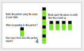
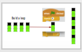
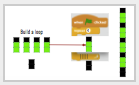
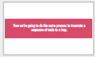
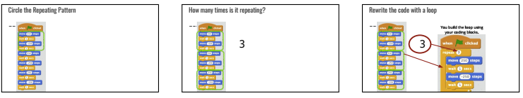
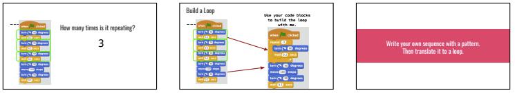
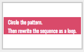

<header class='header' title='Code the Enemy' subtitle='Lesson 08 (Accelerated)'/>

<notable>
<iconp src='/icons/activity.png'>### Overview</iconp>
In this lesson students identify repeating patterns in a sequence and replace the repetition with more efficient code by using a loop.  This is students’ first lesson in writing code with loops. Younger students may need more support and practice with pattern recognition.

<iconp src='/icons/objectives.png'>### Objectives</iconp>
- I can recognize and identify a repeating pattern.
- I can replace a repeating sequence with a forever loop, for-loop, or while loop to increase code efficiency and readability.
- I can code a loop that makes an enemy patrol my maze.

<iconp src='/icons/agenda.png'>### Agenda</iconp>
1. Engage/Explore: Patterns (10 min)
1. Explain/Elaborate: Translating Patterns to Loops (10 min)
1. Evaluate: Exit Challenge (10 min)
1. Extension: Independent Coding (15-30 min)

<note>
<iconp src='/icons/materials.png'>### Materials</iconp>
###### Teacher Materials:
- [ ] [Slide Show][slide-show]
- [ ] Projector
- [ ] [Exit Challenge Answer Key][key]

###### Student Materials:
- [ ] Pencils
- [ ] [Code Handouts][code-handouts]
- [ ] Student Code Blocks: repeat, 2 moves, turn, 2 waits
- [ ] Computers
- [ ] Unifix Cubes
- [ ] [Exit Challenge][exit]

</note>

### Room Design

<note>
<iconp src='/icons/vocab.png'>### Vocabulary</iconp>

- **Loop:** A sequence of instructions that is continually repeated until a certain condition is reached.

</note>

<pagebreak/>

## 1. Engage/Explore: Patterns (10 min)

- [ ] **Build:** Students use unifix cubes to build the pattern they see on the slide.

> > “Build this pattern using the cubes at your table.”

<note>**Slides:**  

</note>

- [ ] **Pattern Recognition:** Students identify the pattern in the cubes.

<iconp type="question">What is repeating in this pattern?</iconp>
<iconp type="answer">Black, green, green</iconp>
<iconp type="question">Does the order matter when describing the pattern?</iconp>
<iconp type="answer">Yes! If a student said “green, black, green” then when you assemble the pieces you won’t get the same design</iconp>
<iconp type="question">How many times does the section repeat itself?</iconp>
<iconp type="answer">4</iconp>

 
- [ ] **Build:** Students use the code blocks to build a loop that describes the pattern.

<iconp type="question">How could you represent the pattern using fewer cubes and code blocks?</iconp>
<iconp type="answer">Put one of the pattern pieces inside a loop. </iconp>
<iconp type="question">What number do I write as the argument in the repeat loop? How do you know?</iconp>
<iconp type="answer">4 because the pattern repeated 4 times</iconp>
<iconp type="question">Why do I put just one piece of the pattern inside the loop?</iconp>
<iconp type="answer">Because only that section is repeating 4 times. If you put the whole thing in the loop you’d get a much longer sequence.</iconp>

 
<note type="tip">The number in the loop block is called an argument.

</note>

- [ ] **Build:** Students use unifix cubes to build the pattern they see on the slide.

> > “Sometimes not everything is part of the pattern. Build this pattern using the cubes at your table.”

<note>

</note>

- [ ] **Pattern Recognition:** Students identify the pattern in the cubes. The end of this design is not part of the pattern.

<iconp type="question">What is repeating in this pattern?</iconp>
<iconp type="answer">Black, green, green</iconp>
<iconp type="question">How many times does the section repeat itself?</iconp>
<iconp type="answer">4</iconp>
<iconp type="question">Are these last 2 black cubes part of the repeating pattern?</iconp>
<iconp type="answer">No</iconp>
<iconp type="question">What can we do with this extra piece that is 2 black cubes?</iconp>
<iconp type="answer">Place it outside the loop.</iconp>

<note> 
</note>
 

## 2. Explain: Translating Patterns to Loops (10 min)

- [ ] **Transfer of Knowledge:** Students will follow the same process to identify the pattern in a sequence and rewrite it as a loop.

> > “Now we’re going to do the same process to translate a sequence of code to a loop.”

<note> </note>
<iconp type="question">What is repeating in this pattern? Circle the pattern each time it repeats.</iconp>
<iconp type="answer">See slides </iconp>

<iconp type="question">How many times does the section of code repeat itself?</iconp>
<iconp type="answer">3 times		4 times		3 times</iconp>

<iconp type="question">How would you rewrite this as a loop? Use the code blocks at your table to build your loop.</iconp>
<iconp type="answer"></iconp>

- [ ] **Summarize:** students summarize the process they just followed in 3 steps to write code using a loop.

<iconp type="question">Describe the process we did to write a sequence of code using a loop in 3 steps? </iconp>
<iconp type="answer">
1. Identify the repeating pattern and how many times it repeats.
2. Place the repeating section of code within the loop’s mouth.
3. Place the number of times the pattern repeats as the loop’s argument.</iconp>

## 3. Elaborate/Evaluate: Exit Challenge (10 min)

- [ ] **Exit Challenge:** Students independently rewrite 3 sequences of code as loops. Collect the exit challenges and review them to identify who needs more support with writing loops.

> > “Coders, I have a challenge for you! Independently rewrite the 3 sequences on your exit challenge as loops. First, circle the pattern that is repeating. Then rewrite the sequence as a loop at the bottom of the page.”

<note></note>

## 4. Extension: Independent Coding (15-30 min)

- [ ] **Independent Coding:** Students move at their pace through Code.org. You can direct students to continue working on Code.org Course 2 Lesson 8: Bee Loops

</notable>

[slide-show]: https://docs.google.com/presentation/d/1RcoJ6hh9rQCNuBCYYBFuNXrB3PB13WVs5xq4jOtregI/edit?usp=sharing
[code-handouts]: https://drive.google.com/file/d/0B2wBzr9vcXjPSkdnS2llTlU0bWc/view?usp=sharing
[exit]: https://docs.google.com/document/d/1DjoqTdASsbnpOnhh5GoJLhPqLtP9nrrbKTEyFZl6wk4/edit?usp=sharing
[key]: https://docs.google.com/document/d/10OFFXNsVVOCNlJ56cydtFdOLkXTYWY7Y1KPpua0G1O4/edit?usp=sharing
