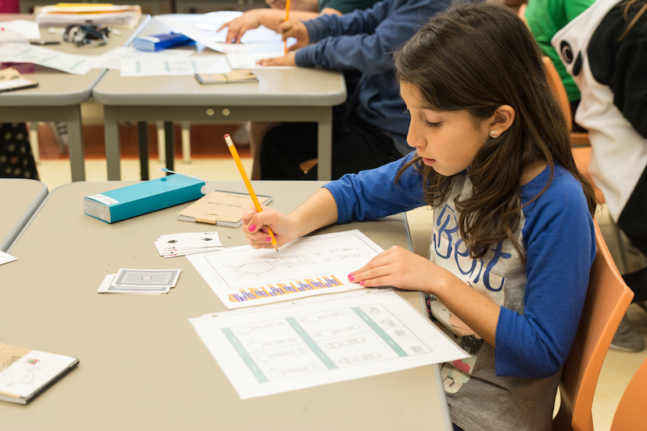

# 3rd Grade

Students begin applying core coding concepts into an Escape the Maze project. In this level, students are introduced to the Scratch block-based language and the offline maze grid. These platforms help student experience and understand new coding concepts such as sequencing, creating loops, and using conditionals.

## Lessons

- [Lesson 1: I am a Coder](../grade-3/lesson-plans/lesson-1.html)
- [Lesson 2: If You Give a Mouse a Cookie](../grade-3/lesson-plans/lesson-2.html)
- [Lesson 3: Rover](../grade-3/lesson-plans/lesson-3.html)
- [Lesson 4: Escape the Maze](../grade-3/lesson-plans/lesson-4.html)
- [Lesson 5: In the Loop](../grade-3/lesson-plans/lesson-5/lesson.html)
- [Lesson 6: Rover Paint](../grade-3/lesson-plans/lesson-6/lesson.html)
- [Lesson 7: Enemies on Patrol](../grade-3/lesson-plans/lesson-7/lesson.html)
- [Lesson 8: Code the Enemy](../grade-3/lesson-plans/lesson-8/lesson.html)
- [Lesson 8 Accelerated: Code the Enemy](../grade-3/lesson-plans/lesson-8-accelerated/lesson.html)
- [Lesson 9: Independent Coding Challenge](../grade-3/lesson-plans/lesson-9/lesson.html)
- [Lesson 10 part 1: ICC Review](../grade-3/lesson-plans/lesson-10-part1/lesson.html)
- [Lesson 10 part 2: Enemies Everywhere](../grade-3/lesson-plans/lesson-10-part2/lesson.html)
- [Lesson 11: Enemies Everywhere Continued](../grade-3/lesson-plans/lesson-11/lesson.html)
- [Lesson 12: Strategic Enemies](../grade-3/lesson-plans/lesson-12/lesson.html)
- [Lesson 13: Debugging Loops](../grade-3/lesson-plans/lesson-13/lesson.html)
- [Lesson 14: Boolean](../grade-3/lesson-plans/lesson-14/lesson.html)
- [Lesson 15: Conditionals](../grade-3/lesson-plans/lesson-15/lesson.html)
- [Lesson 16: Build-a-Bot](../grade-3/lesson-plans/lesson-16/lesson.html)
- [Lesson 17: Debugging Conditionals](../grade-3/lesson-plans/lesson-17/lesson.html)
- [Lesson 18: Write Conditionals](../grade-3/lesson-plans/lesson-18/lesson.html)
- [Lesson 19: Where's Rover](../grade-3/lesson-plans/lesson-19/lesson.html)
- [Lesson 20: I Have a Challenge for You](../grade-3/lesson-plans/lesson-20/lesson.html)
- [Lesson 21: Independent Coding Challenge](../grade-3/lesson-plans/lesson-21/lesson.html)
- [Lesson 22: Bug Tickets](../grade-3/lesson-plans/lesson-22/lesson.html)
- [Lesson 23: User Experience](../grade-3/lesson-plans/lesson-23/lesson.html)
- [Lesson 24: Arcade](../grade-3/lesson-plans/lesson-24/lesson.html)
