<header class='header' title='Debugging Sequences' subtitle='Lesson 04'/>

<notable>
<iconp src='/icons/activity.png'>### Overview</iconp>
Students are introduced to the story of the first bug and practice using the debugging protocol to tackle a series of debugging challenges on pixelBots.

<iconp src='/icons/objectives.png'>### Objectives</iconp>
- I can code a sequence of actions in the order I want them performed.
- I can use the debugging protocol to debug my code.

<iconp src='/icons/agenda.png'>### Agenda</iconp>

1. Engage: The First Bug (5 min)
1. Explore: Challenge (10 min)
1. Explain: Debugging Protocol (10 min)
1. Elaborate: Independent Debugging (20 min)

<note>
<iconp src='/icons/materials.png'>### Materials</iconp>
###### Teacher Materials:
- [ ] Computer
- [ ] Projector
- [ ] [Slide Show][slides]

###### Student Materials:
- [ ] Computers
- [ ] [Playlist: getCoding 3.4 | Code: ZND7W][ind-practice]
- [ ] [Playlist: getCoding 3.4 Exit | Code: QPJJ5][exit-ticket]

</note>

## Room Design

<note>
<iconp src='/icons/vocab.png'>### Vocabulary</iconp>
- **Sequence** - A set of actions that must be performed in the order they are written.
- **Bug** - An error in code.
- **Debugging** - Finding and fixing errors in code.
</note>

<pagebreak/>

## 1. Engage: The First Bug (5 min)

- [ ] **Read** *The First Bug* to the class from the slides.

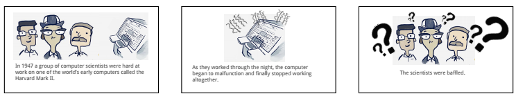
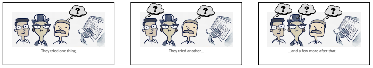
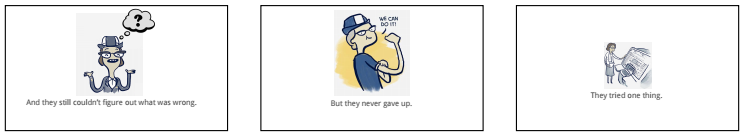
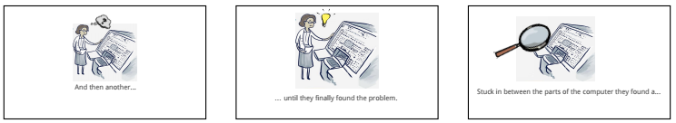

<note>**Slides:** 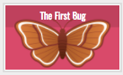</note>

- [ ] **Debrief** the story.

<iconp type="question">What was the problem in the story?</iconp>
<iconp type="question">What was causing the problem?</iconp>

- [ ] **Define** bug and debugging.

>>“Things don’t always work the way we want them to when we code because we can often make mistakes. We call these mistakes in our code, bugs. Everyone say 'bug'. Debugging is the process of removing bugs in our code. Everyone say 'debug'.”

## 2. Explore: Challenge (10 min)

- [ ] **Challenge** students to tackle debugging challenge number one. Students go to pixelBots (Code: ZND7W) and attempt to get the pixelBot to paint the two gray lines black.

>>“Today I have a series of bugs that I need help debugging. I challenge you to attempt the first bug on your own before we talk about it together. The code in challenge number 1 is supposed to make the pixelBot paint the two gray lines black. Your job is to make sure it paints those two lines.”

<note>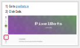

</note>

 
- [ ] **Think Pair Share:** After students have a few minutes to try to debug the challenge, have them turn to their table partner and discuss the steps they took to complete the challenge. Then have them share out their strategies and write them on the board.

>>"Turn to your table partner and share with them what steps you took to tackle this challenge. I am going to write your answers on the board in a few minutes."

<iconp type='question'>What steps did you take to make sure the code did what it was supposed to do?</iconp>
<note> 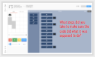</note>

## 3. Explain: Debugging Protocol (10 min)

- [ ] **Model** the debugging protocol and teach students the hand gestures for each step. 

>> “When we debug code we follow three basic steps: (1) Compare (2) Find (3) Try. Let's try it with this challenge. First Compare:"

<iconp type="question">What did we want our program to do?</iconp>
<iconp type="answer">We wanted it to paint the gray boxes.</iconp>
<iconp type="question">What did it do instead?</iconp>
<iconp type="answer">It painted 3 of the 4 boxes correct, but painted the last box too far to the right.</iconp>

>>"Step two, Find: We can use the yellow stepper tool to find where the bug might be."

<iconp type="question">Where in the code do you think the bug is located?</iconp>
<iconp type="answer">Line 8</iconp>

>>"Step three, Try:"

<iconp type="question">What solution should we try? If the solution we try doesn’t work we choose another solution and try it out.</iconp>
<iconp type="answer">Let students try different solutions. Use the 'reset' button to reset the code.</iconp>

<note type="tip">Teach students the hand gestures for each step. Compare: hold your palms up as if you were weighing two options. Find: run your finger in front of you back and forth as if you're scanning a text. Try: pretend to turn a screwdriver in the air.
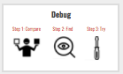
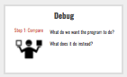
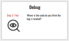
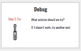
</note>
 
- [ ] **Discuss:** Show the debugging protocol slide and have students discuss where the strategies that were recorded on the board belong in the compare, find, try protocol.

<iconp type='question'>Which strategies on the board belong under compare?</iconp>
<iconp type='question'>Which strategies on the board belong under find?</iconp>
<iconp type='question'>Which strategies on the board belong under try?</iconp>

<note> </note>
 
- [ ] **Guided Practice:** The class works together to use the debugging protocol to solve a debugging challenge. When students share have them respond to each other with "I agree because..." and "I disagree because..."

>> “Click 'Next' to try the next challenge with me.”

<iconp type="question">Compare: What do we want our code to do? What does it do instead?</iconp>
<iconp type="answer">We want our code to paint an L. Instead it paints a square.</iconp>
<iconp type="question">Find: Where in the code might the bug be located? I will give you a few minutes to step through the code and find what line you think has the bug.</iconp>
<iconp type="answer">There are multiple places that could be considered a bug.</iconp>
<iconp type="question">Try: What is a possible solution?</iconp>
<iconp type="answer">There are multiple possible solutions.</iconp>

<note type="tip">While students are sharing have them turn their screens away from them so they can track the student sharing. When students share have them respond to each other with "I agree because..." and "I disagree because..."
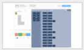</note>

## 4. Elaborate: Independent Debugging (20 min)
- [ ] **Independent Practice:** Students apply the debugging protocol to a series of challenges. During this time circulate to assist students in need of additional help.

> > "Alright coders, now it your turn. Continue to use our 3 steps to debug the remaining challenges."

<note>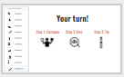</note>
 
- [ ] **Share solutions** for debugging challenge numbers 5 & 7 as a class. Have students project their solutions. Encourage the class to respond with "I agree because..." and "I disagree because..."

<iconp type="question">Compare: What do we want our code to do? What does it do instead?</iconp>
<iconp type="question">Find: Where in the code might the bug be located? I will give you a few minutes to step through the code and find what line you think has the bug.</iconp>
<iconp type="question">Try: What is a possible solution?</iconp>

 
- [ ] **Closing:** Review the three steps to the debugging protocol with the hand gestures.

>>"As a coder you can follow those 3 steps anytime you find a bug. Bugs are a fact of being a coder. You probably run into bugs in your life all the time. For our next lesson I will ask you to share when you have had to debug a situation in your everyday life."

</notable>

[slides]: https://docs.google.com/presentation/d/1Jbm3nJ4cOlYue8rF91Y8nB2ItFWL31juwRQebzU9RHM/edit?usp=sharing
[ind-practice]: http://www.pixelbots.io/ZND7W
[exit-ticket]: http://www.pixelbots.io/QPJJ5
