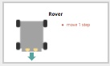
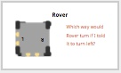
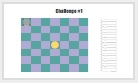
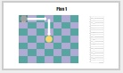
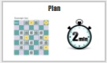

<header class='header' title='Rover' subtitle='Lesson 03'/>

<notable>
<iconp src='/icons/activity.png'>### Overview</iconp>
Students are introduced to the importance of writing clear instructions. Students practice using the writing code protocol (plan, code, validate) to navigate Rover the robot to a goal on the grid using a sequence.

<iconp src='/icons/objectives.png'>### Objectives</iconp>
- I can code a sequence of actions in the order I want them performed.

<iconp src='/icons/agenda.png'>### Agenda</iconp>
1. Explore: Peanut Butter Jelly Time (5 min)
1. Explain: Meet Rover (15 min)
1. Elaborate: Navigate Rover (15 min)
1. Evaluate: Exit Challenge (5 min)
1. Optional Extension: Scavenger Hunt (30 min)

<note>
<iconp src='/icons/materials.png'>### Materials</iconp>
###### Teacher Materials:
- [ ] Peanut Butter & Jelly, Plate, Knife, Bread
- [ ] [Slide Show][slide-show]
- [ ] Foam Tiles
- [ ] [Maze Targets][targets]
- [ ] [Rover Code Blocks][code]

###### Student Materials:
- [ ] [Challenges Handouts][handout]
- [ ] Pencils
- [ ] [Exit Challenges][exit]
- [ ] [Optional Extension Handout][extension]
- [ ] [Rover Tokens][cutouts]

</note>

### Room Design

<note>

<iconp src='/icons/vocab.png'>### Vocabulary</iconp>
- **Code:** A set of instructions designed to be carried out by a computer.
- **Validate:** To check if something is correct or does what it is intended to do.

###### Symbols Key
<iconp ml='1.65em' type='question'>question</iconp>
<iconp ml='1.65em' type='answer'>answer</iconp>
</note>

<pagebreak/>
## 1. Engage/Explore: Peanut Butter Jelly (5 min)

- [ ] **Challenge:** Place the peanut butter, jelly, knife, plate, and bread on the front table.

<iconp type="question">Using the materials on the front table, give step-by-step instructions for your teacher to make a peanut butter and jelly sandwich.</iconp>

<iconp type="answer">Volunteers share their instructions. Follow each step exactly, without using your human intuition to interpret a direction. For example, if a student says “put the peanut butter on the bread” then put the jar of peanut butter on the top of the bag of bread.</iconp>

> > “Humans can interpret the meaning and intention behind a direction in a way computers cannot. You would have known that “put the peanut butter on the bread” meant that first you needed to get a knife and open the jar and put peanut butter on the knife, etc. But a computer cannot infer all of that. It only knows to follow the specific instructions we write. These instructions are code. Today we are going to code a sequence of instructions that are clear and precise for a computer to follow.”

<note type="tip">
Nut allergies are common. Sunflower butter is a safe alternative to peanut butter.
**Slides:** 
</note>

## 2. Explain: Meet Rover (15 min)

- [ ] **Motivate:** Introduce Rover.

> > “This is Rover. Rover is a robot so he can read code. Rover only understands 3 directions:
	- Move 1 Step: Rover moves 1 square in the direction it is facing (the direction its headlights are facing)
	- Turn Left: Rover turns towards its left
	- Turn Right: Rover turns towards its right”

<iconp type="question">Which way will Rover turn? Point with your fingers to show me.</iconp>
<iconp type="answer"></iconp>

<note type="tip">Students will not be tested on Left and Right. You can have students write a “R” and “L” on their individual Rovers to remember which is Rover’s right and Rover’s left.

</note>

- [ ] **Challenge:** Help Rover navigate to the goal on handout 1 and on the foam tiles by following the three steps to write code: 1) plan 2) code 3) validate.

> > “Now that you’ve been introduced to Rover, we are going to use him to complete our first challenge today. We need to write the code that will get Rover to the yellow goal. Find your Rover and place him on Start on your worksheet.”

<note> </note>
 

- [ ] **Plan:** There are multiple ways that Rover can get there so have the class vote on which plan they would like to use. Then have them trace the path on their grid.

> > “There are multiple paths that Rover could take to get to the goal. Let’s look at three of the options and vote as a class which path we will code. Then draw that path on your grid. This is the first step to writing good code: planning.”

<note> 

</note>

- [ ] **Code:** Call a student to come up to the board and place the magnetic code strips up as the class suggests each line of code. This student is the Coder. Have a second student come up to the foam tiles and move Rover with each line of code. This student is the Bot.

> > “I need one volunteer to be our Coder and one volunteer to be our Bot. Class you will follow along writing the code on your paper and moving Rover with us.”

 

- [ ] **Validate:** After we write each line of code we will validate (check) that Rover is on its path and that our Bot is correctly following the code.

> > “Validate means to check that our code and Rover are doing what we want them to do. Everyone will help us validate each line of code as we go.”

## 3. Elaborate: Navigate Rover (15 min)

- [ ] **Challenge:** Students will work in pairs to write the code to navigate Rover to the goal on handout 2. One student will be the Coder and the second will be the Bot.

> > “Now it is your turn. With your table partner navigate Rover to the goal on the second handout. First decide who will be the Coder (write the code) and who will be the Bot (moves Rover and validates the code).”

<iconp type="question">Raise your hand if you are the Coder. What is your job as Coder?</iconp>
<iconp type="answer">Check that each pair has one Coder. They will be writing the code.</iconp>
<iconp type="question">Raise your hand if you are the Bot. What is your job as Bot?</iconp>
<iconp type="answer">Check that each pair has one Bot. They will be moving Rover and validating the code.</iconp>

<note> </note>

- [ ] **Plan:** Give pairs one minute to plan their path.

> > “There are multiple paths that Rover could take to get to the goal. With your partner decide on a path for Rover to get to the goal and draw it on your grid. You have 1 minute.”

<note> </note>
 

- [ ] **Code:** Students write their code. Use a timer and circulate to keep them on task.

> > “Now it’s time to write your code. Coder, write each line of code while your Bot moves Rover and validates each line.”

<note> </note>
 

- [ ] **Validate:** Ask one pair to share their code outloud and move Rover on the foam tiles.

> > “Is there a group that would like to share their code? Remember that there are multiple paths Rover could have taken so we probably all have different code.”

## 4. Evaluate: Exit Challenge (5 min)
- [ ] **Challenge:** Students complete the exit challenge independently. When they are done, collect their work and note students who still need more help reading and writing a sequence.

> > “I have a challenge for you. Complete this challenge independently. On your paper there are two grids. Examine each grid along with the code. Choose the missing block that would get Rover to the goal. Circle the block that you think goes in the blank space in his code.”

<note> </note>

## 5. Optional Extension: Scavenger Hunt (20 min)

- [ ] **Challenge:** Students will work in pairs to write the code to navigate Rover through a grid to reach each goal.

> > “Let’s make it more challenging! Acting as Coders & Bots, your goal is to navigate Rover through the maze to reach as many of the goals as you can. You probably won’t have time to make it to all of the goals. That’s ok. But for each goal you reach there is a prize waiting.”

<iconp type="question">Raise your hand if you are the Coder. What is your job as Coder?</iconp>
<iconp type="answer">Check that each pair has one Coder. They will be writing the code.</iconp>
<iconp type="question">Raise your hand if you are the Bot. What is your job as Bot?</iconp>
<iconp type="answer">Check that each pair has one Bot. They will be moving Rover and validating the code.</iconp>

<note> </note>

- [ ] **Plan:** Give pairs two minutes to plan their path.

> > “There are multiple paths that Rover could take to get to the goal. With your partner decide on the path you will code to get Rover through the maze. You have 2 minutes.”

<note> </note>
 

- [ ] **Code:** Students write their code. Use a timer and circulate to keep them on task. Limit them to 5 minutes.

> > “Now it’s time to write your code. Coder, write each line of code while your Bot moves Rover and validates each line.”

<note> </note>
 

- [ ] **Validate:** Ask each pair to come up. Have a Coder from a different team read the code out loud while they navigate Rover on the foam tiles. If there is a bug in their code they cannot change it there. This is to emphasize the importance of validating their code as they work. For each goal that the pair reaches they should get a prize.

</notable>

[slide-show]: https://docs.google.com/presentation/d/14h8F-A34JqlIF53ZXV2t0l3eunX5blb6184AuwBKZhk/edit?usp=sharing
[targets]: https://drive.google.com/file/d/0B48_2vIyABioeEVTZWx1XzRMUFU/view?usp=sharing
[code]: https://drive.google.com/file/d/0B48_2vIyABioU0FyTTNsR29WNUE/view?usp=sharing
[handout]: https://drive.google.com/file/d/0B48_2vIyABiodlhwdFRiRDJXckU/view?usp=sharing
[exit]: https://drive.google.com/file/d/0B48_2vIyABioZk5fTGZGQkNIX0U/view?usp=sharing
[extension]: https://drive.google.com/file/d/0B48_2vIyABioQmxOeEpnb3F4TVE/view?usp=sharing
[cutouts]: https://drive.google.com/file/d/0B48_2vIyABioX3I1cjkxUW9JckE/view?usp=sharing
