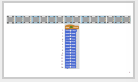
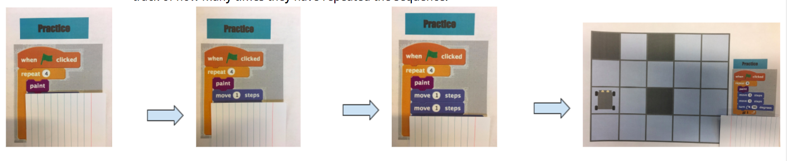
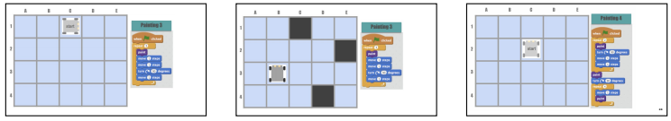

<header class='header' title='Rover Paint' subtitle='Lesson 06'/>

<notable>
<iconp src='/icons/activity.png'>### Overview</iconp>
Students learn to read code with loops by stepping through one block at a time. Using pre-written code, students guide Rover the robot’s movements as it paints a grid.

<iconp src='/icons/objectives.png'>### Objectives</iconp>
- I can step through and act out code that contains a loop.
- I can predict the effects of code that contains a loop.

<iconp src='/icons/agenda.png'>### Agenda</iconp>

1. Engage: Why Loops (5 min)
1. Explore: Loops in GIFS (5 min)
1. Explain: Rover Paint (5 min)
1. Elaborate/Evaluate: Practice (10 min)
1. Extension: Independent Coding (20-35 min)

<note>
<iconp src='/icons/materials.png'>### Materials</iconp>

###### Teacher Materials:
- [ ] Projector
- [ ] [Slide Show][slides]
- [ ] Foam Tiles
- [ ] Construction Paper
- [ ] [Large Rover][large-rover]

###### Student Materials:
- [ ] [Lesson 6 Handout][lesson-6-handout]
- [ ] Index Cards
- [ ] [Rover Cutouts][rover-cutouts]
- [ ] Pencils
- [ ] Computers

</note>

## Room Design

<note>
<iconp src='/icons/vocab.png'>### Vocabulary</iconp>

- **Loop:** A sequence of instructions that is continually repeated until a certain condition is reached.

</note>

## 1. Engage: Why Loops? (5 min)

- [ ] **Engaging Prior Knowledge:** Students connect loops from previous lesson to simplify a long sequence of code.

> > “Let’s read Rover’s code together.”

<iconp type="question">Is there another way to write this code? </iconp>
<iconp type="answer"> Hint to last week’s lesson to get students to suggest using a repeat loop.</iconp>
<iconp type="question">Do both set of instructions get Rover to the goal?  </iconp>
<iconp type="answer">Yes </iconp>
<iconp type="question">Then what is the benefit of using a loop to write this code?  </iconp>
<iconp type="answer">A loop requires less lines of code. </iconp>

<note>**Slides:**  

</note>

## 2. Explore: Loops in GIFs (5 min)

- [ ] **Making Connections:** Students see how loops apply to something they are familiar with: GIFs (an image format that repeats an animation).

> > “Let’s look at some GIFs and see how loops are actually creating the animation we see.”

<iconp type="question">What might the code look like for this GIF?</iconp>
<iconp type="answer">See code suggestions on slides. Students should nest the action they are seeing inside a loop block.</iconp>

- [ ] **Enemy Loops:** Show students the Escape the Maze GIF and identify one of the enemy’s movements as a loop.

<iconp type="question">In this animation of our Escape the Maze project, what do you notice about the enemies?</iconp>
<iconp type="answer">Each enemy is moving in a loop. The actions they are doing repeat. This is because the code they are reading has a loop in it. </iconp>

<note>
</note>

## 3. Explain: Rover Paints (5 min)

- [ ] **Model** the steps to read a chunk of code that contains a loop. Have students follow along on their handout. Uncover each line of code one at a time using an index card. Make a tally at the end of the sequence to keep track of how many times you’ve repeated the sequence.

> > “Before we can write the code to make our enemies move like that, we need to know how to read the code. We are going to use Rover to practice reading loops. Today Rover understands a new instruction - Paint. When Rover sees a Paint block, he will color in the square he is on.”

> > “Use your index card to uncover each line of code one block at a time.”
Narrate what you’re doing at each step.
> > “Make a tally mark at the bottom of the loop.”

<iconp type="question">How many times have I done this sequence? </iconp>
<iconp type="answer">Read the tally marks </iconp>
<iconp type="question">How many times do I need to repeat the sequence? </iconp>
<iconp type="answer">4. </iconp>
<iconp type="question">Am I done? </iconp>
<iconp type="answer">yes/no.</iconp>

<note>

</note>

## 4. Elaborate/Evaluate: Practice (10 min)

- [ ] **Independent Practice:** Students step through the remaining chunks of code on their paper using the steps you modeled.

<note>

</note>

- [ ] **Coder & Bot:** Have one coder and bot read and act out the code on the unplugged platform to check their work on each practice problem.

> > "I need one student to be the Coder and read the sequence one line at a time. A second student will be the Bot and act it out on the foam tiles."

- [ ] **Evaluate:** Choose one problem that you do not go over as a class to collect for your exit challenge.

## 5. Extension: Independent Coding (20-35 min)

- [ ] **Independent Coding:** Students move at their own pace through the Code.org studios. Play the video to introduce students to using Code.org if you did not start with Lesson 00: Digital Literacy.

<note>

 </note>         

</notable>

[large-rover]: https://drive.google.com/file/d/0B48_2vIyABioeEVTZWx1XzRMUFU/view
[lesson-6-handout]: https://drive.google.com/file/d/0B2wBzr9vcXjPYjM5MUhtdkxrc0U/view
[rover-cutouts]: https://drive.google.com/file/d/0B48_2vIyABioNG8tTWZNYmZocFE/view
[slides]: https://docs.google.com/presentation/d/1JaiKYd3o56fOmnQyJ9it6fcgsgpiF_LsjjBf0aCzoUM/edit?usp=sharing
