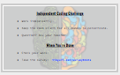

<header class='header' title='Independent Coding Challenge' subtitle='Lesson 9'/>

<notable>
<iconp src='/icons/activity.png'>### Overview</iconp>
We want to establish a coding learning culture where students identify as coders. That means they enjoy challenging themselves, they enjoy learning new things, and they like to address weaknesses in their understanding. Students complete an Independent Coding Challenge to see their progress in the learning objectives covered in lessons 1-8.

<iconp src='/icons/objectives.png'>### Objectives</iconp>
- I can use the editor, block palette, and stage in Scratch to code my program
- I can code a sequence of actions in the order I want them performed.
- I can use the debugging process to debug my code.
- I can step through and act out code that contains a loop.
- I can predict the effects of code that contains a loop.
- I can recognize and identify a repeating pattern.
- I can replace a repeating sequence with a forever loop, for-loop, or while loop to increase code efficiency and readability.

<iconp src='/icons/agenda.png'>### Agenda</iconp>
1. Engage: Set the Challenge (5 min)
1. Explore/Explain: Model Question (5 min)
1. Evaluate: Independent Coding Challenge (35 min)

<note>
<iconp src='/icons/materials.png'>### Materials</iconp>
###### Teacher Materials:
- [ ] [Lesson 9 Slides][slide-show]
- [ ] Projector

###### Student Materials:
- [ ] Pencil
- [ ] [Independent Coding Challenge][icc]
- [ ] Index Cards (class set)
- [ ] Rovers (class set)
- [ ] Student Surveys (class set)
</note>

### Room Design

<note>

<iconp src='/icons/vocab.png'>### Vocabulary</iconp>

See all vocabulary from previous lessons.

</note>

## 1. Engage: Set the Challenge (5 min)

- [ ] **Motivate:** introduce our challenges for today.

> > “You are coders! Coders love to challenge themselves. So today we are going to do a series of Coding Challenges. We want you to see how much you have learned about coding. Some of the challenges may feel easy. Some of the challenges may feel really challenging, which is good!

<note> **Slides:** 
</note>

## 2. Explore/Explain: Model Question (5 min)

- [ ] **Model**: Students may need you to walk them through a practice version of the first question:
> > Let's try this first question together. It looks a lot like the first challenge on your Independent Coding Challenge.

<pagebreak/>

## 3. Evaluate: Independent Coding Challenge (35 min)

- [ ] **Expectations:** Set the expectations for a positive classroom environment for students to feel they can concentrate and push themselves.

> > - (If necessary for room setup:) Use the privacy shields to help you concentrate.
> > - We want to see your own code, so work independently.
> > - Coding takes a lot of brainpower, so keep the room silent for your fellow coders to concentrate.
> > - If you have a question or don’t understand a challenge, ask your teacher with a silent hand.

<note></note>

- [ ] **Independent Coding Challenge:** Students work independently on the challenges. When students are finished encourage them to review and validate their answers. Then they can take the student survey and go to Code.org. If a student is stuck you can help them by:
    - Read the question out loud.
    - Ask guiding questions without giving away an answer:
        - Do you remember when we painted with Rover?
        - Did you validate your code to make sure there are no bugs?
        - Did you use the index card to read each line of code one at a time?
        - What does “sequence” mean?
        - What is a “loop”?

- [ ] **Closing:** Acknowledge the hard work students just did and how excited we are to see their work.

> > "You have tackled a lot of challenges today. You are growing so much as coders! I can't wait to look at your work."

</notable>

[icc]: https://docs.google.com/document/d/1Yf3NHLkcZu8F6c9p7GSH7QXo0dGf6nhD9HzYe7cweHE/edit?usp=sharing
[slide-show]: https://docs.google.com/presentation/d/1ax85reMF15nwSKkqzXcIT0DgWmPmchZaS9igx2uQwDE/edit?usp=sharing
