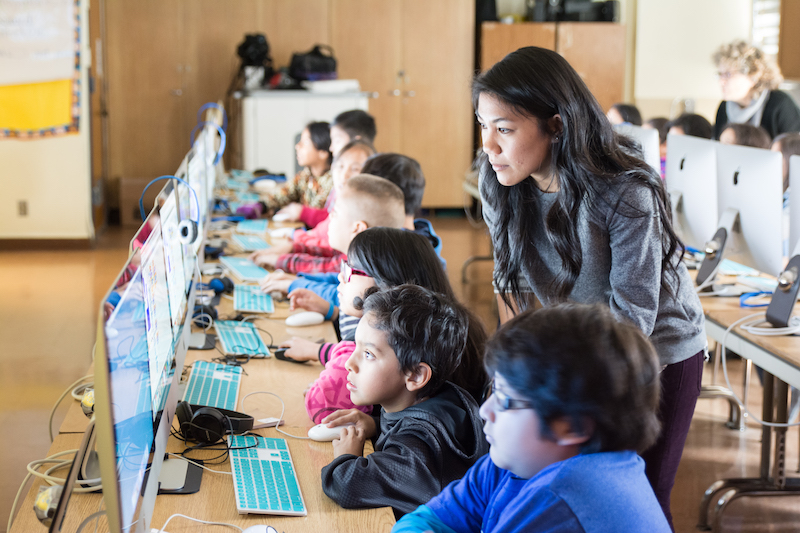

# Welcome to getCoding

Coding is so much more than a language. It's a tool for creating video games, music, and art. A tool for changing the world.
  

We believe that all students should be equipped with the coding skills they need to be creators and active citizens--not just consumers--in the new digital world.
  

Our coding curriculum gives you the tools you need to empower your students to be digital developers, artists, and citizens.

1. **[Grades: K-2](../k-2/index.html)** - An introduction to coding concepts for students who do not yet have the language skills to read and write.
2. **[Grades: 3-5](../3-5/index.html)** - An exploration of the many applications of coding concepts through project- and product-based lessons.

#### Let's getCoding!
