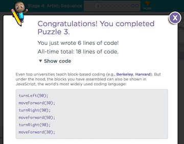

<header title='coding with arguments in code.org' subtitle='plugged'/>

<notable>

<iconp src='/icons/activity.png'>### Overview</iconp>
Students will use numbers as arguments to move an artist to draw on code.org. Arguments are used to specify the length of the line the artist will draw and how many degrees to turn.

<iconp src='/icons/objectives.png'>### Objectives</iconp>

- Students will be able to use arguments on code.org
- Students will be able to use turn blocks with 90°, 60°, and 120°

<iconp src='/icons/agenda.png'>### Agenda</iconp>

1. Engage - Showcase art projects from Code.org (5 mins)
2. Explore - Code the artist (10 mins)
3. Explain - Using arguments to change line length and turn angles (10 mins)
4. Elaborate - Practice using arguments (15 mins)
5. Evaluate - Exit Ticket (5 mins)

<note>

<iconp src='/icons/materials.png'>### Materials</iconp>

###### Teacher materials
- [ ] Projector
- [ ] Computer

###### Student materials
- [ ] Computer
- [ ] [Lesson 12 | Exit Ticket][worksheet]

</note>

## Engage: Showcase art projects from Code.org (5 mins)

- [ ] Choose one or two art projects from [code.org art gallery][art gallery] to show to the class.
	- Run the code of the art
	- Click on “How it works” to display the code of the art.

<note title='code.org art gallery'>

</note>

## Explore: Code the artist (10 minutes)

	“We have been learning about using arguments in function calls the last two classes. Today we will continue to practice using arguments on code.org. to draw.”

- [ ] Remind students of our Write Code Protocol
- [ ] **Independent Exploration:** Students code the first 3 puzzles on [studio.code.org][code.org artist]
	1. Show students how to get to https://studio.code.org/s/course2/stage/4/puzzle/1
	1. Go to studio.code.org
	1. Click on course 2
	1. Under Stage 4: Artist: Sequence, click 1

<note title='Course 2: Stage 4: Artist: Sequence'>

</note>

## Explain: Using arguments to change line lengths and turn angles (10 minutes)

- [ ] **Model** coding [puzzle 3][puzzle 3] and run code.
	- Show js syntax of finished code by clicking “Show Code”

		<iconp type='question'> What are the function calls in our code? </iconp>
		<iconp type='answer'>turnLeft(), moveForward(), turnRight()</iconp>

		<iconp type='question'> What are the arguments in our code? </iconp>
		<iconp type='answer'>90, 30, 50</iconp>

<note title='Show Code'>

</note>

- [ ] **Define** using turn blocks with 90, 60, and 120 as arguments
	- Use [free draw][free draw] on code.org to show different number arguments in the turn blocks.
	- Think out loud of how to draw a triangle
<note>

</note>

	“I want to draw a triangle. Here is my code, but it doesn’t draw a triangle.”

		<iconp type='question'> How do we fix the code? </iconp>
		<iconp type='answer'>Change the number of degrees to 120</iconp>

- [ ] Briefly point out new blocks.

	“Some of you might notice new blocks, the set color blocks are not necessary to complete the following puzzles, but can be fun to use to change the looks for your lines.”

	“Jump is a new block that allows your to move without drawing, this is necessary for some puzzles.”

## Elaborate: Practice using arguments (15 minutes)

- [ ] **Independent Practice:** Students continue to code the artist on [studio.code.org/s/course2][code.org artist]

## Evaluate: Exit Ticket (5 minutes)

- [ ] Pass out [Lesson 12 | Exit Ticket][worksheet] and collect when students finished.
- [ ] After all exit tickets are collected, review answers

	“Who can explain which blocks of code will program the artist to finish drawing the (triangle, square, hexagon, parallelogram)?”

<note>

</note>

</notable>

[worksheet]: ../worksheets/lesson12-wrapup.pdf
[art gallery]: https://studio.code.org/gallery/art
[code.org artist]: https://studio.code.org/s/course2/stage/4/puzzle/1
[puzzle 3]: https://studio.code.org/s/course2/stage/4/puzzle/3
[free draw]: https://studio.code.org/s/course2/stage/4/puzzle/10
