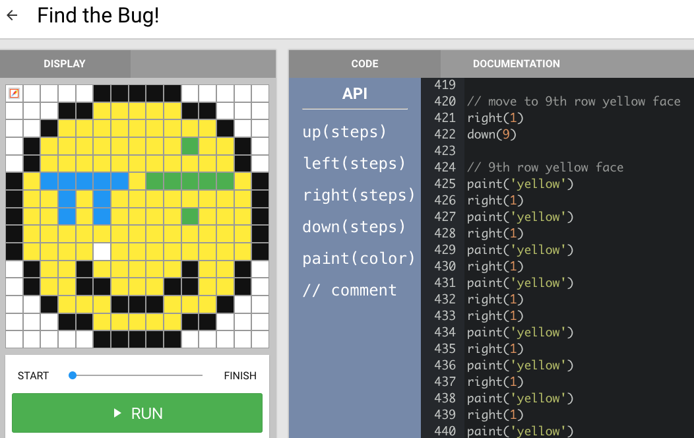
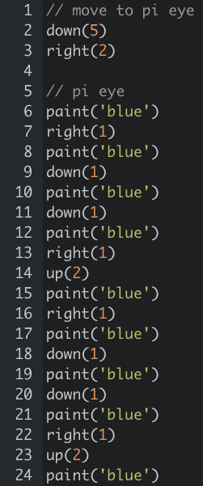

<header title='Lesson 12: Coding Pixel Emojis' subtitle='plugged'/>

<notable>

<iconp src='/icons/activity.png'>### Overview</iconp>
Students use the code planning protocol to organize their project and begin coding their emoji pixel art project.

<iconp src='/icons/objectives.png'>### Objectives</iconp>

- Students will be able to use the code planning protocol to plan the code for their emoji.
- Students will be able to use comments to organize their program.

<iconp src='/icons/agenda.png'>### Agenda</iconp>

1. Engage: Comments are important (5 minutes)
2. Explain: Code planning protocol (5 minutes)
3. Elaborate: Code pixel emoji (30 minutes)
4. Evaluate: Review todo list (5 minutes)

<note>

<iconp src='/icons/materials.png'>### Materials</iconp>

###### Teacher materials
- Projector
- Computer
- [Example Feature & Todo List][example]

###### Student materials
- Computer
- Lesson 12 Worksheet [Page 1][worksheet1] & [Page 2][worksheet2]

<iconp src='/icons/vocab.png'>### Vocabulary</iconp>

</note>

#### Engage: Comments are important (5 minutes)
- [ ] **Contrasting Cases:** Show the importance of planning and comments by comparing math eyed emoji code without and with comments.
  - Students go to [Find the Bug! playlist][playlist] on pixelbots.io
  - **Step 1:** “There is a bug in my code, a pixel was not painted.”
  - **Step 2:**  Search for bug in code challenge 1 in playlist.
  - **Step 3:** Search for bug in code of challenge 2 in playlist.

  <iconp type='question'>Were you able to find the bug?</iconp>
  <iconp type='answer'>The code with the comments helped to find the bug in the code on line 433.</iconp>
  <iconp type='question'>How would we fix the bug?</iconp>
  <iconp type='answer'>Insert paint(‘yellow’) between line 432 and 433</iconp>

#### Explain: Code Planning Protocol (5 minutes)

- [ ] **Define:** Feature List - a document that outlines the important features for a program.

- [ ] **Model:** Write a feature list for the math eyed emoji example, then create a todo list
  - Review decomposition of math eyed emoji
  - The feature list will be the same as the decomposed emoji, if done correctly.

  <note type="tip" title="Tip">
  - Each feature list item should be one color.
  - Features that require less lines of code like eyes and mouth,
    should be first on todo list
  </note>

- [ ] Students write a feature list for their project.

- [ ] **Define:** comment - a line that gets ignored when the code is run.
  >> “Why are comments helpful? Comments are for both you as a programmer to organize your work and for other programmers to understand your work. Anyone should be able to read and understand what all of your code does.”

- [ ] **Model:** Use comments in pixel bots to organize program.
  >> “In our project, we will use comments to organize each feature that needs to be coded. Once all of the comments are in place, you can start adding code to each feature.”

- [ ] Students add comments to their code using their Feature List.

#### Elaborate: Code Pixel Emoji (30 minutes)

- [ ] **Model:** Code the first feature on your todo list, blue pi eye.

- [ ] Support students in coding the features of their emoji.
  - When students get stuck, use the Read, Write, and Debug protocols to support students.

#### Evaluate: Review todo list (5 minutes)

- [ ] Students cross off completed items from todo list.
- [ ] Students assess progress and create a todo list for the next session.
- [ ] Teacher reviews todo lists to prioritize check-ins with students in the next session.

</notable>
[debug]: ../images/debug.png
[example]: https://drive.google.com/file/d/0BzdzqwuMjqy2NjFhZm5QZm1QeVk/view
[pi eye code]: ../images/pieyecode.png
[playlist]: http://www.pixelbots.io/XB4GZ
[worksheet1]: ../../worksheets/lesson12-worksheet1-1.pdf
[worksheet2]: ../../worksheets/lesson12-worksheet1-2.pdf
