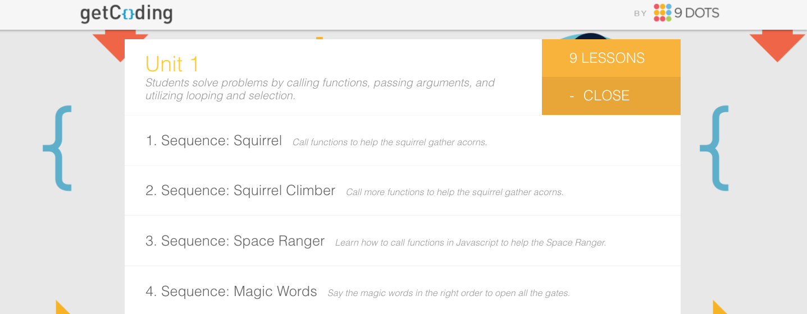

<header title='Calling Functions' subtitle='Lesson 5'/>

<notable>

<iconp src='/icons/activity.png'>### Overview</iconp>
Students write JavaScript online in a series of increasingly difficult challenges involving maneuvering a squirrel to gather nuts, navigating a space ranger to get parts, and opening gates using magic spells.

<iconp src='/icons/objectives.png'>### Objectives</iconp>
1. Students write basic JavaScript to solve simple navigation problems.
1. Students will be able to recognize and use different function calls.

<iconp src='/icons/agenda.png'>### Agenda</iconp>

###### Length: 50 minutes

1. **Do Now:** Write Code (5 minutes)
1. **Engage:** getCoding.io (5 minutes)
1. **Explore:** Sequence Squirrel on getCoding.io (10 minutes)
1. **Explain:** Functions Calls (5 minutes)
1. **Elaborate:** Sequence Space Ranger & Magic Words (20 minutes)
1. **Evaluate:** Exit Ticket (5 minutes)

<note>

<iconp src='/icons/materials.png'>### Materials</iconp>

###### Teacher materials
- [ ] Computer
- [ ] Projector
- [ ] Whiteboard
- [ ] Magnetic pixelBot

###### Student materials
- [ ] [Lesson 5 | Warm-up Worksheet][warm-up]
- [ ] [Lesson 5 | Exit Ticket][wrap-up]
- [ ] Computers
- [ ] Pencils
- [ ] Small pixelBot cutout

<iconp src='/icons/vocab.png'>### Vocabulary</iconp>
- **Code Editor** - The place where coders assemble their program.
- **Function call** - A programming element that tells the computer to do something. In the beginning, most function calls will cause the computer to perform an action.

</note>

#### Do Now: Write Code (5 minutes)
- [ ] Pass out [Lesson 5 | Warm-up Worksheet][warm-up]
- [ ] Students practice writing basic javascript to create a simple pixelBots drawing.

<pagebreak/>
#### Engage: getCoding.io (5 minutes)
- [ ] Introduce [getCoding.io][getCoding] website to students
  >> “We will continue practicing writing code on a new platform.”

- [ ] Walk students through the getcoding.io platform. Show students how to:
  - open activities
  - use the Code Editor (where to type)
  - see elements
  - run code
  - step through the code one line at a time
  - change the speed
<note></note>

#### Explore: Sequence Squirrel on getCoding.io (10 minutes)
- [ ] Direct students to Unit 1, 1. Sequence Squirrel on getCoding.io website.
<note></note>  
- [ ] **Explain** the goal of the activity: move the squirrel to the nut and pick it up.
- [ ] **Independent Practice:** Students do Unit 1, activities 1 and 2
  1. Sequence Squirrel
  1. Sequence Squirrel Climber

<note type="tip" title="Tip">
Students will be exposed to new function calls. Do not explain how they work until they have had the chance to figure it out for themselves.
</note>

#### Explain: Functions Calls (5 minutes)
- [ ] **Review Definition** Function Call: A programming element that tells the computer to do something. In the beginning, most function calls will cause the computer to perform an action.
- [ ] **Discuss** similarities and differences about coding Squirrel on getCoding.io and zebra bot on pixelBots.io
  - On the board:
    1. List the coding elements for zebra on pixelBots
    1. List the coding elements for squirrel on getCoding
    <iconp type='question'>Do zebra and squirrel have the same function calls?</iconp>
    <iconp type='answer'>Some of the names of the functions calls are the same, but they do different actions.</iconp>
    <iconp type='answer'>For squirrel, up(), down(), left(), right() makes squirrel face in that direction.</iconp>
    <iconp type='answer'>For zebra, up(), down(), left(), right() makes zebra move one square in that direction.</iconp>

>> “Programs can have different function calls. It is important to know the function calls and the action that it performs when it is called. “

#### Elaborate: Sequence Space Ranger & Magic Words (20 minutes)
>> “We will continue practicing writing code on getCoding.io. Pay attention to the function calls that are given in each activity.”

- [ ] Direct students to Unit 1, activity 3. Space Ranger.

- [ ] **Independent Practice:** Students write code in JavaScript on the getcoding.io platform to help the Space Ranger gather parts.

- [ ] **Pair Idea Exchange:** Students pause from writing code and talk with a neighbor about the problem they are currently trying to solve.
  - Pairs ask each other the following questions.
    - What is your plan?
    - What have you tried?
    - Is anything standing in your way?
  - Remind students to ask questions instead of offering solutions.
<note></note>

- [ ] Students continue Independent Practice on Space Ranger Activity continues.

- [ ] **Explain** rules to Magic Words.
  - As students finish Space Ranger, pause the class to explain next activity.
  - Rules to Magic Words: Whenever you call out a spell in your program, all of the gates with that spell will move (either up or down, depending on its last position).
<note></note>
- [ ] **Independent Practice:** Students continue to finish activity 3. Space Ranger and then continue to activity 4. Magic Words.

#### Evaluate: Exit Ticket (5 minutes)
- [ ] Pass out [Lesson 5 |  Exit Ticket][wrap-up]
- [ ] Students individually work to complete exit ticket.
- [ ] Review answer after collecting exit ticket, if time allows.

</notable>

[warm-up]: ../worksheets/lesson5-warmup.pdf
[wrap-up]: ../worksheets/lesson5-wrapup.pdf
[getCoding]: www.getCoding.io
