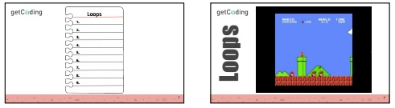

<header class='header' title='Lesson 7' subtitle='Read Loops 2'/>

<notable>
<iconp src='/icons/activity.png'>### Overview</iconp>
Students practice reading code by predicting and stepping through the code of enemies 1-3 in the maze game. Enemies have repeating behavior so students will have to be comfortable reading code that has loops.

<iconp src='/icons/objectives.png'>### Objectives</iconp>
- I can step through and act out code that contains a loop.
- I can predict the effects of code that contains a loop.
- I can summarize what a section of code does on the stage.

<iconp src='/icons/agenda.png'>### Agenda</iconp>
**Small Group: (20 min)**
1. **Engage:** Enemies (5 min)
1. **Elaborate:** Stepping Through Loops (10 min)
1. **Evaluate:** Salsa Practice (5 min)  

**Independent Coding Practice: (20 min)** [Code.org Course 2 Stage 8: Bee Loops](https://studio.code.org/s/course2/stage/8/puzzle/1)

<note>
<iconp src='/icons/materials.png'>### Materials</iconp>
###### Teacher Materials:
- [ ] [Lesson 7 Slides][slide-show]
- [ ] Projector
- [ ] Unplugged Platform
- [ ] Piece of Paper

###### Student Materials:
- [ ] Index cards (1 per student)
- [ ] Idea Journals
- [ ] Pencils
- [ ] Dry erase markers (1/2 class set)
- [ ] [Handout: Maze (1/2 class set)][handout]
- [ ] [Enemies Character (1/2 class set)][characters]
- [ ] [Salsa Cards][salsa-cards]
- [ ] Computers

<iconp src='/icons/vocab.png'>### Vocabulary</iconp>

- **Loop:** A sequence of instructions that is continually repeated until a certain condition is reached.
- **For-Loop:** A type of loop that specifies the number of times to repeat the nested sequence of instructions.

</note>

<pagebreak/>

## Room Design

<note borderLeft='2px solid green' mt='2em'>
###### Symbols Key

<iconp ml='1.65em' type='question'>question</iconp>
<iconp ml='1.65em' type='answer'>answer</iconp>
- [ ] action item
</note>

## Engage: Enemies (5 min)
- [ ] Students setup their journals to make a list.

> > "On the next blank page of your idea journal, setup a page that looks like what you see on the board."
 
- [ ] **Unearth loops in the maze:** Students write a list of movements that may be coded as a loop in their idea journals.

> > "List all the loops you see."
 

- [ ] [Think Pair Share:][tps] Students share their list of loops.

> > "Turn to your table partner and share what loops you listed."
 

- [ ] **Present the Why**

> > "This lesson will allow us to write the code to make our maze look like this."

<note type='key' title='Key Points'>
Loops allow us to repeat sequences without having to write out the entire sequence multiple times.
</note>

###### Slides:

## Elaborate: Support Stepping Through Loops: (10 min)

- [ ] Show students the code for Enemy 1.

> > "Let's look at this code for one of the enemies in the maze."

<iconp type='question'>What do you predict this code will do?</iconp>
<iconp type='answer'>Answers will vary</iconp>

<note type='tip'>
The "Wait 1 secs" block is necessary in Scratch to be able to see the Sprite's movement. When acting out the code, students can pause for one second every time they see this block.
</note>

- [ ] Step through the code using the strategy from lesson 6:

> > "On your paper follow along as we step through this code. Move your index card to uncover each line one at a time. Make a  mark at the end of the sequence each time you complete a loop."
 

- [ ] For grades proficient in writing: Students write a sentence summary on their paper of each enemy’s movements.

> > "Summarize how the enemy moved."
 

- [ ] Repeat this process for Enemies 2 & 3.

###### Slides:

## Evaluate: Salsa Practice (5 min)

- [ ] Students predict and step through the code from one of the four options.
<note type='tip'>
The chili peppers represent the level of difficulty of a card. Four peppers is the most challenging.
</note>

> > "Choose one of the sets of code to predict and step through on your maze. The chili peppers represent the level of difficulty. Start with one or two chili peppers and then work your way up to four."
 
- [ ] Observe student work to evaluate how comfortable students are reading loops.

- [ ] Encourage pairs that finish early to try a more challenging card.

###### Slides:

</notable>

[slide-show]: https://docs.google.com/presentation/d/1xdeJXVRE1wMofw5KSin4iZzqNrtKwqJBOY-RtJPtnec/edit#slide=id.p
[handout]: https://drive.google.com/file/d/0B2wBzr9vcXjPd1gtZFpYSUJIOWc/view
[characters]: https://drive.google.com/file/d/0B2wBzr9vcXjPVTFKd3Z3bXhGUkU/view
[salsa-cards]: https://drive.google.com/file/d/0B2wBzr9vcXjPYzBsV0tTZ21yTDA/view
[tps]: http://www.acpsk12.org/pl/coachs-cuts/think-pair-share/
