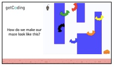
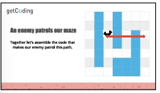

<header class='header' title='Lesson 8' subtitle='Enemies on Patrol'/>

<notable>
<iconp src='/icons/activity.png'>### Overview</iconp>
In this lesson students identify repeating patterns in a sequence and replace the repetition with more efficient code by using a loop.  This is students’ first lesson in writing code with loops. Younger students may need more support and practice with pattern recognition.

<iconp src='/icons/objectives.png'>### Objectives</iconp>
- I can recognize and identify a repeating pattern.
- I can replace a repeating sequence with a forever loop, for-loop, or while loop to increase code efficiency and readability.
- I can code a loop that makes an enemy patrol my maze.

<iconp src='/icons/agenda.png'>### Agenda</iconp>
**Small Group: (20 min)**
1. **Explore:** Code the Enemy (5 min)
1. **Explain:** Translating Patterns to Loops (15 min)  

**Independent Coding Practice: (20 min)** [Continue on Code.org](https://studio.code.org/s/course2/stage/8/puzzle/1)

<note>
<iconp src='/icons/materials.png'>### Materials</iconp>
###### Teacher Materials:
- [ ] [Lesson 8 Slides][slide-show]
- [ ] Projector
- [ ] Unplugged Platform 
- [ ] Piece of Paper 
- [ ] Teacher Scratch Blocks

###### Student Materials: 
- [ ] Index cards (1 per student)
- [ ] Idea Journals
- [ ] Pencils
- [ ] Dry erase markers (1/2 class set)
- [ ] [Code Handouts] [code-handouts]
- [ ] Student Code Blocks: repeat, 2 moves, turn, 2 waits
- [ ] Computers

<iconp src='/icons/vocab.png'>### Vocabulary</iconp>

- **Loop:** A sequence of instructions that is continually repeated until a certain condition is reached.
- **For-Loop:** A type of loop that specifies the number of times to repeat the nested sequence of instructions.

</note>

<pagebreak/>

## Room Design

<note borderLeft='2px solid green' mt='2em'>
###### Symbols Key

<iconp ml='1.65em' type='question'>question</iconp>
<iconp ml='1.65em' type='answer'>answer</iconp>
- [ ] action item
</note>
<pagebreak/>
## 1. Explore: Code the Enemy (5 min)

- [ ] **Introduce:** Remind students of the Escape the Maze game. We are going to write the code for one of the enemies to patrol the maze. Connect this to the ideas they came up with in lesson 2 to improve on the game and make it more challenging. 
<note> 

</note>
- [ ] **Plan:** Act out the movement on the unplugged maze. Use sticky notes to mark which tiles the enemy is moving between. Students can also draw this movement on their maze handout.
<note> 

</note>
- [ ] **Code:** The writer uses the magnetic code strips on the board to code the enemy’s movements.
<note> 

</note>
<iconp type='question'>What pattern do you see in the enemy's movement?</iconp>
<iconp type='answer'>The enemy is moving backwards and forwards.</iconp>  

 

<iconp type='question'>How would we write the code that makes our enemy patrol this part of the maze?</iconp>
<iconp type='answer'>Remind students that in Scratch we use a negative number to move backwards.</iconp>

<iconp type='question'>What pattern do you see in the enemy’s code?</iconp>
<iconp type='answer'>Move 4, Move -4 repeats. Have them circle the repeating pattern.</iconp>

 

<iconp type='question'>What loop could we use to represent the pattern and shorten our code?</iconp>
<iconp type='answer'>Nest two move blocks in a repeat 4 loop. Remind students that in Scratch we use a negative number to move backwards.</iconp>

<iconp type='question'> **Extension Question:** How would we change our code if we wanted the enemy to continue to patrol the maze until game play ends?</iconp>
<iconp type='answer'>Change the repeat loop to a forever loop.</iconp>

 
- [ ] **Validate:** The whole group acts as the computer, reading each line outloud while using the index card.

## 2. Explain: Translating Patterns to Loops (15 min)

</notable>

[slide-show]: https://docs.google.com/presentation/d/1qY2UHzrIAYHKvO47l1gtxVDtr68lObRKzMVWHIrS888/edit#slide=id.p
[code-handouts]: something