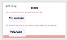
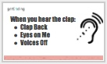
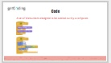
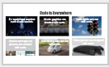
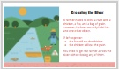
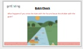
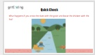
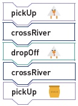
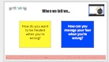

<header class='header' title='I am a Coder' subtitle='Lesson 01'/>

<notable>
<iconp src='/icons/activity.png'>### Overview</iconp>
Students work in groups to tackle a challenging problem-solving game. They begin to view failure as a step towards succeeding. The pre and post lesson resources reinforce the theme that failure is part of the process of learning and building. Create a low stakes environment for students to feel comfortable sharing a wrong solution.

<iconp src='/icons/objectives.png'>### Objectives</iconp>
- I can describe the importance of knowing how to code.
- I am not afraid to fail. I succeed by learning why I failed and trying again.

<iconp src='/icons/agenda.png'>### Agenda</iconp>
1. Introductions (optional)
1. Engage: What is Code (5 min)
1. Explore: River Crossing (25 min)
1. Explain: Solution Sharing (5 min)
1. Elaborate: Norm Building (10 min)

<note>
<iconp src='/icons/materials.png'>### Materials</iconp>
###### Teacher Materials:
- [ ] Projector
- [ ] [Slide Show][slide-show]
- [ ] [Magnetic Code Blocks][Tcode-blocks]
- [ ] [Magnetic Characters][Tcharacters]
- [ ] [Pre and Post Lesson Resources][pre-post]

###### Student Materials:
- [ ] Name Tents & Markers
- [ ] Sticky Notes, 2 Colors
- [ ] [River Crossing Handouts][handout]
- [ ] [Code Blocks][code-blocks]
- [ ] Felt Strip
- [ ] [Character Handout][characters]

</note>

### Room Design

<note>

<iconp src='/icons/vocab.png'>### Vocabulary</iconp>
- **Code** - A set of instructions designed to be carried out by a computer.

###### Symbols Key
<iconp ml='1.65em' type='question'>question</iconp>
<iconp ml='1.65em' type='answer'>answer</iconp>
</note>

<pagebreak/>
## 1. Introductions (optional)

- [ ] **Introductions:** students write their name on one side of their name tent and on the other side they draw or write “When I grow up I want to be a(n) _______________.”

<note type="tip"> Skip this if the instructor already knows their students.
   **Slides:** </note>

- [ ] **Attention Getting Signal:** Teach students your attention getting signal and practice.

<note></note>

## 2. Engage: What is Code (5 min)
Participation: Whole Class, Unplugged

- [ ] **Define** code and present each of the examples on “Code is Everywhere”. Code is what creates the website or computer programs we use. Being a coder is about producing, not just consuming.

<iconp type="question">What is code?</iconp>
<iconp type="answer">A set of instructions designed to be carried out by a computer. It is the instructions someone wrote to make your website, app, game, etc. run.</iconp>

> > “Code is everywhere. Everywhere we look computer programs are running code to run our world.”

<note>
</note>
<pagebreak/>

## 3. Explore: River Crossing (25 min)
Participation: Whole Class ->  Small Group, Unplugged

- [ ] **Challenge** students to tackle the problems today with a productive failure mindset.
> >  “Today we’re going to become coders as we tackle a difficult challenge. Today we will act as both the coder and the computer. We are not going to get it right the first time. When coders make an error it is called a bug. Debugging is at the heart of the practice of coding. So today it is ok when your solution is wrong. We will keep coding and debugging until we have a solution that works."

 

- [ ] **Reveal the Mission**
> > "A farmer needs to cross a river with a chicken, a fox, and a bag of grain. However, his boat can only hold him and one other object. If left together, the fox will eat the chicken and the chicken will eat the grain. You need to get the farmer across the river without losing any of them.""

**Checks for Understanding:**
<iconp type="question"> What happens if the chicken and the fox are left alone while the farmer goes in the boat? </iconp>
<iconp type="answer"> The fox will eat the chicken.</iconp>
<iconp type="question"> If left alone, what will the chicken eat?</iconp>
<iconp type="answer"> The grain</iconp>
<iconp type="question"> If the farmer is with them, will the chicken still eat the grain?</iconp>
<iconp type="answer"> No </iconp>

<note>

</note>

<pagebreak/>

- [ ] **Model** a round of problem solving with the magnetic characters on the board as a whole class.

<note type="tip">Keep a tally on the board of how many solutions we try and throw away - debugging moments. This aims to help students reframe wrong answers as debugging moments, moments of progress.</note>

- [ ] **Group tackle:** In small groups students tackle the challenge using the materials at their desks. Pause every 3-5 minutes to troubleshoot as a whole class and reveal hints as needed.
	- Hint 1: Chicken has to cross the river first.
	- Hint 2: A character can cross the river more than once.
	- Hint 3: The farmer has to take either the chicken or the other item back across the river on his fourth trip.

<note type="tip">The felt is provided for students to stick their code. This also allows you to clip the felt on the board when groups share out their solutions.
</note>

<pagebreak/>

## 4. Explain: Solution Sharing (5 min)
Participation: Whole Class

- [ ] **Solution Sharing:** Call up a group to share out their solution while acting out the code with the magnetic characters on the board.

<note type="tip">Don't use this as a solutions page when checking groups' work. Instead have them role play their solutions to more accurately mimic the debugging process and emphasize that students have the power to identify their bugs and rework their own solutions.
 
</note>

<pagebreak/>

## 5. Elaborate: Norm Setting (10 min)
Participation: Whole Class

- [ ] **Reflection** Students reflect on how it feels to be wrong as they set norms for how they will treat themselves and their peers when they encounter failure.

> > “As coders, we are going to be wrong. It is part of the process of creating good code. It is about how we act and what we do when we fail that defines the kind of coder we are. On your sticky notes answer these two questions:"

<iconp type="question">How do you want to be treated when you’re wrong?</iconp>
<iconp type="question">How can you manage your fear when you’re wrong?</iconp>

<note type="tip">Students may need more prompting with “how does it look like/sound like when…” as follow up questions to oversimplified answers.
 

</note>

 

- [ ] **Closing:** Collect stickies on the board. Group together similar ideas and read outloud. Students can give a thumbs up to ideas with which they agree. Acknowledge the work students have accomplished.

> > “You have such great ideas! This is going to help guide us this year as we become coders in how we are going to treat ourselves and eachother when we encounter bugs in our code. The lesson is that you have to fail before you succeed. Thank you so much for sharing your time and ideas with us today.”

</notable>

[slide-show]: https://docs.google.com/presentation/d/15ayO8DbbLpKE8sAk4XguSR4K9KH7c23RGo9G3mGNbN8/edit?usp=sharing
[Tcode-blocks]: https://drive.google.com/file/d/0B2wBzr9vcXjPVFJSdmpISXlaU2c/view?usp=sharing
[Tcharacters]: https://drive.google.com/file/d/0B2wBzr9vcXjPRDdsaHhzMVpKT3M/view?usp=sharing
[solution]: https://drive.google.com/file/d/0B2wBzr9vcXjPaXZMS1ZDaUVJanM/view?usp=sharing
[pre-post]: https://docs.google.com/document/d/1FJadnUWO4exzRNfrZ7wbNUuTBXjgFHvgwgLV9D8neek/edit?usp=sharing
[handout]: https://drive.google.com/open?id=1KtK75TuiA325kNRi_n6fS5FQMISY1oownFKKqG5Qz18
[code-blocks]: https://drive.google.com/file/d/0B2wBzr9vcXjPVFJSdmpISXlaU2c/view?usp=sharing
[characters]: https://drive.google.com/file/d/0B2wBzr9vcXjPNjhKX19SdGs1OXc/view?usp=sharing
