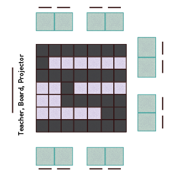
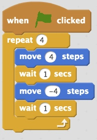
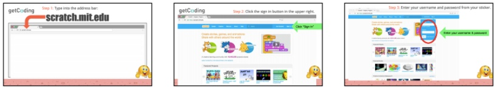
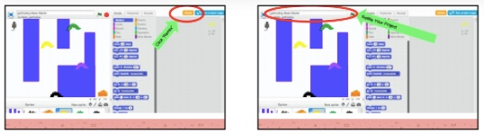

<header class='header' title='Lesson 10 Part2' subtitle='Enemies Everywhere'/>

<notable>
<iconp src='/icons/activity.png'>### Overview</iconp>
This lesson assumes you are completing it in the same period as the ICC review. As a class we write the code for an enemy to patrol the maze while applying their knowledge of loops. This process begins on the unplugged maze and then moves into coding in Scratch.

<iconp src='/icons/objectives.png'>### Objectives</iconp>
- I can use the editor, block palette, and stage in Scratch to code my program.
- I can code a loop that makes an enemy patrol my maze.

<iconp src='/icons/agenda.png'>### Agenda</iconp>
1. Engage & Explore: Code the First Enemy (5 min)
1. Explain & Explore: Code it in Scratch (30 min)

<note>
<iconp src='/icons/materials.png'>### Materials</iconp>
###### Teacher Materials:
- [ ] [Lesson 10 Slides][slide-show]
- [ ] Teacher Scratch Blocks
- [ ] Projector
- [ ] Unplugged Maze

###### Student Materials: 
- [ ] Scratch Studio
- [ ] Idea Journals

<iconp src='/icons/vocab.png'>### Vocabulary</iconp>

- **Loop:** A sequence of instructions that is continually repeated until a certain condition is reached.
- **Sprite:** An object that can perform an action.
- **Editor:** A program designed for editing computer code by coders.
</note>

<pagebreak/>

## Room Design

<note borderLeft='2px solid green' mt='2em'>
###### Symbols Key

<iconp ml='1.65em' type='question'>question</iconp>
<iconp ml='1.65em' type='answer'>answer</iconp>
- [ ] action item
</note>

## 1. Engage & Explore: Code the First Enemy (5 min)
Participation: Whole Class, Unplugged

- [ ] **Motivate:** Frame the purpose of this lesson. Show students the original Escape the Maze game.

<iconp type='question'>What did we want to improve upon first in our game?</iconp>
<iconp type='answer'>Make the enemies move instead of stay still.</iconp>

> > “Yes! We are going to write the code for one of the enemies to patrol the maze. We’ve been practicing reading and writing code to improve on the game and make it more challenging. Today we will make it happen!”

<note type="tip"> Use sticky notes to mark which tiles the enemy is moving between. Students can also draw this movement on their maze handout.</note>

- [ ] **Question Driven:** Prompt students with questions to write the first enemy’s code as they act it out on the unplugged maze.

> > “I need one student to come up to the unplugged maze and act out the back and forth movement of the enemy that you see on the board.”

> > “I need a second student to act as the writer and place the magnetic code blocks on the board as we write the code together.”

> > “I want to write code that makes this enemy move back and forth.”

<iconp type='question'>What pattern do you see in the enemy’s movement?</iconp>
<iconp type='answer'>The enemy is moving backwards and forwards.</iconp>

<iconp type='question'>How would we write the code that makes our enemy patrol this part of the maze?</iconp>
<iconp type='answer'>Remind students that in Scratch we use a negative number to move backwards.</iconp>
                  

<iconp type='question'>What pattern do you see in the code we wrote?</iconp>
<iconp type='answer'>Move 4, Move -4 repeats. Circle the repeating pattern.</iconp>

<iconp type='question'>What loop could we use to represent the pattern and shorten our code?</iconp>
<iconp type='answer'>Nest two move blocks in a repeat 4 loop. Remind students that in Scratch we use a negative number to move backwards.</iconp>
 

<iconp type='question'>**Extension Question:** How would we change our code if we wanted the enemy to continue to patrol the maze until game play ends?</iconp>
<iconp type='answer'>Change the repeat loop to a forever loop.</iconp>

<note type="key" title="To Write a Loop:">
1. Identify the repeating element of a pattern and how many times it repeats.
1. Place the repeating section of code within the loop’s block.
1. Place the number of times the pattern repeats as the loop’s argument.</note>

## 2. Explain: Code it in Scratch (30 min)
Participation: Whole Class on Computers

- [ ] **Demonstrate:** Add the enemy code in Scratch. (10 min)

> > ”We just wrote the code to control one of the enemies. So now let’s put the code into our game!” 

<note type="key" title="key point">When writing code we follow the process of plan, code, validate.</note>

**Step 1:** Click “See Inside” to view the editor.

**Step 2:** Select the Sprite we will write the code for (Enemy 1). 

**Step 3:** Copy the code from the board into the editor and click the green flag to test the code.
<iconp type='question'>Why does it look like nothing happens?</iconp> 
<iconp type='answer'>Because we need to use “wait” blocks to see the movement, otherwise the computer is performing the movement so quickly we cannot see it.</iconp>
 

**Step 4:** Add the wait blocks and click the green flag to test the code. 
<iconp type='question'>It look like it barely moves. How can we fix this?</iconp>
<iconp type='answer'>Adjust the code to make the enemy travel an equivalent distance in Scratch to the unplugged maze by changing the arguments in the move block to 200 and -200. Change this in the magnetic blocks on the board as well.</iconp>
 

**Step 5:** Click the green flag to test the code again.

- [ ] **Making:** (20 min) Walk students through the steps to navigate to and remix the starter code to produce their own version. 

> > “Now it is your turn. Let’s login to your Scratch account and put the code into your own version of the maze.”

<note type="tip">
Students have not been on Scratch in a while so they will need you to guide them through explicit directions to navigate to their project. One way to do this is: 

- Students place their hands on their heads
- Demonstrate 3 steps
- Give a go signal for students to do the 3 steps while you repeat them
- Students place their hands on their heads when ready for the next set of instructions
</note>

- [ ] **Challenge:** (if time) Allow students to experiment coding different enemies. We will follow a more formal process in Lesson 11.

“Think back to all the code you wrote in Lessons 7 & 8. Can you write the code to make a different enemy spin? Can you make one travel in a square?”

</notable>

[slide-show]: https://docs.google.com/presentation/d/1FYKb6QpjKcpymzLRw4CAEs_r0DKZ5RElQh8bizPxPsc/edit?usp=sharing