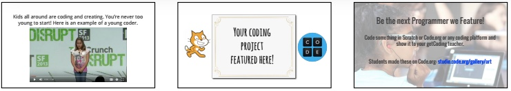
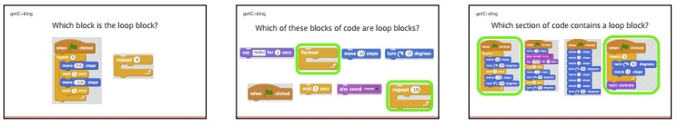
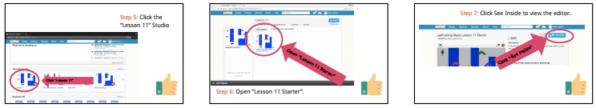
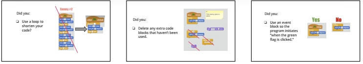

<header class='header' title='Lesson 11' subtitle='Enemies Everywhere Continued'/>

<notable>
<iconp src='/icons/activity.png'>### Overview</iconp>
In Lesson 10 students wrote the code in the Scratch editor to make an enemy patrol the maze in a line. In this lesson students will continue to practice writing enemy code using loops in Scratch.

<iconp src='/icons/objectives.png'>### Objectives</iconp>
- I can use the editor, block palette, and stage in Scratch to code my program.
- I can code a loop that makes an enemy patrol my maze.

<iconp src='/icons/agenda.png'>### Agenda</iconp>
1. Engage: Kids Code (5 min)
1. Elaborate: Enemies on Patrol (30 min)
1. Evaluate: Submit Your Code (10 min)

<note>
<iconp src='/icons/materials.png'>### Materials</iconp>
###### Teacher Materials:
- [ ] [Lesson 11 Slides][slide-show]
- [ ] [Scratch Studio Starter Code][starter-code]
- [ ] Projector
- [ ] [Scratch Example of Finished Code][exemplar]

###### Student Materials: 
- [ ] Computers
- [ ] [Lesson 8 Handouts][handout]
- [ ] Idea Journals
- [ ] Dry Erase Markers (class set)

<iconp src='/icons/vocab.png'>### Vocabulary</iconp>

- **Loop:** A sequence of instructions that is continually repeated until a certain condition is reached.
- **Sprite:** An object that can perform an action.
- **Editor:** A program designed for editing computer code by coders.
</note>

<pagebreak/>

## Room Design

<note borderLeft='2px solid green' mt='2em'>
###### Symbols Key

<iconp ml='1.65em' type='question'>question</iconp>
<iconp ml='1.65em' type='answer'>answer</iconp>
- [ ] action item
</note>

## 1. Kids Code (5 min)

- [ ] **Engage:** Showcase young student programmer and show [video][video].

> > "Kids all around are coding and creating. You’re never too young to start! Here is an example of a young coder.”

- [ ] Introduce platforms for kids to create projects.
* Scratch
* Code.org 
* [Code an artist][code-an-artist]

> > “If you code a project on your own, we would like to feature your project/app at the start of our class.”

## 2. Elaborate: Enemies on Patrol (30 min)

- [ ] Vocabulary Review: On the ICC students had difficulty identifying the loop block. Use this as an opportunity to review what the loop structure looks like in Scratch. (4 min) 

<iconp type='question'>Which block is the loop block?</iconp>
<iconp type='question'>Which of these blocks of code are loop blocks?</iconp>
<iconp type='question'>Which section of code contains a loop block?</iconp>

- [ ] **Remind** students of code they wrote in lesson 10. (1 min)  

> > “In lesson 10 we planned, coded, and validated the loop that made our Escape the Maze game a little more exciting by making the enemy patrol the maze.” 

- [ ] **Demonstrate:** Show students how to navigate to the Scratch studio and enter the code from their first enemy in Scratch. (5 min) View the steps here.

> > “This is the code you wrote in lesson 8 to make the enemies patrol your maze. Today we are going to put our code into Scratch.”

**Step 1:** Click “See Inside” to view the editor.

**Step 2:** Select the Sprite we will write the code for (Enemy 1). 

**Step 3:** Enter the code written as a sequence and click the green flag to test the code.

**Step 4:** <iconp type='question'>Didn’t we write this in a better way?</iconp>
<iconp type='answer'>Have students tell you how to replace the code with a loop that contains the repeating pattern and click the green flag to test the code.</iconp>

**Step 5:** <iconp type='question'>What if we want the enemy to patrol until the end of game play?</iconp>
<iconp type='answer'>Replace the repeat loop with a forever loop.</iconp> 

<note type="tip">If you lose an enemy off the Stage click the “r” key to reset the positions of all of the enemies.</note>

- [ ] **Making:** Students get on Scratch and add the code for all of the enemies they coded in Lesson 8. (20 min)

> > “Now it is your turn. Let’s login to your Scratch account and put the code into your own maze. Start with Enemy 1.”

<note type="tip"> Some of the enemies may need debugging after the code is written in Scratch by adding wait blocks or adjusting the number of steps. Pause the class to remind them of this process from lesson 10.</note>

## 3. Submit Your Code (10 min)

- [ ] **Evaluate:** Share with students what you are looking for when viewing their code.

> > “Before we wrap up, let’s take a few minutes to look over our work. Did you:
- use the correct repeating pattern in the loop?
- use a loop to shorten your code?
- delete any extra code blocks that haven’t been used?
- use an even block so your program initiates when the green flag is clicked?”

- [ ] **Exit Ticket:** Model how to properly title, remix/share, and add their projects to the studio for you to view. 

**Step 1:** Click “Remix”

**Step 2:** Click the title and delete remix

**Step 3:** Add your first name to title.  Example: Lesson 11 Starter Maayan

**Step 4:** Click “See project page” 

**Step 5:** Click “Studios”

**Step 6:** Click check mark next to Lesson 11

<note type="tip"> After the lesson the teacher should view student progress in the studio and target individuals who need assistance in further programming. It is ok if students did not code all 6 enemies, but they should have the code for at least one enemy they wrote on their own. You can view an example of what the finished code might look like [here][exemplar].</note>

</notable>

[slide-show]: https://docs.google.com/presentation/d/1fdFUCvEZMqRLqZ-2s5JmR7jYWQPmQlxgaiiYnoNU-IY/edit#slide=id.p
[starter-code]: https://scratch.mit.edu/projects/138905189/
[exemplar]: https://scratch.mit.edu/projects/138901128/
[handout]: https://drive.google.com/file/d/0B2wBzr9vcXjPbmZZRHVNVTcwM2M/view?usp=drive_web
[code-an-artist]: https://studio.code.org/gallery/art
[video]: https://drive.google.com/open?id=0B2wBzr9vcXjPSTJCWmdDdDFFbXc