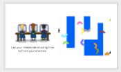
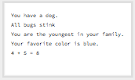
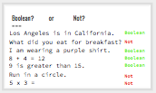
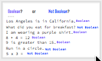

<header class='header' title='Lesson 13' subtitle='Boolean'/>

<notable>
<iconp src='/icons/activity.png'>### Overview</iconp>
Students are introduced to “boolean” and practice identifying true/false statements.

<iconp src='/icons/objectives.png'>### Objectives</iconp>
- I can identify Boolean as true/false statements.

<iconp src='/icons/agenda.png'>### Agenda</iconp>
1. Engage: Kids Code (5 min)
1. Explore: True/False (5 min)
1. Explain: Define (5 min)
1. Elaborate: Boolean Code (5 min)
1. Evaluate: Exit Challenge (5 min)

<note>
<iconp src='/icons/materials.png'>### Materials</iconp>
###### Teacher Materials:
- [ ] Projector
- [ ] [Slide Show][slide-show]
- [ ] [Answer Key][answer-key]

###### Student Materials: 
- [ ] Computers
- [ ] [Exit Challenges][exit-challenge]
- [ ] [Boolean Cards][boolean-cards]
- [ ] Idea Journals
- [ ] Pencils
- [ ] Code Blocks

</note>

## Room Design

<note>
<iconp src='/icons/vocab.png'>### Vocabulary</iconp>

- **Boolean:** A statement that can be "true" or "false".

###### Symbols Key

<iconp ml='1.65em' type='question'>question</iconp>
<iconp ml='1.65em' type='answer'>answer</iconp>
- [ ] action item
</note>

## 1. Kids Code (5 min)
Participation: Whole Class Unplugged

- [ ] **Showcase** young student programmer

> > “Kids all around are coding and creating. You’re never too young to start! ”

<note>
</note>

- [ ] **Challenge** students to be the next programmer we feature.

> > “If you code a project on your own, we would like to feature your project/app at the start of our class. Code something in Scratch or Code.org or any coding platform and show it to your getCoding teacher.”

<note>
</note>

- [ ] **Motivate** students by connecting today’s lesson to their Escape the Maze game. 

> > “Last week when we played the three versions of our Escape the Maze game, what happened when the hero touched an enemy? The hero was sent back to the start! In order to write this code, we first need to learn about boolean code. When you are working independently on the computers you can work on finishing your enemies in Scratch. When you are working in our small group we will be learning about boolean, the foundation to programming enemies that react when the hero touches them.”

<note>

</note>

<pagebreak/>
## 2. Explore: True/False (5 min)
Participation: Small Group Unplugged 

- [ ] **True/False:** Students hold up True or False to respond to questions. 

<note type="tip">Have students hold their card up against their collarbone. 

</note> 

> > “Answer each statement by holding up ‘True’ or ‘False’ on your card.”

- You have a dog.
- All bugs stink
- You are the youngest in your family.
- Your favorite color is blue.
- 4 + 5 = 8
- You like to draw.
- The light is green.
- Kittens grow up to be cats
- Italy is a candy.

- [ ] **Contrasting Cases:** Give students two list of statements and ask:

<iconp type="question">What do you think Boolean means?</iconp>

|Boolean Statements|Not Boolean Statements|
|----------------------|------------------------|
| I have a dog.        | Say hello.             |
| You are the youngest in your family.| Spin in a circle and touch your toes. |
| 10 is greater than 2 | Draw a circle.         |
| Italy is a candy.    | Repeat 5 times.        |
| 4 + 5 = 8            | Wait for 1 second.     |

<note>
 </note>

<pagebreak/>
## 3. Explain: Define (5 min)
Participation: Small Group Unplugged 

- [ ] **Define** boolean - students write the definition in their idea journals.

> > “On a blank page in your idea journal let’s write the definition of Boolean. Boolean - A statement that can either be "true" or "false".”

<note></note>

- [ ] **Contrasting Cases:** Review the contrasting cases from above.

> > “You answered each of the statements on the left with “True” or “False”. It doesn’t make sense to answer the non-boolean statements with true/false. If I say “Draw a circle”, you would respond by drawing a circle. If you responded “false”, I would be very confused.”

<note></note>

- [ ] **Popcorn:** Students hold up Boolean or Not Boolean cards to respond to questions. Pop around the room to different students asking them to explain if each statement is a boolean statement or not. It is important to have them say the word “boolean” to cement the term. 

<iconp type="question"> Is this a boolean statement or not? If you’re not sure, try to answer true/false first.</iconp>

| Statement | Answer |
|------------------------------|----------|
| Los Angeles is in California. |	boolean |
| What did you eat for breakfast? | Not boolean |
| I am wearing a purple shirt. |	boolean |
| 8 + 4 = 12	|	 	boolean |
| 9 is greater than 15. 	|	boolean |
| Run in a circle. 	|		Not boolean |
| 5 x 3 = 		|		Not boolean |

<note>
</note>

- [ ] **Check for Understanding:**

<iconp type="question">Patty is taking a Boolean test. How do we know? </iconp>
<iconp type="answer">All the questions can be answered with “True” or “False”. </iconp>

<note></note>

## 4. Elaborate: Boolean Code (5 min)    
Participation: Small Group, Partners, Unplugged 

- [ ] **Contrasting Cases:** Give students a series of Scratch blocks and have them work in partners to identify which are examples of Boolean statements. 

> > “In your box you have a series of code blocks. Sort your blocks into two piles: those that are boolean blocks and those that are not. Use your cards to label each group. If you’re having trouble, try answering the statements with true/false.”

<note type="tip">If you are short on time, this section of the lesson can be done in lesson 14.
 </note>

<iconp type="question"> What do you notice about the shape of boolean blocks? </iconp>
<iconp type="answer">The ends of boolean blocks have points like triangles.</iconp>

## 5. Evaluate: Exit Challenge (5 min)
Participation: Small Group, Independent, Unplugged 

- [ ] **Exit Challenge:** Students answer the [exit challenge][exit-challenge] on paper using pencil independently and turn it in.

> > “Try these three challenges independently to test your new knowledge of booleans!”

<note> </note>

- [ ] **Closing:** Collect exit challenges and remind students of their goal for independent work.

<note>

</note>

</notable>

[slide-show]: https://docs.google.com/presentation/d/1e1pb_i3jLzJHgTZ3zRVfOR3S3PrjVpg7rE7Z4WmrWYQ/edit?usp=sharing
[answer-key]: https://docs.google.com/document/d/1VCO5Z0fPzbgoiQgkzvngx9JP_BMw0xfmHmjADoLOyaY/edit?usp=sharing
[exit-challenge]: https://docs.google.com/document/d/1Ep32lyMTvf5f5oCggVSgyIqNUWsAeefzj6zFtGm04J4/edit
[boolean-cards]: https://docs.google.com/document/d/1ENgpq-WdFCHz869IwJ9gVTF9bnf_TYze7dyVgDiy6uE/edit