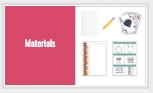
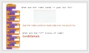
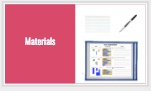
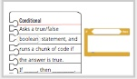
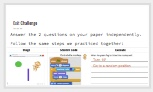

<header class='header' title='Lesson 15' subtitle='Build-a-Bot'/>

<notable>
<iconp src='/icons/activity.png'>### Overview</iconp>
Students practice reading code with conditionals by checking the boolean statement and then deciding if the nested code in the conditional should be executed or not. Conditional statements include code that causes the hero and enemy to interact. Students practice reading code written with conditionals that instructs them in drawing a robot.

<iconp src='/icons/objectives.png'>### Objectives</iconp>
- I can read an if-then statement to execute a sequence if a test is true.

<iconp src='/icons/agenda.png'>### Agenda</iconp>
1. Engage: Kids Code (5 min)
1. Explore: Build-a-Bot (15 min)
1. Explain: Read Protocol (5 min)
1. Elaborate: Conditionals in Scratch (15 min)
1. Evaluate: Exit Challenge (5 min)

<note>
<iconp src='/icons/materials.png'>### Materials</iconp>
###### Teacher Materials:
- [ ] Projector
- [ ] [Slide Show][slide-show]

###### Student Materials: 
- [ ] [Lesson 15 Handout][handout1]
- [ ] [Bots Code Handout][handout2]
- [ ] [Bots Picture Handout][handout3]
- [ ] [Exit Challenges][exit-challenge]
- [ ] Index Cards
- [ ] Pencils
- [ ] Dry erase markers
- [ ] Playing Cards (min 6 per student)

</note>

## Room Design
Students do not need a special setup for this lesson as they will not be on computers. It will help if they are sitting in pairs.

<note>

<iconp src='/icons/vocab.png'>### Vocabulary</iconp>

- **Boolean:** A statement that can be "true" or "false".
- **Conditional** Asks a boolean statement, and runs a chunk of code if the answer is true.

</note>

###### Symbols Key

<iconp ml='1.65em' type='question'>question</iconp>
<iconp ml='1.65em' type='answer'>answer</iconp>
- [ ] action item

<pagebreak/>

## 1. Kids Code (5 min)
Participation: Whole Class Unplugged

- [ ] **Showcase** the video of Anivitha, the youngest programmer to attend Apple’s Worldwide Developer Conference last year.

> > “Kids all around are coding and creating.”

<note>
</note>
- [ ] **Challenge** students to be the next programmer we feature.

> > “If you code a project on your own, we would like to feature your project/app at the start of our class. Code something in Scratch or Code.org or any coding platform and show it to your getCoding teacher.”

<note>
</note>
 

- [ ] **Motivate** students by connecting today’s lesson on reading conditionals to their Escape the Maze games.

<iconp type="question"> When you played the 3 versions of Escape the Maze, what happened when the hero touched an enemy?</iconp>
<iconp type="answer">It went back to the start.</iconp>
> > “This is an example of code that uses a conditional! Today you are going to read the code that caused the hero to react to touching the enemies.”

<note>
</note>

## 2. Explore: Build-a-Bot (15 min)
Participation: Independent Unplugged

- [ ] **Connect Prior Knowledge:** 

<iconp type="question"> The code on the side of your paper are your instructions for building your robot. What are we going to use our index cards for?</iconp>
<iconp type="answer">Uncover each line of code one at a time as we read.</iconp>
<iconp type="question"> Look at the yellow blocks of code on your paper that start with “If”. What do we call code that starts with “If”?</iconp>
<iconp type="answer">Conditionals. Bonus if they can identify the triangular Boolean statement as well.</iconp>
<note>

</note>
- [ ] **Model** the steps to reading conditionals as you complete your own bot on the board. When you read each Boolean statement read it “... is true”. 

Steps for reading code with conditionals:
1. **Draw a box** around the conditional statement.
1. **Identify** if the Boolean statement is ✓ true or X false?
1. **Step** through code before the conditional statement.
1. **If true:** Jump into the conditional.
1. **If false:** Skip the conditional statement.
1. **Step** through code after the conditional statement.

<note>

</note>

- [ ] **Explore:** Students draw cards following the teacher model to complete their own bot.

> > “Your turn. Follow my steps and don’t forget to use your index card as you build your own bot.”

 

- [ ] **Share:** If time allows, call up a couple of volunteers to share their bots with the class.

## 3. Explain: Read Protocol (5 min)
Participation: Whole Class Unplugged

- [ ] **Model:** Follow the same steps you introduced in explore to read the Scratch code in the first example on the handout.

> > “In the last lesson we were translating Scratch code with conditionals. In this lesson we will read how the conditional code is executed. That means what happens when we run the conditional code.”

Steps for reading code with conditionals:
1. **Draw a box** around the conditional statement.
1. **Identify** if the Boolean statement is ✓ true or X false?
1. **Step** through code before the conditional statement.
1. **If true:** Jump into the conditional.
1. **If false:** Skip the conditional statement.
1. **Step** through code after the conditional statement.

<note>

</note>

## 4. Elaborate: Conditionals in Scratch (15 min)
Participation: Pairs Unplugged

- [ ] **Pair Practice:** Students continue with challenges 2-6 on the handout in pairs. Younger grades that are not as proficient in writing can do this as a Pair-Share activity where they say their statement to their partner. A good way to pace this activity is to give groups 90 seconds for each challenge and then 30 seconds to share whole group. Have students write out at least one of the problems so they are prepared to write on the exit challenge.

<note>!
There are 8 more slides in this section.
</note>

## 5. Evaluate: Exit Challenge (5 min)
Participation: Independent Unplugged

- [ ] **Exit Challenge:** Students answer the [Exit Challenge][exit-challenge] on paper using pencil independently and turn it in.

> > “Try these three challenges independently to test your new knowledge of conditionals!”

<note>

</note>

</notable>

[handout1]: https://docs.google.com/document/d/1fSpf8pCcVZ0IOAqMHoqblKPumZ1YzYSHaOhpN-_yHrU/edit?usp=sharing
[handout2]: https://drive.google.com/file/d/0B2wBzr9vcXjPQmdYWE1BZ2dTN2M/view?usp=sharing
[handout3]: https://drive.google.com/file/d/0B48_2vIyABiobmdhS2wxWjctSGs/view?usp=sharing
[exit-challenge]: https://docs.google.com/document/d/17CoW2GSrtILlClHWW7BEO2LIaL7V3PUfHG7T1V2UmOc/edit?usp=sharing
[slide-show]: https://docs.google.com/presentation/d/1iyrvTfBPOIJBptvhT4CYhAbtus-xAybmmpDaX4NL6go/edit?usp=sharing