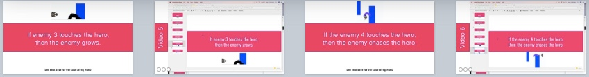
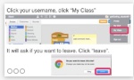

<header class='header' title='Lesson 17' subtitle='Write Conditionals 2'/>

<notable>
<iconp src='/icons/activity.png'>### Overview</iconp>
Students apply their knowledge of conditionals to write code in their Escape the Maze projects that cause the hero and enemies to interact.

<iconp src='/icons/objectives.png'>### Objectives</iconp>
- I can write an if-then statement to execute a sequence if a test is true.
- I can write a conditional (if-then) to make my maze hero and enemies interact.

<iconp src='/icons/agenda.png'>### Agenda</iconp>
1. Engage/Explore: Code Along (15 min)
1. Explain: Design (5 min)
1. Elaborate: Code (20 min)
1. Evaluate: Submit (5 min)

<note>
<iconp src='/icons/materials.png'>### Materials</iconp>
###### Teacher Materials:
- [ ] Projector
- [ ] [Slide Show][slide-show]
- [ ] [Scratch Studio][studio]

###### Student Materials:
- [ ] Computers
- [ ] Idea Journals
- [ ] Code Along Handout & Checklist

</note>

## Room Design
Students will be on computers for the entire lesson. Your room setup should allow students to easily see the board and you to easily walk around the room and view their screens.

<note>

<iconp src='/icons/vocab.png'>### Vocabulary</iconp>

- **Conditional** Asks a boolean statement, and runs a chunk of code if the answer is true.

</note>

###### Symbols Key

<iconp ml='1.65em' type='question'>question</iconp>
<iconp ml='1.65em' type='answer'>answer</iconp>
- [ ] action item

<pagebreak/>

## 1. Engage/Explore: Code Along (15 min)
Participation: Independent Online

- [ ] **Code along:** Students navigate to the Lesson 16 studio and work in the “code along” project with the teacher.

<note type="tip">You can show the videos for each challenge or write the code yourself in Scratch.</note>

The four conditionals we will demo are:

1. If the goal touches the hero, then the backdrop changes to level 2 and the goal moves to the opposite end.
1. If Enemy 2 touches the hero, then the enemy changes color.
1. If Enemy 3 touches the hero, then it grows.
1. If Enemy 4 touches the hero, then he chases the hero.

Finished product looks like this https://scratch.mit.edu/projects/143255918/#editor
 

## 2. Explain: Design (5 min)
Participation: Independent Unplugged

- [ ] **Plan:** students view the code along they completed and plan the conditionals they will add to their game today.

> > “Now that you have seen the power of conditionals, it is your turn to write conditionals into your Escape the Maze project. The code you write today will be the start of your final version of the project. Take a minute to plan in your Idea Journal what conditionals you will write into your project. You can see all of the code we wrote in our code alongs on the handout.”

**Student Handout:**

<note></note>

## 3. Elaborate: Code (20 min)
Participation: Independent Online

- [ ] **Make:** Students add the conditionals code to their projects following their plan and the code we demoed in the Code Along.

> > “Navigate to the Final Project studio in Scratch and start to add the code you planned in your journal.”

<note>

</note>

## 4. Evaluate: Submit (5 min)
Participation: Independent Online

- [ ] **Evaluate:** Students check their projects against the rubric checklist and ensure their project is in the Lesson studio.

> > “Let’s read through the submission checklist and follow the steps to submit our project. You will have more time to work on the project next week so you are not expected to be done today.”

**Student Handout:**

<note>

</note>

</notable>

[slide-show]: https://drive.google.com/file/d/0B2wBzr9vcXjPSkdTbThzcmQzRTQ/view?usp=sharing
[studio]: https://scratch.mit.edu/studios/3755751/
