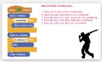
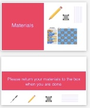

<header class='header' title='Lesson 18' subtitle='Where is Rover'/>

<notable>
<iconp src='/icons/activity.png'>### Overview</iconp>
In small groups students build their argumentation skills to debate where Rover lands while they practice reading conditionals. Independently, students continue to practice writing conditionals and loops in their Escape the Maze projects. 

<iconp src='/icons/objectives.png'>### Objectives</iconp>
- I can write an if-then statement to execute a sequence if a test is true.
- I can write a conditional (if-then) to make my maze hero and enemies interact.

<iconp src='/icons/agenda.png'>### Agenda</iconp>
1. Engage: Kids Code (5 minutes)

Small Groups
1. Engage: Dance Dance Conditionals (2 minutes)
1. Elaborate: Where’s Rover (13 minutes)
1. Evaluate: Exit Challenge (5 minutes)

Independent Work 
1. Finish Conditionals in Project (20 minutes)

<note>
<iconp src='/icons/materials.png'>### Materials</iconp>
###### Teacher Materials:
- [ ] Projector
- [ ] [Slide Show][slide-show]
- [ ] Rover (large)
- [ ] Foam Tiles (with numbers written in permanent marker)

###### Student Materials: 
- [ ] Computers
- [ ] Idea Journals
- [ ] [Where's Rover Handout][handout] 
- [ ] Index Cards
- [ ] Rovers
- [ ] Dry Erase Markers
- [ ] [Exit Challenges][exit]
- [ ] Pencils

</note>

## Room Design

<note>

<iconp src='/icons/vocab.png'>### Vocabulary</iconp>

- **Conditional** Asks a boolean statement, and runs a chunk of code if the answer is true.

</note>

###### Symbols Key

<iconp ml='1.65em' type='question'>question</iconp>
<iconp ml='1.65em' type='answer'>answer</iconp>
- [ ] action item

## 1. Engage: Kids Code (5 min)
Participation: Whole Class Unplugged

- [ ] **Showcase** Mostafa’s project from Alexandria. Mostafa coded this game on his own using the code alongs he did in class! Play the game and show the code behind it.

<note>**Slides:**  </note>

- [ ] **Challenge** students to be the next programmer we feature.

> > “If you code a project on your own, we would like to feature your project/app at the start of our class. Code something in Scratch or Code.org or any coding platform and show it to your getCoding teacher.”

- [ ] **Motivate** students by introducing today’s lesson. 

> > “In our small group we will continue to work towards mastering conditionals. While you work independently on the computers, continue to add conditionals to your Escape the Maze project.”

<note> </note>

## 2. Engage: Dance Dance (2 min)
Participation: Small Group Unplugged

- [ ] **Review** the steps of reading conditionals by calling a volunteer up to the front to perform the dance code on the board. 

<note>**Slide:**  </note>

## 3. Elaborate: Where's Rover (13 min) 
Participation: Small Group Unplugged

- [ ] **Argumentation:** Students get the Where's Rover handout. They individually practice reading the code as they move Rover around their grid to determine where he lands. Give students a minute to try the problem on their own and then have students argue their answer by stepping through the code and moving Rover on the large foam tiles. The discussion should be student led. Provide sentence starters for students to respond to answers they believe are not correct: 
- “I disagree with your answer because…”
- “Can you show me how you got…”
- “What line of code shows that…” 

<note type="tip"> Not every group will complete all 5. Number 5 is challenging because there is a loop with conditionals nested inside. This means students will need to evaluate the Boolean statement each time they run through the loop. 
 
**Slides:**

</note>

- [ ] **Optional If Time**: On the back of the handout students use the debugging protocol to determine what error was made while reading the code.

<note> 
</note>

## 4. Evaluate: Exit Challenge (5 min)
Participation: Independent Unplugged

- [ ] **Evaluate:** Students answer the Exit Challenge on paper using pencil independently and turn it in.

> > “Try these challenges independently to test your knowledge of reading conditionals!”

<note> **Slides:**

</note>
</notable>

[slide-show]: https://drive.google.com/open?id=0B2wBzr9vcXjPcTB1bFBxNGhRQzQ
[handout]: https://drive.google.com/file/d/0B2wBzr9vcXjPaFhWVG83TEhaMjg/view?usp=sharing
[exit]: https://drive.google.com/file/d/0B2wBzr9vcXjPUkFOajdHbHhlQTg/view?usp=sharing
