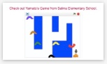
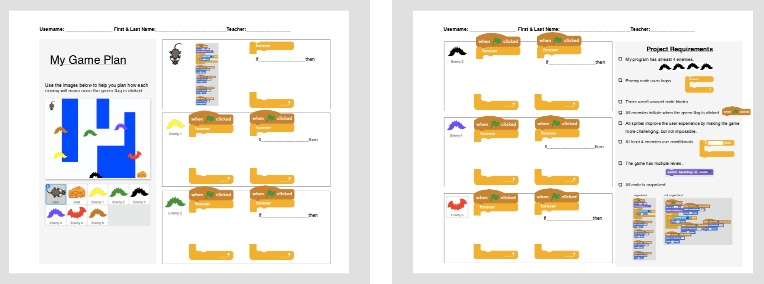
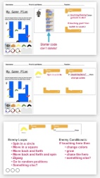
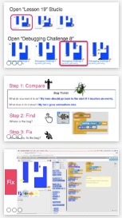

<header class='header' title='Lesson 19' subtitle='Debug & Plan'/>

<notable>
<iconp src='/icons/activity.png'>### Overview</iconp>
Students continue to build their debugging skills by reading a bug ticket and using the debugging protocol to tackle a series of challenges within the Escape the Maze game. They also apply their knowledge of conditionals and loops to create a plan for coding their final project.

<iconp src='/icons/objectives.png'>### Objectives</iconp>
- I can write an if-then statement to execute a sequence if a test is true.
- When my code fails, I use the debugging protocol to debug my code.

<iconp src='/icons/agenda.png'>### Agenda</iconp>
1. Engage: Kids Code (5 minutes)
1. Engage: Plan (10 minutes)
1. Explore: Debugging Challenges (20 minutes)
1. Elaborate: Project (10-25 minutes)

<note>
<iconp src='/icons/materials.png'>### Materials</iconp>
###### Teacher Materials:
- [ ] Projector
- [ ] [Slide Show][slide-show]
- [ ] [Debugging Studio][studio]

###### Student Materials: 
- [ ] Computers
- [ ] Idea Journals
- [ ] [Planning Handout][handout] 
- [ ] Pencils

</note>

## Room Design
Students will be on computers for the entire lesson. Your room setup should allow students to easily see the board and you to easily walk around the room and view their screens.
<note>

<iconp src='/icons/vocab.png'>### Vocabulary</iconp>
- **Debug** Finding and fixing errors in code.
- **Conditional** Asks a boolean statement, and runs a chunk of code if the answer is true.

</note>

###### Symbols Key

<iconp ml='1.65em' type='question'>question</iconp>
<iconp ml='1.65em' type='answer'>answer</iconp>
- [ ] action item

## Engage: Kids Code (5 min)
Participation: Whole Class Unplugged

- [ ] **Showcase** Yamato’s Project from Selma Avenue Elementary.

- [ ] **Challenge** students to be the next programmer we feature.

> > “We would like to feature your project at the start of our class. Code something and show it to your getCoding teacher.”

<note>**Slides:** </note>

## 2. Explore: Plan (10 min)
Participation: Independent Unplugged

- [ ] **Project Requirements** Read the project requirements from the handout together.

> > “Game designers do not just start coding without first creating a design or plan for their game. Let’s take a few minutes to put together a plan for your final project. First, let's read the requirements for your project.”

<note>**Slides:**  </note>

<pagebreak/>

- [ ] **Model** filling out a plan for your game. Think aloud through creating your plan (there is a plan provided in the slides you can follow). There is also a slide with ideas of loops and conditionals we have coded for enemies if students need a reminder.

 

<note>**Slides:**  </note>

 

- [ ] **Create:** Students complete their own game plan, which you will collect and redistribute at each lesson for them to follow as they code their final projects.

## 3. Explore: Debugging Challenges (20 min) 
Participation: Whole Class Online

- [ ] **Set the Challenge:** Students login to Scratch and navigate to the debugging studio in “My Class”. For each challenge read the Bug Ticket together. Coders will follow the 3 steps as they debug the code. Focus discussion on step 2: "Find" and logically identifying where the bug must be in the code. There is a video to help students fix the bug after they have discussed and tried it themselves.

> > “As we write more complex code, our bugs get more challenging.  Often when a coder encounters a bug they write a Bug Ticket. I have 5 more challenges for you to debug today and for each I have provided you with the Bug Ticket. Let’s login to Scratch and follow the 3 steps to debug: 1. Compare, 2. Find, 3. Fix.”

<note>**Slide:**  </note>

 

- [ ]**Challenge 6:**
 
<iconp type="question"> Compare: What does the coder want their program to do? What does it do instead?</iconp>
	<iconp type="answer"> “My mouse goes through the walls. It is supposed to move backwards when it bumps into a wall.”</iconp>
 <iconp type="question"> Find: Where is the bug in their code?</iconp>
	<iconp type="answer"> The hero’s starter code -> the chunk that controls the wall</iconp>
 <iconp type="question"> Fix: How did you fix the bug?</iconp> 
	Solution: “Move 10” needs to be “Move -10”

<note>**Slides:**  </note>

- [ ]**Challenge 7:** 

<iconp type="question"> Compare: What does the coder want their program to do? What does it do instead?</iconp>
	<iconp type="answer">“I want my enemy to change colors if it touches the hero. But instead my hero is changing color.”</iconp>
 <iconp type="question"> Find: Where is the bug in their code? </iconp>
	<iconp type="answer">The hero’s code -> the conditional </iconp>
 <iconp type="question"> Fix: How did you fix the bug? </iconp>
	Solution: The conditional needs to be moved from the hero to the enemy.

<note>**Slides:**  </note>

<pagebreak/>
- [ ]**Challenge 8:**

<iconp type="question"> Compare: What does the coder want their program to do? What does it do instead?</iconp>
	<iconp type="answer">“I want my hero to go back to the start when it touches an enemy. But instead my hero goes somewhere else.”</iconp>
 <iconp type="question"> Find: Where is the bug in their code? </iconp>
	<iconp type="answer">The hero’s code -> the go to block</iconp>
 <iconp type="question">Fix: How did you fix the bug? </iconp>
	Solution: The "go to" coordinates need to be x: -205, y: 147

<note>**Slides:**  </note>

- [ ]**Challenge 9:** 

<iconp type="question"> Compare: What does the coder want their program to do? What does it do instead?</iconp>
	<iconp type="answer">“I want my hero to go back to the start when it touches an enemy. But it only goes back to the start for enemy 1.”</iconp>
 <iconp type="question"> Find: Where is the bug in their code?</iconp> 
	<iconp type="answer">“The hero’s code -> the conditionals </iconp>
 <iconp type="question">Fix: How did you fix the bug? </iconp>
	Solution: Move the last 4 conditionals out of the first conditional.

<note>**Slides:**  </note>
<pagebreak/>
- [ ]**Challenge 10:** 

<iconp type="question"> Compare: What does the coder want their program to do? What does it do instead?</iconp>
	<iconp type="answer">“I want my bat to go back to its original size when I press the reset key, but it doesn’t work.”</iconp>
 <iconp type="question"> Find: Where is the bug in their code? </iconp>
	<iconp type="answer">The enemy’s code -> missing reset code</iconp>
 <iconp type="question">Fix: How did you fix the bug? </iconp>
	Solution: Add the reset code, you can look at the other enemy to see what it should look like, but you will have to change the coordinates

<note>**Slides:**  </note>

## 4. Elaborate: Projects (10-25 min)
Participation: Independent Online

- [ ] **Create:** students use their game plan from the start of class to work on their final projects.

> > “Now let’s return to the plan you created at the start of the lesson. Use your plan to code the loops and conditionals for each of your Sprites. You have the rest of the lesson to work on your project.”
<note>**Slides:**  </note>
</notable>

[slide-show]: https://drive.google.com/file/d/0B2wBzr9vcXjPMjQweUQ0b25MX2M/view?usp=sharing
[handout]: https://drive.google.com/file/d/0B2wBzr9vcXjPN3hPQmItMndvQ1k/view?usp=sharing
[studio]: https://scratch.mit.edu/studios/3833131/
