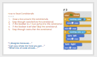
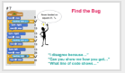

<header class='header' title='Where is Rover?' subtitle='Lesson 19'/>

<notable>
<iconp src='/icons/activity.png'>### Overview</iconp>
Students continue to practice reading conditionals with Rover. They build their argumentation skills to debate where Rover lands. Independently, students continue to practice writing conditionals and loops as they work on their Escape the Maze projects.

<iconp src='/icons/objectives.png'>### Objectives</iconp>
- I can read an if-then statement to execute a sequence if a test is true.
- I can write a conditional (if-then) to make my maze hero and enemies interact.

<iconp src='/icons/agenda.png'>### Agenda</iconp>
1. Engage: Dance Dance Conditionals (5 minutes)
1. Elaborate: Where’s Rover (20 minutes)
1. Evaluate: Exit Challenge (5 minutes)
1. Extension: Secret Word (15-30 minutes)

<note>
<iconp src='/icons/materials.png'>### Materials</iconp>
###### Teacher Materials:
- [ ] Projector
- [ ] [Slide Show][slide-show]
- [ ] Rover (large)
- [ ] Foam Tiles (with numbers to match the handout)

###### Student Materials:
- [ ] [Where's Rover Handout][handout]
- [ ] Index Cards
- [ ] Rovers
- [ ] [Exit Challenges][exit]
- [ ] Pencils
- [ ] [Secret Word Handout][secret]
- [ ] Token for secret word challenge

</note>

## Room Design

<note>

<iconp src='/icons/vocab.png'>### Vocabulary</iconp>

- **Conditional** Asks a boolean statement, and runs a chunk of code if the answer is true.

</note>

<pagebreak/>
## 1. Engage: Dance Dance (5 min)
Participation: Small Group Unplugged

- [ ] **Review** the steps of reading conditionals by calling a volunteer up to the front to perform the dance code on the board.

<note>**Slide:**  </note>

## 2. Elaborate: Where's Rover (20 min)

- [ ] **Challenge:** Students individually practice reading code on the Where's Rover handout as they move Rover around their grid to determine where he lands. Give students time to try the problems on their own.

> > "Coders, I have a challenge for you. Use Rover to read the code on your handout and determine where Rover will land on the grid after he follows the code. Remember that when code has conditionals in it you need to also read any code that is before and after the conditional in order.
> > 	1. Read the If statement.
> > 	1. ✔ if the Boolean is true, read and execute what is inside the conditional
> > 	1. ✘ if the Boolean is false, skip what is inside the conditional"

<note></note>
<pagebreak/>

- [ ] **Arugmentation** Have students argue their answer by stepping through the code and moving Rover on the large foam tiles. The discussion should be student led. Provide sentence starters for students to respond to answers they believe are not correct:
- “I disagree with your answer because…”
- “Can you show me how you got…”
- “What line of code shows that…”

<note>

</note>
 

- [ ] **Optional If Time**: On the back of the handout students use the debugging protocol to determine what error was made while reading the code.

<note> 

</note>

## 3. Evaluate: Exit Challenge (5 min)

- [ ] **Evaluate:** Students answer the Exit Challenge on paper using pencil independently and turn it in.

> > “Try these challenges independently to test your knowledge of reading conditionals!”

<note> **Slides:**

</note>

<pagebreak/>

## 4. Extension: Secret Word (15-30 min)
Participation: Partners, unplugged

- [ ] **Challenge:** Complete the first row together as a class on the board. Students read and step through the code on the handout to reveal a secret word. In this activity they are practicing using all of the tools we have used to read code: index cards, tally marks, ✘ and ✔.  After students have had time to complete the challenge discuss the solution as a class, encouraging students to ask questions where they had difficulty with the code.

> > “Coders, I have a super challenge for you. For this challenge you are going to combine your knowledge of sequences, loops, and conditionals to reveal a secret word. Let’s do the first column of the challenge together and then you will continue on your own.”

<note type="tip">It’s ok if they do not finish the challenge in class, you can have them take it with and complete it throughout the week.

</note>

</notable>

[slide-show]: https://docs.google.com/presentation/d/12gEP4eKzWl3vAGfh2-v8Z2FWzq86bZ8CBY7UemnCVWI/edit?usp=sharing
[handout]: https://drive.google.com/file/d/0B2wBzr9vcXjPaFhWVG83TEhaMjg/view?usp=sharing
[exit]: https://drive.google.com/file/d/0B2wBzr9vcXjPUkFOajdHbHhlQTg/view?usp=sharing
[secret]: https://drive.google.com/open?id=0B2wBzr9vcXjPbG9pc3ZhRE1fWGM
