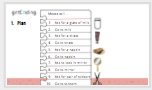
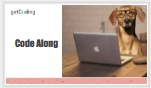
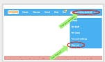

<header class='header' title='If You Give a Mouse a Cookie' subtitle='Lesson 2'/>

<notable>
<iconp src='/icons/activity.png'>### Overview</iconp>
Students get comfortable using the Scratch editor and writing a sequence in code by translating If You Give a Mouse a Cookie to a Scratch game.

<iconp src='/icons/objectives.png'>### Objectives</iconp>
- I can code a sequence of actions in the order I want them performed.
- I can use the editor, block palette, and stage in Scratch to code my program.

<iconp src='/icons/agenda.png'>### Agenda</iconp>
1. Engage:  If You Give a Mouse a Cookie (5 min)
1. Explore & Explain: Code Along (30 min)

<note>
<iconp src='/icons/materials.png'>### Materials</iconp>
###### Teacher Materials:
- [ ] Projector
- [ ] [Slide Show][slide-show]
- [ ] [Scratch Studio][scratch]

###### Student Materials:
- [ ] Idea Journals
- [ ] Pencils
- [ ] Computers

</note>

## Room Design

<note>

<iconp src='/icons/vocab.png'>### Vocabulary</iconp>
- **Editor** - A program designed for editing computer code by coders.
- **Sequence** - A set of actions that must be performed in the order they are written.

###### Symbols Key
<iconp ml='1.65em' type='question'>question</iconp>
<iconp ml='1.65em' type='answer'>answer</iconp>
</note>

<pagebreak/>
## 1. Engage: If You Give a Mouse a Cookie (5 min)

- [ ] **Hook**: Read the book _If You Give a Mouse a Cookie_ outloud to the class.

<note>**Slides:** </note>

- [ ] **Plan:** Explain that we are going to practice coding a sequence by coding the sequence of the book. Show the step by step plan.

<iconp type="question">Ask students to identify connection between a step and what happened in the story.</iconp>
<note></note>

## 2. Explore: Code Along (40 min)
Participation: Whole Class, Unplugged

- [ ] **Setup:** Students login to Scratch and navigate to the project editor for “If You Give a Mouse a Cookie”. Then students remix & re-title their projects.

<note></note>

- [ ] **Code:** Display the “Plan” and your Scratch editor in parallel as you walk students through the process of coding the sequence one line at a time.

<iconp type="question">What do you think the next block will be?</iconp>
<iconp type="question">Where will I find that block?</iconp>
<iconp type="answer">Students will find blue blocks in "motion" and purple blocks in "looks".</iconp>

<note></note>

- [ ] **Validate:** Pause after adding each line of code to “Validate” your code by running it on the stage.

- [ ] **Challenge** students to continue coding on their own, continuing beyond the plan to follow the sequence of the story. Encourage students to explore other blocks that improve the story if they’ve completed the sequence. Every time you add a line of a code, run it on the stage to validate it does what you expect it to do.

<note type="tip">The events block indicates when the sequence should begin.</note>

- [ ] **Closing:** Congratulate coders on their first program! Remind students to signout of Scratch.

❗Anticipating Student Misconceptions:
- Coding in the wrong sprite - Students should be coding in the sprite where the action is occuring.
- Taking a “say” block instead of “say for 2 sec” - without the time, Scratch will perform the action so quickly that it won’t be seen on the stage.
- Deleting the starter code - Students should not change or delete the first two blocks as they ensure that whenever the green flag is pressed the mouse returns to its original position.

<note>
</note>

</notable>

[slide-show]: https://docs.google.com/presentation/d/1bzntxoBDBpM8bsbLZDJKZCcdwQTNmLBWaudyCXP_poo/edit?usp=sharing
[scratch]: https://scratch.mit.edu/studios/3448945/
