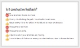

<header class='header' title='User Experience' subtitle='Lesson 23'/>

<notable>
<iconp src='/icons/activity.png'>### Overview</iconp>
Students are introduced to giving constructive feedback on user experience. They practice giving and incorporating feedback from a peer to improve the user experience of their game.

<iconp src='/icons/objectives.png'>### Objectives</iconp>
- When my code fails, I use the debugging protocol to debug my code.
- I can use the editor, block palette, and stage in Scratch to code my program.
- I can give and receive feedback on user experience.

<iconp src='/icons/agenda.png'>### Agenda</iconp>
1. Engage: Challenges Solved (10 min)
1. Explore/Explain: User Experience (15 min)
1. Elaborate: Project Time (20 min)

<note>
<iconp src='/icons/materials.png'>### Materials</iconp>
###### Teacher Materials:
- [ ] Projector
- [ ] [Slide Show][slide-show]
- [ ] [Scratch Zine][zine]

###### Student Materials:
- [ ] [Game plans][plan]
- [ ] Pencils
- [ ] Computers
- [ ] [Bug Tickets][bug]

<iconp src='/icons/vocab.png'>### Vocabulary</iconp>
- **User Experience** - How a person feels when using a program or product.

</note>

### Room Design

<note>

###### Symbols Key
<iconp ml='1.65em' type='question'>question</iconp>
<iconp ml='1.65em' type='answer'>answer</iconp>
- [ ] action item
</note>

<pagebreak/>
## 1. Engage: Challenges Solved (10 min)

- [ ] **Challenge** students to debug their Independent Coding Challenges as you step through the slides. Encourage students to share their own answers and ask questions before revealing the solutions in the slides. Solutions to challenges 8-10 are shown in movies in the slides.

> > “In Lesson 21 you completed a series of coding challenges. Let’s look at your Independent Coding Challenges together so we can debug any challenges you struggled with and celebrate the challenges you completed without any bugs.”

**Slides:** 

<note type="tip"> Students will be more engaged if you have them lead this activity.</note>

## 2. Explore/Explain: User Experience (15 min)

- [ ] **Motivate:** introduce the importance of user experience.

> > “User experience is how a person feels when using a program or product. When designing a game you want to create the best experience for your users. Before we continue working on our project today, we are going to get some peer feedback on user experience.”

 
- [ ] **Explore/Explain:** Play the example game. Have students identify constructive feedback on user experience.

<incop type="question">Which of these are constructive feedback? That means it is helpful.</incop>
	- Your enemies should do more.
		⛔ Not constructive, not specific
	- Enemy 4 is blocking the path. You should move it over.
		👍 Constructive, specific and actionable
	- Move enemy 13 to the white. In the blue it is never an obstacle.
		👍 specific and actionable
	- This game is too hard.
		⛔ Not constructive, not specific
	- This game is boring.
		⛔ Not constructive, not specific
	- I like that all of your enemies are moving.
		👍 it is helpful to know what others like about the game
	- It would be cool if when an enemy touches the hero, then it chases the hero.
		👍 specific and actionable

<iconp type="question">What other feedback might you give this coder?</iconp>

 
<note> 

</note>

- [ ] **Practice:** Students play their partner’s game and give them constructive feedback. Then students share out the feedback they received. Optional: Have students write down the feedback they receive in their workbooks.

> > “You and your table partner are going to play each other’s game. Give your partner 2 pieces of feedback: 1) Something you liked about their game. 2) Something they can do to improve their game. Be specific and actionable. I will ask you to share out in 5 minutes so make sure you both share your feedback with each other.”

<note>  </note>

## 3. Elaborate: Project Time (20 min)

- [ ] **Work time:** Students have the rest of the lesson to work on their final project. Students can use a bug ticket today if they are stuck on a bug in their game and want to get help from the class. Have a student fill out the bug ticket and then get the whole class’s attention before having the student present their bug to the class. Students can also reference the coding zine if they need help.

> > “Today is your last day to implement your Escape the Maze game design. Remember to incorporate your user experience feedback as you continue to work on your game.”

<note></note>
</notable>

[slide-show]: https://docs.google.com/presentation/d/1ocZZQSVxaP8DneUVH-qfys1Z5ecJ3qUUnrktrOnZGKo/edit#slide=id.g212b6187de_0_12
[bug]: https://docs.google.com/document/d/1nsZKA0Pq9K1XtSI7n0oyUqLmY5HV9E9t4LU_wkDZJYA/edit?usp=sharing
[plan]: https://drive.google.com/file/d/0B2wBzr9vcXjPN3hPQmItMndvQ1k/view
[zine]: https://tinyurl.com/scratch-zine
