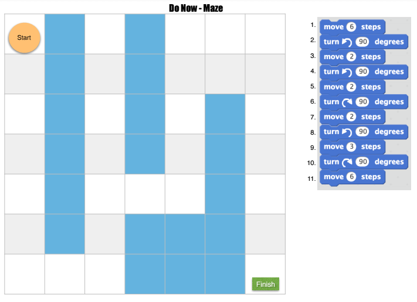

<header class='header' title='In the Loop' subtitle='Lesson 5'/>

<notable>

<iconp src='/icons/activity.png'>### Overview</iconp>
In this lesson students explore and predict how they can use loops to more efficiently write code. Allow students to discover the need for loops in the explore activity. Encourage students to make connections between loops and the real world in the elaborate activity.

<iconp src='/icons/objectives.png'>### Objectives</iconp>

- I can use the debugging process to debug my code.
- I can replace a repeating sequence with a loop to increase code efficiency and readability.

<iconp src='/icons/agenda.png'>### Agenda</iconp>

1. **Engage:** Sequence Through a Maze (10 min)
2. **Explore:** Discovering Loops (10 min)
3. **Explain:** Loops (5 min)
4. **Elaborate:** Loops in the Real World (5 min)
5. **Evaluate:** Exit Challenge (15 min)

<note>
<iconp src='/icons/materials.png'>### Materials</iconp>

###### Teacher Materials:
- [ ] [Lesson 5 Slides][slide-show]
- [ ] Projector
- [ ] Unplugged Foam Maze
- [ ] Whiteboard
- [ ] Teacher Scratch Blocks magnetic
- [ ] [Socrative Quiz][soc]

###### Student Materials:
- [ ] [Maze Handout][maze-handout]
- [ ] Scratch blocks
- [ ] Pencils
- [ ] Rovers 
- [ ] Computers

<iconp src='/icons/vocab.png'>### Vocabulary</iconp>

- **Loop:** A sequence of instructions that is continually repeated until a certain condition is reached.

</note>

<pagebreak/>

## Room Design

<note borderLeft='2px solid green' mt='2em'>
###### Symbols Key

<iconp ml='1.65em' type='question'>question</iconp>
<iconp ml='1.65em' type='answer'>answer</iconp>
- [ ] action item
</note>

<pagebreak/>

## 1. Engage: Sequence Through a Maze (10 min)

- [ ] **Debugging:** Students move their rover around their paper maze to identify where in the given sequence there is a bug.

> > "Move Rover around the maze as you read the sequence of code on your paper. Identify where in the sequence there is a bug (error) and how would you fix it."

<note type='reminder' title='Reminders'>
- A sequence is the order in which the code is written.
- Show students that 90 degrees clockwise and counterclockwise means a quarter turn left or right.
</note>

<pagebreak/>

- [ ] **Students Propose Solutions:**

<iconp type='question'> If the code works as it is, stand up. If the code does not work, put your hands on your head.</iconp>
<iconp type='answer' mb='1em'>No, the code does not work.</iconp>

<iconp type='question'> How would you change the sequence of the code to get your hero to the finish line?</iconp>
<iconp type='answer'> After line 10 there needs to be another move 2 steps and then turn right 90 degrees.</iconp>

<note type='key' title='Key Points'>
- Validating your code is an essential step in writing code.
- When you test a sequence, point to each block and act it out on the stage in order, one line at a time.
</note>

 
- [ ] **Coders & Bots:** Assign a student to be the coder and read each line of code while another acts as the Bot and acts out the solution on the foam tiles.

> > "I need one student to be the Coder and read the sequence one line at a time. A second student will be the Bot and act it out on the foam tiles."

<iconp type='question'> What did the code do before that wasn’t working? </iconp>
<iconp type='answer'> Answer: At line 11 the hero moved 6 steps instead of 2 so it walked off the board. </iconp>

## 2. Explore: Discovering Loops (10 min)

- [ ] **Challenge:** In pairs students code a sequence that will take Rover around the grid, following the dotted path. Students will not have enough move and turn blocks to finish the sequence.

> > “Now it is your turn. With your table partner navigate Rover along the dotted path on the grid. First decide who will be the Coder (write the code) and who will be the Bot (moves Rover and validates the code).”

<iconp type="question">Raise your hand if you are the Coder. What is your job as Coder?</iconp>
<iconp type="answer">Check that each pair has one Coder. They will be writing the code.</iconp>
<iconp type="question">Raise your hand if you are the Bot. What is your job as Bot?</iconp>
<iconp type="answer">Check that each pair has one Bot. They will be moving Rover and validating the code.</iconp>

<note type='tip' title='Tip'>
_Younger students may need to be told to write in 90 degrees on turn blocks._
</note>

- [ ] **Discover Loops:** Wait until students identify that there are not enough blocks before introducing loops.  Without introducing them verbally, place loop strips on each group’s table.

- [ ] **Demo Code:** Call on one group to demo their code by bringing their felt up to the board and acting it out on the unplugged maze.

<iconp type='question' mb='1em'>Extension: Can you rewrite your code with fewer blocks</iconp>

## 3. Explain: Loops (5 min)

- [ ] **Predict Vocabulary Definitions:** Each group’s driver holds up each loop as you introduce it.

<iconp type='question'>For each loop: What do you think this loop will do?</iconp>

<iconp type='answer'>Forever: Repeats the nested sequence forever</iconp>
<iconp type='answer'>Repeat Until _____: Repeats the nested sequence until an action happens</iconp>
<iconp type='answer'>Repeat __: Repeats the nested sequence that number of times</iconp>

> > "These structures are called loops. Loops make it so we don’t have to write a sequence of code over and over to make it repeat."

## 4. Elaborate: Loops in the Real World (5 min)

- [ ] **Making Connections:** Have students identify the type of loop you would use for each of the examples below.

> > "Loops are everywhere. Let's look at some examples from our life and identify which type of loop you could use to code each example."

<iconp type='question'>The School Week <iconp ml='1em' type='answer'>Repeat Until Summer Break</iconp></iconp>
<iconp type='question'>The Seasons <iconp ml='1em' type='answer'>Forever</iconp></iconp>
<iconp type='question'>Washing Dishes <iconp ml='1em' type='answer'>Repeat Until No More Dirty Dishes</iconp></iconp>
<iconp type='question'>Riding The Tower of Terror 5 Times <iconp ml='1em' type='answer'>Repeat 5</iconp></iconp>
<iconp type='question'>Riding The Tower of Terror Until the Park Closes <iconp type='answer' mb='1em'>Repeat Until Park Closes</iconp></iconp>

- [ ] **Think Pair Share:** What other examples of loops can you come up with?

## 5. Evaluate: Exit Challenge (15 min)

- [ ] **Socrative:** Students independently complete an exit challenge on Socrative. Remember to give them the Room Name. If there is time, review the answers as a class.

> > "I have a challenge for you. Login to Socrative to complete the challenge questions about Loops."

</notable>

[maze-handout]: https://drive.google.com/open?id=0B2wBzr9vcXjPSUV2ZlZtc01Ea2c
[slide-show]: https://docs.google.com/presentation/d/1bbWIFAN66jsNqsTDXqy4OG31CUGDuPw9bRMqtKDNU-4/edit#slide=id.g1612fbdbad_0_42
[soc]: https://b.socrative.com/teacher/#import-quiz/28442633