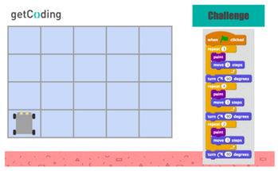

<header class='header' title='Rover Paint' subtitle='Lesson 6'/>

<notable>
<iconp src='/icons/activity.png'>### Overview</iconp>
In this lesson students learn to read code with loops by stepping through one block at a time. Using pre-written code, students guide Rover the robot’s movements as it paints a grid.

<iconp src='/icons/objectives.png'>### Objectives</iconp>
- I can step through and act out code that contains a loop.
- I can predict the effects of code that contains a loop.

<iconp src='/icons/agenda.png'>### Agenda</iconp>

1. **Engage:** Unearthing Loops in GIFs (7 min)
2. **Explore/Explain:** Teacher demonstrates how to step through code with loops and students practice using the pre-written code. (15 min)

**Independent Coding Practice:** **https://studio.code.org/s/course2/stage/6/puzzle/1**

<note>
<iconp src='/icons/materials.png'>### Materials</iconp>

###### Teacher Materials:
- [ ] Projector
- [ ] Unplugged Platform
- [ ] Blank Piece of Paper
- [ ] [Large Rover][large-rover]

###### Student Materials:
- [ ] [Lesson 6 Handout][lesson-6-handout]
- [ ] Idea Journals
- [ ] Index Cards
- [ ] [Rover Cutouts][rover-cutouts]
- [ ] Dry-Erase Markers
- [ ] Computers

<iconp src='/icons/vocab.png'>### Vocabulary</iconp>

- **Loop:** A sequence of instructions that is continually repeated until a certain condition is reached.

</note>

<pagebreak/>

## Room Design

<note borderLeft='2px solid green' mt='2em'>
###### Symbols Key

<iconp ml='1.65em' type='question'>question</iconp>
<iconp ml='1.65em' type='answer'>answer</iconp>
- [ ] action item
</note>

## Engage: Unearthing Loops (7 min)

- [ ] **Review the concept of loops.** Display the slide of Rover moving 14 steps in one direction.
	- [ ] Step through the code required to get Rover to the finish line.
	- [ ] The sequence can be shortened to only 3 blocks by using a loop.
	- [ ] “Move 1 Step” can be looped 14 times to produce the same result.
	- [ ] Step through the looped code.

<note type='key' title='Key Points'>
- Actions that happen more than once can be coded as a loop.
- Loops allow us to repeat sequences without having to write out the entire sequence multiple times.
</note>

- [ ] **GIFs as Loops:** Show students the series of GIFs and explain that they are examples of loops. Show what the code might look like if it were written in Scratch.

#### Slides

<note type='key' title='Key Points'>
- The video plays to the end and starts all over again from the beginning. The video keeps repeating forever.
- Actions that happen more than once can be coded as a loop.
</note>

- [ ] **Identify Enemy Loops:** Show students the Escape the Maze video and identify one of the enemy’s movements as a loop.

<iconp type='question'>What other loops do you see in the maze?</iconp>
<iconp type='answer'>Each enemy is moving in a loop.</iconp>

## Explain: Reading Loops with Stepping (15 min)

- [ ] **Demonstrate stepping through a loop: (5 min)**
	- Each student follows along on [Lesson 6 Handout][lesson-6-handout], filling in with their dry erase marker as they go.
	- Demonstrate uncovering each line of code one at a time using a sheet of paper (students will use an index card).
	- Make a tick mark at the end of the sequence each time you make one complete loop. This strategy will help students keep track of how many times they have repeated the sequence.

- [ ] **Students practice (5 min)** stepping through a loop in **Painting 1** on their handout following the steps we used in the practice.
	- Have one stepper and computer act out the code on the unplugged platform to check their work.

- [ ] **Students practice (5 min)** stepping through loops with **Painting 2** on their handout.
	- Have one stepper and computer act out the code on the unplugged platform to check their work.

## Extension

- [ ] **Students Attempt the Challenge** (10 min)
	- Have one stepper and computer act out the code on the unplugged platform to check their work.

</notable>

[large-rover]: https://drive.google.com/file/d/0B48_2vIyABioeEVTZWx1XzRMUFU/view
[lesson-6-handout]: https://drive.google.com/file/d/0B2wBzr9vcXjPYjM5MUhtdkxrc0U/view
[rover-cutouts]: https://drive.google.com/file/d/0B48_2vIyABioNG8tTWZNYmZocFE/view
