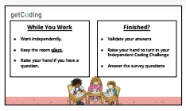

<header class='header' title='Lesson 9' subtitle='Independent Coding Challenge'/>

<notable>
<iconp src='/icons/activity.png'>### Overview</iconp>
We want to establish a coding learning culture where students identify as coders. That means they enjoy challenging themselves, they enjoy learning new things, and they like to address weaknesses in their understanding. Students complete an Independent Coding Challenge to see their progress in the learning objectives covered in lessons 1-8. 

<iconp src='/icons/objectives.png'>### Objectives</iconp>
- I can use the editor, block palette, and stage in Scratch to code my program 
- I can code a sequence of actions in the order I want them performed.
- I can use the debugging process to debug my code. 
- I can step through and act out code that contains a loop.
- I can predict the effects of code that contains a loop.
- I can recognize and identify a repeating pattern.
- I can replace a repeating sequence with a forever loop, for-loop, or while loop to increase code efficiency and readability.

<iconp src='/icons/agenda.png'>### Agenda</iconp>
1. Set the Challenge (4 min)
1. Independent Coding Challenge (40 min)
1. Closing (1 min)

<note>
<iconp src='/icons/materials.png'>### Materials</iconp>
###### Teacher Materials:
- [ ] [Lesson 9 Slides][slide-show]
- [ ] Projector

###### Student Materials: 
- [ ] Pencil
- [ ] [Independent Coding Challenge][icc]
- [ ] Index Cards (class set)
- [ ] Rovers (class set)
- [ ] Student Surveys (class set)

<iconp src='/icons/vocab.png'>### Vocabulary</iconp>

- **Loop:** A sequence of instructions that is continually repeated until a certain condition is reached.

</note>

<pagebreak/>

## Room Design

<note borderLeft='2px solid green' mt='2em'>
###### Symbols Key

<iconp ml='1.65em' type='question'>question</iconp>
<iconp ml='1.65em' type='answer'>answer</iconp>
- [ ] action item
</note>

## 1. Set the Challenge (4 min)

- [ ] What are we doing today? 

> > “You are coders! Coders love to challenge themselves. So today we are going to do a series of Coding Challenges.”

- [ ] Why?

> > “Challenges are fun. We want you to see how much you have learned about coding.”

- [ ] Expectations:
> > - (If necessary for room setup:) Use the privacy shields to help you concentrate.
> > - We want to see your own code, so work independently.
> > - Coding takes a lot of brainpower, so keep the room silent for your fellow coders to concentrate.
> > - If you have a question, ask your teacher with a silent hand.
> > - If you don’t understand a question, ask your teacher!

<note type='key' title='Key Point'>The Independent Coding Challenge is not a test, it is an opportunity for you to show off your coding skills and to see where you still need more practice.</note>

- [ ] Students may need you to walk them through a practice version of the first question:
> > Let's try this first question together. It looks a lot like the first challenge on your Independent Coding Challenge.

## 2. Independent Coding Challenge (40 min)

- [ ] Pass out rovers, index cards, and the Independent Coding Challenge (ICC).

- [ ] When the ICC is completed, have students complete the Student Survey.

- [ ] If a student is stuck you can: 
    - Read the question out loud.
    - Ask guiding questions without giving away an answer:
    - Do you remember when we painted with Rover?
    - Did you validate your code to make sure there are no bugs?
    - Did you use the index card to read each line of code one at a time?
    - What does “sequence” mean?
    - What is a “loop”?

- [ ] When students finish:
    - Students take the student survey.
    - Encourage them to review and validate their answers.
    - Students can continue on Code.org.

<note>

</note>

## 3. Closing (1 min)

- [ ] Acknowledge the hard work students just did and how excited we are to see their work.

<note>

</note>

</notable>

[icc]: https://docs.google.com/document/d/1Yf3NHLkcZu8F6c9p7GSH7QXo0dGf6nhD9HzYe7cweHE/edit?usp=sharing 
[slide-show]: https://docs.google.com/presentation/d/1ax85reMF15nwSKkqzXcIT0DgWmPmchZaS9igx2uQwDE/edit?usp=sharing
