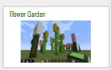
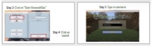
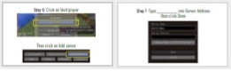
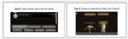
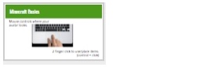
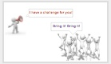
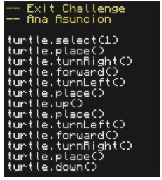

<header title='Turtles & Minecraft' subtitle='Lesson 1'/>

<notable>

<iconp src='/icons/activity.png'>### Overview</iconp>
Students learn the interface of MinecraftEdu and write programs in Lua to move and build simple structures and shapes with a turtle.  

<iconp src='/icons/objectives.png'>### Objectives</iconp>
- I can use function calls to move my turtle and build in Minecraft.

<iconp src='/icons/agenda.png'>### Agenda</iconp>

#### Length: 60 minutes

1. Engage: Flower Garden Project (3 minutes)
1. Explore: Turtle Actions (15 minutes)
1. Explain: Function Calls (12 minutes)
1. Elaborate: Build Challenges (20 minutes)
1. Evaluate: Exit Challenge (10 minutes)

<note>

<iconp src='/icons/materials.png'>### Materials</iconp>

#### Teacher Materials
- Computer
- Projector
- MinecraftEdu
- [Lesson 1 Slides][slides]

#### Student Materials
- Computer
- MinecraftEdu
- [Minecraft | L1 pixelBots playlist (code: V8LP4)][playlist]

<iconp src='/icons/vocab.png'>### Vocabulary</iconp>
- **Function call** - A programming element that tells the computer to perform a task.

</note>
<pagebreak/>
#### 1. Engage: Flower Garden Project (3 minutes)

- [ ] **Motivate:** Reveal the Flower Flower Garden Project over the projector. Show turtle building flower then show files of code. Click through the slide to see the files of code used for Flower Garden.
    - Garden 
    - Flower
    - Stem
    - Petals
    - Center
    - Leaf

> > “In this class we are going to create flower gardens in Minecraft using turtles! Turtles in Minecraft can build for us. We code them using a programming language called Lua. We will also use pixelBots to plan what we want our turtle to build. Before we write programs in Lua for turtle, let’s read code in Lua.”

<note> **Slides:**

</note>

#### 2. Explore: Turtle Actions (10 minutes)

- [ ] **Group Exploration:** Students explore the different function calls of turtle in a whole class, unplugged activity. For each program, ask for a volunteer to be the robot and act out the code, then the class will be the computer and read the program one line at a time. Students will stand on the corresponding square. 

> > “Let’s read code and predict what will happen. What will turtle do when we run these different programs?”

<note> 

</note>

#### 3. Explain: Minecraft (12 minutes)

- [ ] **Code Along:**  Students follow along on their own computer as you walk through each step of logging onto MinecraftEdu. Before the end of the code along, review basic Minecraft player control keys. 

> > “Open your computers and following along as we walk through the steps to log into Minecraft.”

**Steps:**
  1. Use Spotlight Search to find MinecraftEdu.
  2. Double click on app.
  3. Click on “Start MinecraftEdu”.
  4. Login Mode: MinecraftEdu, click Launch.
  5. Type in username: firstlaststudent. This will be your username for the class.
  6. Click Multiplayer, then Add server.
  7. Type _______ into Server Address then click done.
  8. Select Server, then click Join Server.
  9. Choose a minecraft skin, click ‘Connect’, then tilt screen down.
        - When all students are logged in, give remote to all and give turtle to all.  
        - Preview the next step before students do: Show students how to place turtle and hold remote. Students should have laptops halfway closed during this preview.
  10. Students open laptop, place turtle, and hold remote. Turtles are placed using ‘control’ click or 2 finger click on trackpad. To use a remote, hold their remote and use ‘control click’ or 2 finger on turtle to use remote.

Review: Review Minecraft basic player controls and how to use trackpad (2 finger click and ‘control’ click)

> > “Once you have placed your turtle in front of you and have a remote, close your laptop.”

<note type="tip">Uphold good classroom management on computers. When you give each step, students should have eyes on you and hands off computers.

</note>

 

- [ ] **Model** coding turtle in Minecraft and how to navigate the editor. Write and run Program #3 from above. Narrate each step you do when coding turtle. Highlight key features of Turtle menu: 

> > “Let’s check our predictions and see what turtle does in program #3”

<note> </note>

**Steps:**
  1. Right click on turtle.
  2. Select editor and create a new file program.
  3. Type code for Program #3 from above, reference API on the right.
      Tip: Teach autocomplete using right arrow or tab. 
  4. Click on the Run Button. 
  5. Observe turtle’s actions. 
      Tip: Exit turtle menu to back up from turtle to get a better view of turtle building.
  6. Press ‘0’ (zero) to reopen turtle menu. Click undo to undo all building and reset turtle. 
  7. Run program again. 

#### 4. Elaborate: Build Challenges (20 minutes)

- [ ] **Guided Practice:** Together as a class, program turtle to build the first and second challenge in Minecraft | L1 playlist. Write code in pixelBots to complete the pixelBots challenge, then use that as a plan to write code for turtle in Minecraft.

> > “Now we know how turtle moves, let’s start building. We will use pixelBots to plan what we will build in Minecraft.”

**Steps:**
  1. Go to pixelBots.io, code link: V8LP4
  2. Code the challenge in pixelBots, prompt students for each line of code. (do not use for loops)
  3. Go to Minecraft, add the correct wool color to turtle inventory slots.
        Remember to give students wool using the Teacher Menu.
  4. Create a new file program. Call it after the challenge in pixelBots, ex: verticalLine, horizontalLine
  5. First we need to select an inventory slot for turtle, code turtle.select(1)
  6. Next we can place the block using, code turtle.place()
  7. Next we need to move (up, right, etc.)
  8. Continue asking students for the next line of code for turtle until challenge is done.

<note>

</note>

**Solutions:**

Guided Practice 1: 

Guided Practice 2: 

- [ ] **Independent Practice:** Students continue to program turtle to build in Minecraft. Students reference a playlist of challenges in pixelBots that they will build in Minecraft. Students will write code in pixelBots to complete a pixelBots challenge, then use that as a plan to write code for turtle in Minecraft.

> > “Continue coding the challenges on pixelBots and then programming turtle to build the same image in Minecraft.”

#### 5. Evaluate: Exit Challenge (10 minutes)

- [ ] **Call and Response:** teach students the call and response. Teacher says: “I have a challenge for you.” Students say: “Bring it, bring it.”

> > “Before we get started I’m going to teach you a call and response. Whenever you hear me say ‘I have a challenge for you’, you will respond ‘Bring it, bring it’. Let’s try it. ‘I have a challenge for you’ … (students respond ‘Bring it, bring it.’)”

 
<note></note>

- [ ] **Exit Challenge:** Students work independently to write a program to code turtle to build a square.

> > “Okay coders, I have a challenge for you. *pause for students’ response*   Use what we learned today to program turtle to build a square! You will work on this challenge independently to show me and yourself what you learned this lesson.”

**Possible Solution:**

<note></note>

- [ ] **Evaluate:** Circulate and check students code to determine student’s understanding of moving turtle, focusing on placing a block to the right of another block.
  - To move turtle to the right, similar to the movement of bots in pixelBots, students need to code turtle to turnRight, forward, then turnLeft. In the next lesson students will write a file “function” called moveRight. 

<note></note>

</notable>
[slides]: https://docs.google.com/presentation/d/1qGCvh0JdtQiMOSwtuN7D5aQE_ytWNrPxUpmXnp4WuE0/edit#slide=id.g2059004b8a_0_86
[playlist]: http://www.pixelbots.io/V8LP4