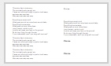
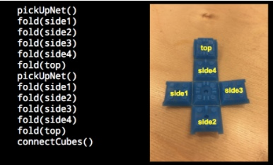
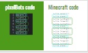
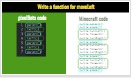

<header title='Functions' subtitle='Lesson 2'/>

<notable>

<iconp src='/icons/activity.png'>### Overview</iconp>
Students learn to write functions for reuse in Lua to move turtle left and right. In the previous lesson, to move turtle to the right or left required three lines of code. Students will define functions called moveRight and moveLeft to move turtle laterally with a single line of code. Students will use these functions in all programs moving forward.

<iconp src='/icons/objectives.png'>### Objectives</iconp>
- I can identify a chunk of code that is reused in a program. 
- I can write a function and call that function in a program.

<iconp src='/icons/agenda.png'>### Agenda</iconp>

#### Length: 60 minutes

1. Engage: Less is More (5 minutes)
1. Explore: Reusable Code (10 minutes)
1. Explain: Functions (5 minutes)
1. Elaborate: moveRight & moveLeft (25 minutes)
1. Evaluate: Exit Challenge (15 minutes)

<note>

<iconp src='/icons/materials.png'>### Materials</iconp>

#### Teacher Materials
- Computer
- MinecraftEdu
- Projector
- [Lesson 2 Slides][slides]

#### Student Materials
- Computer
- [Lyrics][lyrics]
- Omnifix Cubes
- Pencils
- Coding Journals
- MinecraftEdu
- [Loops Handout][handout]

<iconp src='/icons/vocab.png'>### Vocabulary</iconp>
- **Function** - a reusable chunk of code that performs a task.

</note>
<pagebreak/>
#### 1. Engage: Less is More (5 minutes)

- [ ] **Contrasting Cases:** Students compare two ways of writing song lyrics for A Cloud Away by Pharrell: 1) writing out all of the lyrics 2) replacing the chorus with the word "chorus". Give students time to listen to part of the song and read the printed lyrics.

> > "On your paper you see two different ways of writing song lyrics. One way writes each word of a song and the other  uses one word to reference a set of lines of lyrics.”

<iconp type="question">Which of these ways of writing lyrics is shorter?</iconp>
<iconp type="answer">The second one.</iconp>
<iconp type="question">How is it made shorter?</iconp>
<iconp type="answer">Instead of rewriting the entire chorus each time, the writer writes ‘Chorus’. When people read the lyrics they can reference the chorus lyrics.</iconp>
<iconp type="question">If you had to write the lyrics, which way of writing would you prefer? Why?</iconp>
<iconp type="answer">Using Chorus because it is shorter and you don’t have to write as much.</iconp>
 
> > “Let’s take a look at the last part of the song. We see that there are lines of lyrics that are reused. Someone decided to call these lines of lyrics the ‘Chorus’. Keep these two sets of lyrics in mind as we go through our lesson today.”  (click through slide during this script)

<note> **Slides:**

</note>

#### 2. Explore: Reusable Code (10 minutes)

- [ ] **Read Code:** Students individually read and step through each line of code in a program using omnifix cubes. 
  
> > “Now let’s read code. During this activity I want you to think about how rewriting lyrics can relate to code. Everyone needs 2 cube nets each for this activity. You are a robot that knows three function calls: pickUpNet(), fold(), and connectCubes(). Step through the program line by line to build the structure according to the code.”

Students step through the following program: 

<note> </note>

- [ ] **Write Pair Share:** In their coding journals, students think of a way to refactor the program similar to the way the lyrics are written in the engage activity with ‘Chorus’. Then in pairs students share their ideas. Place hints on the table for students to use as a resource:
  - Hint 1: Think about the song lyrics. 
  - Hint 2: What chunk of code/lines are reused.

<iconp type="question">How could you rewrite this program? Here are hint cards if you need them. You can pull the black sheet down to reveal each hint. There are 2 hints total.</iconp>

<note> </note>

#### 3. Explain: Functions (5 minutes)

- [ ] **Define & Identify** Functions. Students write definition of function in coding journals. Functions are a reusable chunk of code that performs a task. Students then identify what code is reused and what to name the function.

> > “A function is a reusable chunk of code that performs a task. We can refactor our code by writing a function.“

<note type="tip"> Collect the Omnifix cubes so students are not distracted during this activity.

</note>

<iconp type="question">What lines/chunk of code is reused in this program? </iconp>
<iconp type="answer">pickUpNet(), fold(side1), fold(side2), fold(side3), fold(side4), fold(top)</iconp>

> > “This is the function body.”

<iconp type="question">What task is this chunk of code performing/doing? This will be the name of our function.</iconp>
<iconp type="answer">Building a cube, suggested function name can be buildCube.</iconp>

> > “This is the function name. We want to pick a clear name for it.”

<iconp type="question">How would we rewrite our program using buildCube()</iconp>
<iconp type="answer">buildCube(), buildCube(), connectCubes()</iconp>

> > “When we use a function we defined, it is a function call. buildCube() is a function call.”                                                                

- [ ] **Call & Response:** Review parts of a function: function name, function body, function call. Point to the parts of the function on the slide and ask students to respond as a whole class.

<iconp type="question">What is this called? </iconp>
<iconp type="answer">Function Name</iconp>
<iconp type="answer">Function Body</iconp>
<iconp type="answer">Function Call</iconp>

#### 4. Elaborate: moveRight & moveLeft Functions (25 minutes)

- [ ] **Contrasting Cases:** First show gif demo of pixelBots vs. Minecraft. Then students compare code for painting/building a horizontal line in pixelBots and in Minecraft. 

> > “Let’s take a look at two programs that paint and build four squares in a line.”

<iconp type="question">What do you notice about the two different programs?</iconp>

<iconp type="question">Which line of code in Minecraft is similar to the paint() function call in pixelBots?</iconp>
<iconp type="answer">turtle.place()</iconp>

<iconp type="question">Which lines of code in Minecraft is similar to the right() function call in pixelBots?</iconp>
<iconp type="answer">turtle.turnRight(), turtle.forward(), turtle.turnLeft()</iconp>

<iconp type="question">The image they create is the same, so why is the Minecraft program more lines of code?</iconp>
<iconp type="answer">In pixelBots you can move right in one line. In Minecraft you have to turn right then move forward, then turn left to move to the right one unit.</iconp>

<iconp type="question">What do you think we should do?</iconp>
<iconp type="answer">See if students come up with the idea of writing a function in Minecraft. You can hint back to the chorus in the song lyrics and the cube instructions.</iconp>

<note></note>

- [ ] **Guided Practice:** Step students through the process of creating and calling a new function file called moveRight in MinecraftEdu.

> > “We can define a function called moveRight and rewrite the Minecraft code using less lines of code. Do these steps with me.”

**Steps:**
  1. Create a new file and name the function ‘moveRight’ or ‘right’.
  2. Write the body of the function: turtle.turnRight(), turtle.forward(), turtle.turnLeft()
  3. Create a new file called ‘horizontalLine’  and write a program using moveRight to simplify Minecraft code from the contrasting cases activity.

  **Extension:** See if students can come up with the idea to use loops to simplify code.  Pass out handouts of comparing syntax of loops in pixelBots and loops in Minecraft. Students should be able to use and understand loops in Minecraft from this comparison. 

<note>

</note>

- [ ] **Independent Practice 1:** Students write a moveLeft function and call the moveLeft function in a program. Students will compare the pixelBots and minecraft code and then write a moveLeft function. 

> > “Now it’s your turn. Write a function named moveLeft for minecraft. You may need to look back at the pixelBots code.”

Solution for moveLeft function:

<note>
</note>

- [ ] **Independent Practice 2:** Students call the moveLeft and moveRight functions in a program to build a rectangle.

Possible Solution for rectangle:

<note></note>

#### 5. Evaluate: Exit Challenge (15 minutes)

- [ ] **Exit Challenge:** Students read a given program over the projector. Then in their coding journals, students identify the reusable code, define a function named line(), and refactor the program calling the function line().

> > “Okay coders, I have a challenge for you. *pause for students’ response*. I wrote a program for turtle, and I need you to help me refactor my code. Use what we learned today to write a function for turtle called ‘line’.  Then call the line function to rewrite the code.”

<note>
</note>

- [ ] **Evaluate:**  Check student’s coding journals after class to determine student’s understanding of writing a function and calling that function in a program. 

Solution: 

<note>
</note>

</notable>
[slides]: https://docs.google.com/a/9-dots.org/presentation/d/1pU4jKqw2xItSfiDLZmXjpYj8xAA-6OUpSqPUWHpBuBs/edit?usp=sharing
[lyrics]: https://docs.google.com/a/9-dots.org/document/d/1f2d6wwGzlskh8VYAssr5SnCYNCL6WfafAZIyQ5l1GgM/edit?usp=sharing
[handout]: https://docs.google.com/document/d/1H0u2a3ElQOQNkKnviNZS3A9frbhwaR2hVBqugqLdGhw/edit?usp=sharing