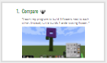
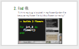
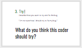
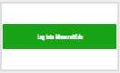

<header title='Project Time Continued' subtitle='Lesson 6'/>

<notable>

<iconp src='/icons/activity.png'>### Overview</iconp>
Students continue working on their flower/sculpture garden project. If students get stuck they follow the 3 steps to debug and get assistance from their peers.

<iconp src='/icons/objectives.png'>### Objectives</iconp>
- I can code turtle to build my design using for loops and functions.

<iconp src='/icons/agenda.png'>### Agenda</iconp>

#### Length: 60 minutes
1. Engage: Debugging (5-10 mins)
1. Elaborate: Project Time (50-55 mins)

<note>

<iconp src='/icons/materials.png'>### Materials</iconp>

#### Teacher Materials
- Computer
- MinecraftEdu
- Projector
- [Lesson 6 Slides][slides]

#### Student Materials
- Computer
- Pencils
- Coding Journals
- MinecraftEdu
- PixelBots Account
- [Minecraft Project | Prototype (code: V88Z9)][PixelBots]
- [Minecraft Zine][minecraftzine]

<iconp src='/icons/vocab.png'>### Vocabulary</iconp>
- **For-Loop** - Specifies the number of times to repeat a sequence of instructions.
- **Function** -  A reusable chunk of code that performs a task.
- **Parameter** - An extra piece of information that is passed to a function to customize it for a specific need.

</note>
<pagebreak/>
#### 1. Engage: Debugging (5 mins)
- [ ] **Review** and read the Debugging Protocol. If students get stuck while working on their project, students can follow these steps and share their bug with the class to get help.
  >>“Today you are going to work on your flower/sculpture garden projects on Minecraft. If you need help debugging, follow these three steps and ask the class for help.”

<note>
**Slides:**

</note>

- [ ] **Debugging Practice [OPTIONAL]:** Together as a class, review how an example student used the Debugging Protocol and needs help from the class on what to try in order to fix the bug.
  >> "Let's take a look at how a student used the Debugging Protocol. First they compared what they wanted their code to do verses what the code actually did. Next they located the file in Minecraft of where they think their bug might be. And now the student needs your help in trying to fix their bug. What do you think this coder should try?"

  - **Possible Solution:** In order to fix the bug, the student needs to move the turtle before the next flower is built.
  

<note>
**Slides:**

</note>

<pagebreak/>
#### 2. Elaborate: Project Time (55 mins)
- [ ] **Project Time:** Students continue coding their final projects using functions for their decomposed design.
  >>“Today you will continue coding your final project. By the end of today you should be more than halfway done. Next week you will have one hour to finish your project before our showcase!”

<note> **Slides:**

</note>

- [ ] **Evaluate/Circulate:** While students work independently, circulate and check in with each student. Review student progress on projects.
  - Check for:
    - Progress on coding project: Student should be more than halfway done, otherwise their design will need to be simplified.

<note>

</note>

</notable>
[slides]: https://docs.google.com/a/9-dots.org/presentation/d/1zXn81XDzu3nRxfotg9IkH-WcqzfS9azax24FrVLsSAY/edit?usp=sharing
[PixelBots]:https://www.pixelbots.io/V88Z9
[minecraftzine]:https://www.tinyurl.com/minecraftzine
