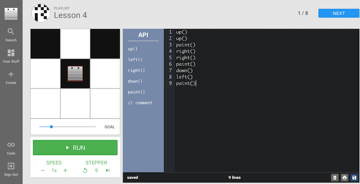
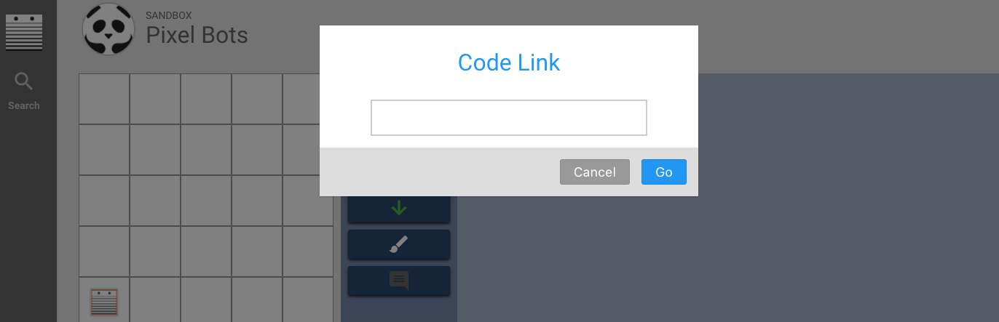

<header title='pixelBots Online' subtitle='Lesson 2'/>

<notable>

<iconp src='/icons/activity.png'>### Overview</iconp>
Students learn the interface of pixelBots.io and write programs in Javascript to complete online pixelBots challenges.

<iconp src='/icons/objectives.png'>### Objectives</iconp>
- Students will be able to write programs using JavaScript.
- Students will continue to develop proficiency in writing and reading code.

<iconp src='/icons/agenda.png'>### Agenda</iconp>
###### Length: 45 mintues

1. **Engage:** Math Eyed Emoji on pixelBots (5 minutes)
1. **Explore:** pixelBots Online (5 minutes)
1. **Explain:** pixelBots Interface (5 minutes)
1. **Elaborate:** Practice Writing Code on pixelBots (30 minutes)

<note>

<iconp src='/icons/materials.png'>### Materials</iconp>
###### Teacher Materials
- [ ] Projector
- [ ] Computer
- [ ] Whiteboard
- [ ] [Math Eyed Emoji on pixelBots][emoji] (pixelBots code: V1OQ3)
- [ ] [Lesson 2 Slideshow][slides]

###### Student Materials
- [ ] Computer
- [ ] Pencil
- [ ] [Lesson 2 | Worksheet 1][worksheet1]
- [ ] [Lesson 2][playlist] (pixelBots code: XLQMO)

<iconp src='/icons/vocab.png'>### Vocabulary</iconp>
- **Program** - A list of statements that a computer can perform.
</note>

<pagebreak/>

#### Engage: Math Eyed Emoji on pixelBots (5 minutes)
- [ ] Run code for [Math Eyed Emoji][emoji] (pixelBots code: V1OQ3) on pixelBots.io (slide 2)
  - Briefly explain pixel emoji art project.
  >> "In a few weeks, you will design an emoji! Then you will write a program to have it painted on pixelBots."

<note> </img></note>

- [ ] **Review** definition of program (slide 3)
  >> “A program is a sequence that a computer is able to understand. Today we are writing programs online to make pixelBots move and paint.”

#### Explore: pixelBots Online (5 minutes)
- [ ] Direct students to pixelBots Lesson 2 playlist. (slide 4)
  1. Type pixelbots.io in the url
  1. Click on 'code' in the lower left.
  1. Type the Lesson 2 playlist code: XLQMO

<note type="tip" title="Tip">
This time is meant for the students to discover the online interface. If students have questions hold off from answering till after you model the first challenge.</note>

- [ ] Students explore pixelBots online for the first time.
  - Give students 2 minutes on the first Challenge.

#### Explain: Introduce pixelBots Online (5 minutes)

- [ ] **Model:** Do first challenge from [Lesson 2 playlist][playlist] (pixelBots code: XLQMO) over the projector. (slide 4)
  - Narrate what you are doing out loud.
  - Highlight how to how to:
    - use a code to go to a pixelBots playlist
    - add code
    - run program
    - reset after run
    - insert code
    - save code
<note type="tip" title="Tip">
Students should close their laptops half way while you model challenge 3.
 </img>
</note>

#### Elaborate: Practice Writing Code on pixelBots (30 minutes)
>>"Let's continue practicing writing programs in pixelBots."

- [ ] Pass out [Lesson 2 | Worksheet 1][worksheet1]
- [ ] Pair students

>>“We will do the following pixelBots challenges. Your partner will check your work and mark that you have finished a challenge and was able to explain your code on your worksheet.”

- [ ] Explain pixelBots pair activity. (slide 5)
  1. Programmer finishes a challenge. If challenge was done correctly, partner checks it on worksheet.
  1. Programmer explains how their code works. If partner is satisfied with the explanation, partner checks the explain box.
  1. Programmer can now continue on to the next challenge.

- [ ] Direct students to pixelBots.io [Lesson 2 playlist][playlist] (slide 6)

<note>
 </img>
</note>

- [ ] Students complete challenges and check partners code.

</notable>
[slides]: https://docs.google.com/presentation/d/1ZN_95v7EPGgwyP3gmzLWsMgdqkhpTYVb_vvnQ-sx5oU/edit?usp=sharing
[emoji]: https://www.pixelbots.io/V1OQ3
[playlist]: http://www.pixelbots.io/XLQMO
[worksheet1]: ../../worksheets/lesson2-worksheet1.pdf
