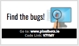
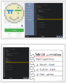
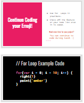

<header title='Coding Pixel Emojis' subtitle='Lesson 6'/>

<notable>

<iconp src='/icons/activity.png'>### Overview</iconp>
Students evaluate progress on project, create a todo list, and continue coding their Pixel Emoji Projects.

<iconp src='/icons/objectives.png'>### Objectives</iconp>
- Students will be able to write a todo list of specific features they need to code.
- Students will be able to code at least two features of their emoji.

<iconp src='/icons/agenda.png'>### Agenda</iconp>
###### Total Length: 60 minutes
1. **Engage:** Vocabulary (13 minutes)
1. **Explore:** Todo List (3 minutes)
1. **Explain:** Todo List (4 minutes)
1. **Elaborate:** Code Features (40 minutes)

<note>

<iconp src='/icons/materials.png'>### Materials</iconp>

###### Teacher materials
- [ ] Projector
- [ ] Computer
- [ ] [Lesson 6: Slideshow][slideshow]

###### Student materials
- [ ] Computer
- [ ] Pencils
- [ ] Coding Journal
- [ ] [Lesson 6 | Debug!][debug] playlist (code: V7YMY)
- [ ] Student pixelBots account with pixel emoji project

<iconp src='/icons/vocab.png'>### Vocabulary</iconp>
- **For-Loop:** Specifies the number of times to repeat a sequence of instructions.

</note>
 
 
#### 1. Engage: Debug & Vocab (13 minutes)
- [ ] **Independent Practice:** Students do [Lesson 6 | Debug!][debug] on pixelbots.io. (code: V7YMY)
  >>“To be great coders, we have to be good at debugging, so let’s take some time now to practice finding and fixing bugs.“

<note>
**Slides:** </note>
<pagebreak/>

- [ ] **Connecting Prior Knowledge:** Connect past vocabulary words with 1st challenge on Debugging playlist. Call students up to the board to circle the part of the program that matches the given vocabulary word in the program. You should hear from every student during this activity.
  <iconp type='question'>“Circle a few function calls in this program.”</iconp>
  <iconp type='question'>“How do we know that is a function call?”</iconp>
  <iconp type='question'>“Circle the arguments.”</iconp>
  <iconp type='question'>“Define argument.”</iconp>
  <iconp type='question'>“Which argument is a string?”</iconp>
  <iconp type='question'>“Circle a comment.”</iconp>
  <iconp type='question'>“Define comment.”</iconp>
  <iconp type='question'>“Circle 2 For Loops.”</iconp>
  <iconp type='question'>“How do we know this is a for loop?”</iconp>

<note type="reminder" title="Reminder">
Click through to see each vocabulary word on slide.

**Slides:**
</note>

#### 2. Explore: Todo List (3 minutes)
- [ ] **Contrasting Cases:** Compare example and nonexample of todo lists.
  <iconp type='question'>Which of these two todo lists is more useful?</iconp>
  <iconp type='answer'>The one on the right.</iconp>
  <iconp type='question'>What makes a todo list useful?</iconp>
  <iconp type='answer'>Each feature is listed on a separate line.</iconp>
  <iconp type='answer'>Each item is specific.</iconp>
  <iconp type='answer'>Each item is a single color.</iconp>
  <iconp type='answer'>There are check boxes so I can check off a feature when I am done.</iconp>
  <iconp type='answer'>Todo list is dated.</iconp>
  <iconp type='answer'>Says the name of the project the todo list is for.</iconp>

<note>
</note>
<pagebreak/>

#### 3. Explain: Todo List (4 minutes)
- [ ] **Model:** Create a todo list for math eyed emoji.
  - Assess progress on project by looking at code.
      >> “So far I have coded the pi and division eye. I still need to code the face, mouth, and outline.”
  - Create todo list (click through to show each feature on slide.)
      >> "I am going to list the features I still need to code. I want to code the mouth and outline today, and if I have time I will code the face.”

<note>
**Slides:**
</note>

- [ ] **Planning:** Students assess progress on their pixel emoji and create a todo list in their coding journal.
  - Remind students that they have today and next week to complete their Pixel Emoji for the showcase.

<note>
</note>

#### 4. Elaborate: Code Features (40 minutes)

- [ ] **Project:** Students code one feature of their pixel emoji at a time. Instructor circulates room to check students progress on final project.
  - Create a list of students who are not halfway done with their project. These students should continue working on project out side of class to ensure they have enough time to finish their project before the showcase.
  - Narrate students who are using todo list and loops.
    >> Suggested Narration:
      * "____ is referencing his/her todo list."
      * "____ checked off a completed feature on his/her todo list."
      * "____ is using loops."

<note>
</note>

</notable>
[debug]: https://www.pixelbots.io/V7YMY
[slideshow]: https://docs.google.com/presentation/d/1_L2ecqIcdIPM8CFSdT9OTsepZAr27Xi-ig4uJ_uo3OU/edit?usp=sharing
