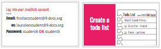

<header title='Showcase Pixel Emojis' subtitle='Lesson 7'/>

<notable>

<iconp src='/icons/activity.png'>### Overview</iconp>
Students finish coding pixel emoji project and share their emoji and program with the class.

<iconp src='/icons/objectives.png'>### Objectives</iconp>
- Students will be able to finish their pixel emoji project.

<iconp src='/icons/agenda.png'>### Agenda</iconp>
###### Total Length: 60 minutes
1. **Elaborate:** Finish Coding Project (40 minutes)
1. **Showcase:** Share Emojis with class (20 minutes)

<note>

<iconp src='/icons/materials.png'>### Materials</iconp>

###### Teacher materials
- [ ] Projector
- [ ] Computer
- [ ] [Lesson 7: Slideshow][slideshow]

###### Student materials
- [ ] Computer
- [ ] Pencils
- [ ] Coding Journal
- [ ] Student pixelBots account with pixel emoji project

</note>
<pagebreak/>
#### 1. Elaborate: Finish Coding Project (40 minutes)
- [ ] **Planning:** Students log in onto pixelBots and assess progress on their pixel emoji and create a todo list in their coding journal. (slide 2-3)
  - Remind students that today is the last day to complete their Pixel Emoji.

<note>
**Slides:**
</note>

- [ ] **Project:** Students code one feature of their pixel emoji at a time and then check it off their todo list. (slide 4)
  - Remind students of for loop code. (slide 5)
<note></note>
#### 2. Showcase: Share Emojis with class (20 minutes)
- [ ] Students open their final emoji project on their computer. (slide 6)
<note></note>
- [ ] Students walk around the classroom and view each other's emojis and program.

</notable>

[slideshow]: https://docs.google.com/presentation/d/1BQj0vnVxf4hdrzebcMh6bXWmz0fNVN9Xgww6nOlL2FE/edit?usp=sharing
