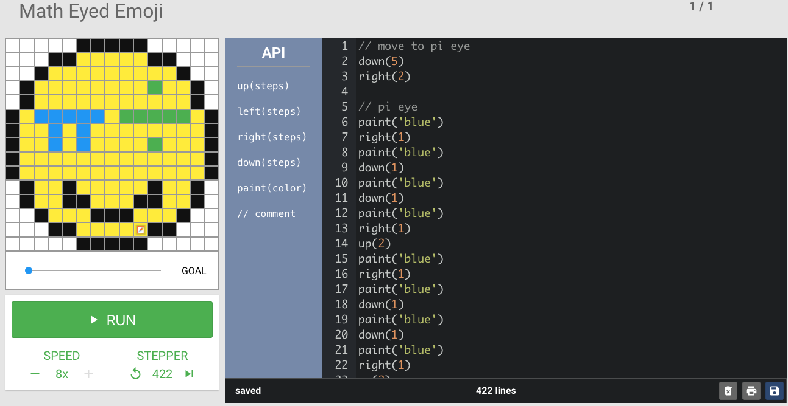

<header title='pixelBots Online' subtitle='Lesson 4' bgColor='#FFA5AB'/>

<notable>

<iconp src='/icons/activity.png'>### Overview</iconp>
Students learn the interface of pixelBots.io and write programs in Javascript to complete online pixelBots challenges.

<iconp src='/icons/objectives.png'>### Objectives</iconp>
- Students will be able to write programs using JavaScript.
- Students will continue to develop proficiency in writing and reading code.

<iconp src='/icons/agenda.png'>### Agenda</iconp>
###### Length: 45 mintues

1. **Engage:** Math Eyed Emoji on pixelBots (5 minutes)
1. **Explain:** Introduce pixelBots Online (10 minutes)
1. **Elaborate:** Practice Writing Code on pixelBots (30 minutes)

<note>

<iconp src='/icons/materials.png'>### Materials</iconp>
###### Teacher Materials
- [ ] Projector
- [ ] Computer
- [ ] Whiteboard
- [ ] [Math Eyed Emoji on pixelBots][emoji] (pixelBots code: V1OQ3)

###### Student Materials
- [ ] Computer
- [ ] Pencil
- [ ] [Lesson 4 | Worksheet 1][worksheet1]
- [ ] [pixelBots Online Playlist][playlist] (pixelBots code: V6G5Q)
- [ ] [Lesson 4 | Exit Ticket Worksheet][wrap-up]

<iconp src='/icons/vocab.png'>### Vocabulary</iconp>
- **Program** - A list of statements that a computer can perform.
</note>

<pagebreak/>

#### Engage: Math Eyed Emoji on pixelBots (5 minutes)
- [ ] Run code for [Math Eyed Emoji][emoji] (pixelBots code: V1OQ3) on pixelBots.io
  - Briefly explain pixel emoji art project.
  >> "In a few weeks, you will design an emoji! Then we will write code to have it painted on pixelBots."

<note> </img></note>

#### Explain: Introduce pixelBots Online (10 minutes)

- [ ] **Review** definition of program
  >> “A program is a sequence that a computer is able to understand. Today we are writing programs to make pixelBots move and paint.”

- [ ] **Model:** Do first challenge from [pixelBots Online Playlist][playlist] (pixelBots code: V6G5Q) over the projector
  - Narrate what you are doing out loud.
  - Highlight how to how to:
    - add code
    - run program
    - reset after run
    - insert code
    - use a code link
    - save code
<note>
 </img>
</note>
<pagebreak/>

#### Elaborate: Practice Writing Code on pixelBots (30 minutes)
>>“We practiced creating code sequences on paper, now we are ready to start writing programs on a computer.”

- [ ] Pass out [Lesson 4 | Worksheet 1][worksheet1]
- [ ] Pair students

>>“We will do the following pixelBots challenges. Your partner will check your work and mark that you have finished a challenge and was able to explain your code on your worksheet.”

- [ ] Explain pixelBots pair activity.
  1. Programmer finishes a challenge, then partner checks. If challenge was done correctly, partner checks it on worksheet.
  1. Programmer explains how their code works. If partner is satisfied with the explanation, partner checks the explain box.
  1. Programmer can now continue on to the next challenge.

- [ ] Direct students to pixelBots.io [Lesson 4 playlist][playlist]
    - Write website on board: http://www.pixelBots.io
    - Click on Code on the left
    - Type pixelBots Code Link: V6G5Q

<note>
 </img>
</note>

- [ ] Students complete challenges and check partners code.

</notable>
[emoji]: https://www.pixelbots.io/V1OQ3
[playlist]: http://www.pixelbots.io/V6G5Q
[worksheet1]: ../worksheets/lesson4-worksheet1.pdf
[wrap-up]: ../worksheets/lesson4-wrapup.pdf
