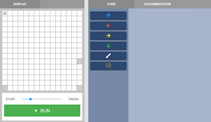
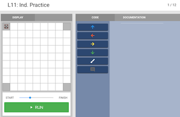

<header title='Coding with Arguments in pixelBots' subtitle='Lesson 11'/>

<notable>

<iconp src='/icons/activity.png'>### Overview</iconp>
Students will use numbers as arguments, so that they can write less code. In pixelbots, the panda can move multiple squares at a time by passing arguments to the directional move commands.

<iconp src='/icons/objectives.png'>### Objectives</iconp>

- Students will be able to use numbers as arguments with directional moves in pixelbots.

<iconp src='/icons/agenda.png'>### Agenda</iconp>

1. Engage: Coding without arguments (5 mins)
2. Explore: Arguments in pixelbots (7 mins)
3. Elaborate: Coding with arguments (23 mins)
4. Evaluate: Exit Ticket (10 mins)

<note>

<iconp src='/icons/materials.png'>### Materials</iconp>

###### Teacher materials
- [ ] Projector
- [ ] Computer
- [ ] [Pixelbots Warm-up link][warm-up] (pixelBots code: VPDOK)

###### Student materials
- [ ] Computer
- [ ] [Lesson 11 | Worksheet][worksheet]
- [ ] [Pixelbots Lesson 11: Ind. Practice link][practice] (pixelBots code: JW6GP)
- [ ] [Pixelbots Lesson 11: Exit Ticket link][exit ticket] (pixelBots code: VYWZW)
- [ ] [Lesson 11 | Exit Ticket][worksheet2]

<iconp src='/icons/vocab.png'>### Vocabulary</iconp>

- **Function Call:** A programming element that tells the computer to do something. In the beginning, most function calls will cause the computer to perform an action.
- **Argument:** Specific value supplied to a function call.

</note>

<pagebreak/>

## Engage: Coding without arguments (5 mins)

- [ ] **Guided practice:** Together as a class, do the first challenge of [Pixelbots Warm-up][warm-up] (pixelBots code: VPDOK) over the projector.

<note></note>

	<iconp type='question'> How many lines of code did we write? </iconp>
	<iconp type='answer'>36 lines.</iconp>

	<iconp type='question'>Can we write the same program with fewer lines?</iconp>
	<iconp type='answer'>Yes! We learned about using arguments in our last class.</iconp>

## Explore: Arguments in pixelbots (7 minutes)

>>“We are going to do the same pixelbots challenge, but with panda instead!”

- [ ] **Independent Exploration:** Students rewrite the program using numbers as arguments on second challenge of [Pixelbots Warm-up][warm-up] (pixelBots code: VPDOK)

	<iconp type='question'> How many lines of code did we write? </iconp>
	<iconp type='answer'>6 lines.</iconp>

	<iconp type='question'>Why was panda easier to code with?</iconp>
	<iconp type='answer'>We can input numbers after the directional arrow to tell panda how many times to repeat the directional move.</iconp>

>> “The function calls of our program are to move down, right, and up, the arguments are the numbers that let our program know how many times to repeat a direction.”

>>“Both programs painted the same picture, but the program that used arguments had less lines of code, making the program easier to read. As coders one goal we should always keep in mind is to write programs that are easy for others to read and understand.”

## Elaborate: Coding with arguments (23 minutes)

- [ ] **Independent Practice:** Students practice using numbers as arguments on [Pixelbots Ind. Practice][practice] (pixelBots code: JW6GP)
	- Pass out [Lesson 11 | Worksheet][worksheet]
	- Students write code link on worksheet and check the box when they have completed each challenge

<note></note>

## Evaluate: Exit Ticket (10 minutes)
- [ ] Students do [Pixelbots Exit Ticket][exit ticket] (pixelBots code: VYWZW) and write their code link on [Lesson 11 | Exit Ticket][worksheet2] (7 mins)
- [ ] **Turn and Talk:** Students share their code and how many lines they wrote for pixelbot challenge. (3 mins)
- [ ] **Extension:** For students who finish early, have them rewrite the program to only use 12 lines of code.
<note></note>

</notable>

[worksheet]: ../../worksheets/lesson11-worksheet.pdf
[worksheet2]: ../../worksheets/lesson11-wrapup.pdf
[warm-up]: http://www.pixelbots.io/VPDOK
[practice]: http://www.pixelbots.io/JW6GP
[exit ticket]: http://www.pixelbots.io/VYWZW
