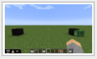
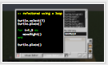
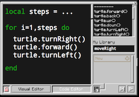
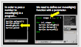
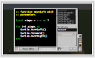
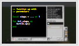
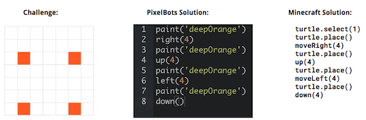

<header title='Functions with Parameters' subtitle='Lesson 3'/>

<notable>

<iconp src='/icons/activity.png'>### Overview</iconp>
Students learn to define functions with parameters to generalize turtle’s actions with arguments. For example, we can define moveRight() with a parameter called ‘steps’ so we can program turtle to move a numbered amount of steps to the right. Turtle will be able to move to the right nine times by passing the number ‘9’ as an argument to the moveRight() function call, for example ‘moveRight(9)’.

<iconp src='/icons/objectives.png'>### Objectives</iconp>
- I can define a function with a single parameter.
- I can pass an argument to a function call.

<iconp src='/icons/agenda.png'>### Agenda</iconp>

#### Length: 60 minutes

1. Engage/Explore: PixelBots Code (10 min)
1. Explore: Minecraft Code (10 min)
1. Explain: Parameters & Arguments (7 min)
1. Elaborate: Defining Parameters (23 min)
1. Evaluate: Exit Challenge (10 min)

<note>

<iconp src='/icons/materials.png'>### Materials</iconp>

#### Teacher Materials
- Computer
- MinecraftEdu
- Projector
- [Lesson 3 Slides][slides]

#### Student Materials
- Computer
- Pencils
- Coding Journals
- MinecraftEdu
- [Minecraft | L3 pixelBots playlist (code: VPQ6W)][pixelBots]
- [Single Parameter Function Handout][handout]

<iconp src='/icons/vocab.png'>### Vocabulary</iconp>
- **Parameter** - An extra piece of information that is passed to a function to customize it for a specific need.
- **Argument** - A specific value passed to a function call.

</note>
<pagebreak/>
#### 1. Engage/Explore: PixelBots Code (10 min)

- [ ] **Do Now:** Students code and complete challenges 1-3 of [Minecraft | L3 PixelBots Playlist (code: VPQ6W)][pixelBots].
  >> “Code the bot to complete the challenges, the first one is done for you. You will notice all three challenges paint the same pixel, in the upper right corner. I want you to focus on refactoring the program to use the least amount of lines as possible.”

<note>
**Slides:**

</note>

- [ ] **Contrasting Cases:** Students compare code of three pixelBots challenges.
  >> “All three programs paint the picture, but the codes looks different, let’s take a closer look at each program.”

<iconp type="question">How many lines are used to code challenge 1?</iconp>
<iconp type="answer">31 lines of code</iconp>
<iconp type="question">Who coded challenge 2 in the least amount of lines? How?</iconp>
<iconp type="answer">5 lines, using 2 for loops</iconp>
<iconp type="question">Challenge 3 asks you to complete the challenge in 3 lines, so how did you code the bot?</iconp>
<iconp type="answer">up(15), right(15), paint(‘black’)</iconp>
<iconp type="question">How did you know to put a number between the parenthesis?</iconp>
<iconp type="answer">API</iconp>
<iconp type="question">What is the difference in API from Challenge 2 vs Challenge 3?</iconp>
<iconp type="answer">The directional moves have the word ‘steps’ between the parenthesis</iconp>
<iconp type="question">What does ‘steps’ mean? When you called the function up in your program, why didn’t you type the word ‘steps’? How did you know to use a number instead?</iconp>
<iconp type="answer">Student answers will vary. Encourage students to explain their thoughts and answers about how ‘steps’ works.</iconp>

  >> “We have a name for this, we call them parameters. When we call the function up() in our program, we don’t type the word ‘steps’ in the parenthesis, we type in the number 15 because we want our bot to move up 15 steps. When we pass a number to a function call, we call it an argument.”

<note type="reminder">
This is a student driven discussion. Teachers ask questions and students come to the answers.
<iconp type="question">Teacher asks question</iconp>
<iconp type="answer">Students answer</iconp>
 
**Slides:**

</note>

#### 2. Explore: Minecraft Code (10 min)

- [ ] **Explore:** Students look at a long sequence of code, predict what the code will do, and come up with a strategy to refactor the code. The long sequence of code is turtle placing a block and moving nine spaces to the right and then placing another block. They should point to the idea of parameters from the previous activity.
  >> “Now that we have an idea about parameters, let’s take a look at code and how we might want to refactor it.”

<iconp type="question">Predict what will happen when we run this code.</iconp>
<iconp type="answer">The turtle places a block that is in inventory slot 1 and places another block from inventory slot 1 nine spaces to the right.</iconp>
<iconp type="question">This program is 12 lines, can we rewrite this program to use less lines? How?</iconp>
<iconp type="answer">We can moveRight 9 times using a for loop.</iconp>
<iconp type="question">Our program is now 6 lines when we use a loop. Can we rewrite our program to use even less lines?
</iconp>
<iconp type="answer">Get students to come up with the idea of passing an argument to moveRight(). We can try passing 9 as an argument to to moveRight().</iconp>
<iconp type="answer">Now our program is 4 lines. But, if we try to run our program we have a bug, before we can pass an argument to moveRight(), we need to change how we defined the function moveRight using a parameter.</iconp>

<note> **Slides:**

</note>

<pagebreak/>
#### 3. Explain: Parameters & Arguments (7 minutes)

- [ ] **Summarize** parameters and arguments. Have students come up to point to their answers on the board.
  >> “When defining a function, you can specify additional information to customize what the function does, we call this a parameter. A parameter stores and uses information that is passed to a function. Let’s take a look back at our pixelBots code and point out the parameters. Remember not to confuse parameters and arguments. When we give a specific value to a function call, we call this an argument.”

<iconp type="question">What are the parameters here?</iconp>
<iconp type="answer">‘steps’ and ‘color’</iconp>
<iconp type="question">What are the arguments?</iconp>
<iconp type="answer">15 and paint</iconp>
<iconp type="question">What are the functions here?</iconp>
<iconp type="answer">up(), left(), right(), down(), paint()</iconp>

<note>**Slides:**

</note>

- [ ] **Model:** Show how to redefine function moveRight() with a parameter called steps.  
  >> “Now that we know about parameters, we can define a function with a parameter in Minecraft.”

**Steps:**
  1. Open function moveRight()
  2. Define a local variable, and name it ‘steps’ and set it equal to ‘... or 1’
  3. Write a for loop starting at 1 and ending at steps.

  >> “When we call moveRight() in a program, we need to pass a number to move right that many steps. For example, if we write moveRight(9), our turtle will move to the right 9 steps.”

<note type="tip">Model steps while student laptops are closed half way. [Reference code of Single Parameter Functions][handout] should be passed out for students to access.
 
**Slides:**

</note>
 
- [ ] **Call & Response:** Review parts of a function: function name, function body, parameter, function call, argument. Point to the parts of the function on the slide and ask students to respond as a whole class.
  >> “moveRight is our function, this code here is the body and ‘steps’ is a parameter. In a program if we use moveRight(9), we are calling the function moveRight() and passing the argument ‘9’.

#### 4. Elaborate: Writing Functions with Parameters (23 minutes)

- [ ] **Code Along:** Students follow along on their own computer as you walk through each step of redefining function moveLeft() with a parameter.
  >> “Let’s add a parameter to our moveLeft function step by step, together as a class.”

**Steps:**
  1. Open function moveLeft()
  2. Define a local variable, and name it ‘steps’ and set it equal to ‘... or 1’
  3. Write a for loop starting at 1 and ending at steps.

<note>
**Slides:**

</note>

<pagebreak/>
- [ ] **Independent Practice 1:** Students define movement functions with parameters, ex: up(steps) & down(steps).
  >> “Continue writing functions with parameters for turtle’s movement actions. By the end of today you should have moveRight(steps), moveLeft(steps), up(steps), and down(steps)

<note>**Slides:**

</note>

- [ ] **Independent Practice 2:** Students call functions moveRight(steps), moveLeft(steps), up(steps), and down(steps) and pass in arguments to program turtle to complete build challenges on [Minecraft | L3 playlist][pixelBots].
  >> “Now that we have defined functions with parameters, we can use them in our programs. Our programs will now use less lines of code and will be easier to read.”

#### 5. Evaluate: Exit Challenge (10 minutes)

- [ ] **Exit Challenge:** Students write a program to code turtle to build Exit Challenge on pixelBots [Minecraft | L3 playlist][pixelBots] (last challenge on playlist). Students first code the solution on pixelBots, then use their code as a plan to code their turtle in Minecraft.
  >> “Okay coders, I have a challenge for you. *pause for students’ response*   Use what we learned today to program turtle to build this *show challenge on pixelBots*. Your turtle has to place 4 blocks in a square shape, each 4 spaces apart.”

<note></note>

- [ ] **Evaluate:** Circulate & check code to determine student’s understanding of parameters.

</notable>
[slides]: https://docs.google.com/presentation/d/105i3w9VEYiUUSe7xk3uu7ZZRo2117RnMXB44ZHInZtM/edit?usp=sharing
[pixelBots]: http://www.pixelbots.io/VPQ6W
[handout]: https://docs.google.com/document/d/1AC2UMEg8cfCHEh25iK1-dyu7AQXLb3VblnDh5hM3PpA/edit?usp=sharing
