<header title='Build Challenges & Prototype' subtitle='Lesson 4'/>

<notable>

<iconp src='/icons/activity.png'>### Overview</iconp>
Through build challenges, students will review for loops, functions, and parameters. Students will also begin their Minecraft Flower/Sculpture Garden Project by prototyping their design on PixelBots.

<iconp src='/icons/objectives.png'>### Objectives</iconp>
- I can prototype a design that I can code my turtle to build.

<iconp src='/icons/agenda.png'>### Agenda</iconp>

#### Length: 60 minutes

1. Review: For Loops (optional) (10 minutes)
1. Engage: Make a Plan (5 minutes)
1. Elaborate: Turtle Build Challenges (30-40 minutes)
1. Elaborate: Prototype Flower/Sculpture (15 minutes)
1. Evaluate (0 minutes)

<note>

<iconp src='/icons/materials.png'>### Materials</iconp>

#### Teacher Materials
- Computer
- MinecraftEdu
- Projector
- [Lesson 4 Slides][slides]

#### Student Materials
- Computer
- Pencils
- Coding Journals
- MinecraftEdu
- [Minecraft | L4 pixelBots playlist (code: X2B5Y)][pixelBots]

<iconp src='/icons/vocab.png'>### Vocabulary</iconp>
- **For-Loop** - Specifies the number of times to repeat a sequence of instructions.
- **Function** -  A reusable chunk of code that performs a task.
- **Parameter** - An extra piece of information that is passed to a function to customize it for a specific need.

</note>
<pagebreak/>

#### 1. Review: For Loops (optional) (10 minutes)
- [ ] **Discuss:** Introduce the build challenge: Build a 20 block high pillar in Minecraft. Then discuss a plan of how to code turtle.
  <iconp type="question">How would we code turtle to build this 20 block high column? *show slide* </iconp>
  <iconp type="answer">turtle.place(), turtle.up(), turtle.place(), turtle.up(), turtle.place(), turtle.up(), …</iconp>
  <iconp type="question">How can we code turtle to build this column using the least amount of lines of code?</iconp>
  <iconp type="answer">Use a for loop!</iconp>
  <iconp type="question">Yes, to use a for loop, we ask ourselves, What code is being repeated?</iconp>
  <iconp type="answer">turtle.place() and turtle.up()</iconp>
  <iconp type="question">The next piece of information we need to write a for loop is, how many times does it repeat?</iconp>
  <iconp type="answer">Repeats 20 times</iconp>
  >> “Now that we have a plan to code turtle with a for loop, let’s log into Minecraft and write the program.”

<note> **Slides:**
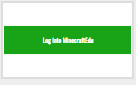
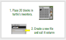

</note>
- [ ] **Code Along:** Students follow along on their own computer as you walk through each step of using a for loop to build a 20 block high pillar in Minecraft. First set up students to be logged into Minecraft with 20 blocks of any colored wool. Then as a class code turtle using a for loop.
    - **Steps:**
      1. Place 20 blocks of wool into turtle’s inventory slot 1.
      2. Create a new file and title it “ ___ “
      3. Write the first part of the for loop “for i=1, 20 do”
         “We want to repeat our code 20 times, so we type i=1,20  if we wanted our code to repeat 5 times what would we type instead?”
      4. Next type the lines of code you want to repeat. We want to repeat ‘turtle.place()’ and ‘turtle.up()’
      5. To end our Loop we type ‘end’
  >> **Completed Code:**
  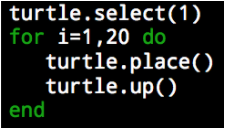

<note>

</note>

#### 2. Engage: Make a Plan (5 minutes)
- [ ] **Engage:** As a class, students brainstorm a plan to code turtle to build three 2x2 squares in a diagonal.
  >> “In just a few weeks, you learned about loops, functions and parameters. Using these coding concepts, what would be our plan to code turtle to build this *show slide of challenge*”

  - **Questions to Help Students Thinking:**
    <iconp type="question">Can we use a function? How?  What would our function be named?</iconp>
    <iconp type="question">Can we use a loop? What is being repeated? How many times?</iconp>
    <iconp type="question">Do we need to use a parameter?</iconp>
    <iconp type="answer">Students should come to the idea of defining a square function and using a for loop to repeat painting a square three times.</iconp>
  >> “When we look at a design or challenge, it’s good to make a plan of how you will go about coding it. Using our plan for these three squares in a diagonal, code it on PixelBots and then code turtle to build it in Minecraft.”

<note>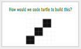</note>		
<pagebreak/>
#### 3. Elaborate: Turtle Build Challenges (30-40 minutes)
- [ ] **Students Login:** Set up the students by walking them through logging into Minecraft & pixelBots.
  - Teacher Note: Today will be the first day to logging into pixelBots accounts, which is necessary to save students’ prototype design later in the lesson.
<note> **Slides:**
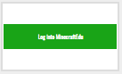

</note>

- [ ] **Code Along (Optional):** Code the challenge from above, diagonal squares, together as a class. Code the challenge on PixelBots and then code turtle to build it in Minecraft. First set up the students by logging into Minecraft & pixelBots.
Teacher Note: Today will be the first day to logging into pixelBots accounts, which is necessary to save students’ prototype design later in the lesson.
  - **Steps:**
    - PixelBots
      1. Code a square function on PixelBots. Notice we have code starting on line 15 for our function, we just need to write the body of the function.
      1. We can call function square() to paint a square.
      1. Now we need to move to where we want to paint the next square. We can go up then right.
      1. Then we call function square again, and we move up then right.
      1. And we can call function square a third time.
      1. We can refactor our code to use a for loop since we paint a square, move up, move right and repeat that 3 times.
    - Minecraft
      1. Create a program for turtle called square on Minecraft and code how to build a square, similar to the code in PixelBots.
      1. Create a new program for turtle called diagonal square and code how to build 3 squares in a diagonal using a for loop.
  >> **Completed Code:**
  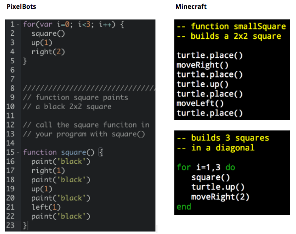

<note>

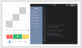

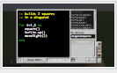</note>

- [ ] **Independent Practice:** Students complete challenges on Minecraft | L4 playlist.
  >> “We will continue to practice using for loops, functions, and parameters by coding and completing Turtle Build Challenges. Use PixelBots as a planning tool, to help you organize how you code turtle in Minecraft.”

<note>
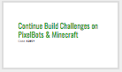</note>

- [ ] **Share out:** After 15 minutes of Build Challenges, pause students to discuss challenges/bugs. How does the student need help or how has the student fixed their bugs. Students who need help can cast their screen over the projector and explain their bug. Then other classmates can offer advice.
  >> “Let’s take a pause from the computers and talk about the challenges you might be facing in your code. You can present your code and bug to your classmates over the projector and as a class we can debug code together.  OR you can offer up a short story about a bug you faced today and how you fixed it.”

<note>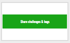</note>

- [ ] **Teacher Circulate:** While students work independently, circulate and check in with each student. Review what challenge they are working on and ask them to explain their thought process of completing the challenge. Take note of students who will need 1 on 1 help to strengthen understanding on concepts: for loops, functions, and parameters.
  >> Suggested Narration while circulating room:
    - “I see ___ writing a function in Minecraft.”
    - “I see ___ referencing (loops, functions with parameters, variables) on the reference code handouts.”
    - “I see ___ refactoring their code to use less lines.”

#### 4. Elaborate: Prototype Flower/Sculpture (15 minutes)
- [ ] **Prototype:** Students prototype their flower/sculpture in the Prototype for Minecraft Challenge in [Minecraft | L4 playlist][pixelBots].
  >> “Today you will prototype your flower/sculpture for your project! Design your flower/sculpture to have more than two color and remember to prototype a design that you are able to code.”

<note>**Example Prototypes:**
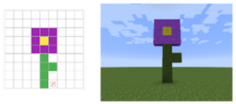
</note>

#### 5. Evaluate (0 minutes)
- [ ] **Evaluate:** Circulate and check students completed prototypes.
  - Design is buildable in Minecraft, i.e. doesn’t fill every square in pixelBots prototype grid.
  - Design incorporates more than 2 colors.

<note>
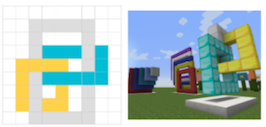
</note>

</notable>
[slides]: https://docs.google.com/presentation/d/1xFnW9aJUsH6GhEDjBXjAkxucT2zD3l9Okb-t9PWN6wU/edit?usp=sharing
[pixelBots]: http://www.pixelbots.io/X2B5Y
