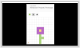
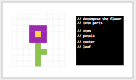
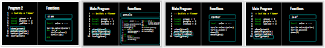
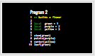
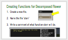
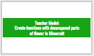
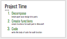

<header title='Project Time' subtitle='Lesson 5'/>

<notable>

<iconp src='/icons/activity.png'>### Overview</iconp>
Students will prototype their flower/sculpture design on a PixelBots challenge and decompose their design into key parts that will be coded as functions in Minecraft.

<iconp src='/icons/objectives.png'>### Objectives</iconp>
- I can prototype a design that I can code in Minecraft.
- I can decompose a design into key parts that I can code as functions.

<iconp src='/icons/agenda.png'>### Agenda</iconp>

#### Length: 60 minutes

1. Engage: Prototype (5-10 mins)
1. Explore: Decomposition (7 mins)
1. Explain: Creating Functions for Projects (10 mins)
1. Elaborate/Evaluate: Project Time (33-37 mins)
1. Extension: Multiple Parameters [Optional]

<note>

<iconp src='/icons/materials.png'>### Materials</iconp>

#### Teacher Materials
- Computer
- MinecraftEdu
- Projector
- [Lesson 5 Slides][slides]

#### Student Materials
- Computer
- Pencils
- Coding Journals
- MinecraftEdu
- [Minecraft Project | Prototype (code: V88Z9)][PixelBots]
- [Reference Code - Multiple Parameters Handout][handout]

<iconp src='/icons/vocab.png'>### Vocabulary</iconp>
- **For-Loop** - Specifies the number of times to repeat a sequence of instructions.
- **Function** -  A reusable chunk of code that performs a task.
- **Parameter** - An extra piece of information that is passed to a function to customize it for a specific need.

</note>

<pagebreak/>

#### Engage: Prototype (5-10 mins)
- [ ] **Prototype:** Students log into PixelBots and prototype their flower/sculpture in a PixelBots challenge called [Minecraft Project | Prototype (code: V88Z9)][PixelBots].
  >> “Today you will begin your Minecraft Flower/Sculpture Garden Project. You will start by prototyping a design of your flower/sculpture on PixelBots. By the end of this lesson, you will have decomposed your design into key parts. And the key parts will be the basis of your functions for your project.”

<note> **Slides:**

</note>

#### Explore: Decomposition (7 mins)
- [ ] **Explore:** Show prototype of a flower and ask students to decompose the image into key parts using comments.
  >>“Before we code our designs, we are going to decompose or break apart our design into key parts. Let’s decompose a design together as a class using comments.”

  <iconp type="question">What are the key parts of this prototype?</iconp>
  <iconp type="answer">stem, petals, center, leaf</iconp>

<note>

</note>
 
- [ ] **Contrasting Cases:** As a whole class, students explore the importance of decomposition by comparing Program 1, which doesn’t use functions, and Program 2, which uses decomposition as a basis for functions.
  >>“Some of you might wonder, ‘why is decomposition important?’  To answer that question, we are going to compare two programs that both build the flower we just decomposed.” *(show slides of program 1 & 2)*

  <iconp type="question">Which program is easier to read and understand? Why? </iconp>
  <iconp type="answer">Program 2. The program has a comment that explains that it will build a flower. The program also uses less lines.</iconp>
  <iconp type="question">What is stem(), petals(), center(), and leaf()? What do we call these?</iconp>
  <iconp type="answer">Function calls</iconp>
  <iconp type="question">Are these function calls built into Minecraft Turtle? Can I find it in the API? </iconp>
  <iconp type="answer">No, they are functions defined by the programmer. </iconp>

  >>“Let’s take a closer look at each function defined by the programmer of this code” *(click through the functions: stem, petals, center, leaf).* We have our main program here on the left, and when we call the stem function, we are executing all the code that is defined here in function stem on the right. In Minecraft this would be two different files.”
  

  <iconp type="question">What is the main difference between Program 1 and 2?</iconp>
  <iconp type="answer">Get students to point out that Program 2 uses functions for each part of the flower.</iconp>
  <iconp type="question">Why is decomposition important?</iconp>
  <iconp type="answer">Decomposing a design can be a tool to help a coder plan functions for their program.</iconp>

  >>“The author of Program 2 uses functions for each decomposed part of the flower which made the program clear and readable.“

<note>

</note>

#### Explain: Creating Functions for Projects (10 mins)
- [ ] **Model** decomposition and creating functions in Minecraft with the decomposed parts of the flower.
  >> “This flower can be decomposed into a stem, petals, center, and leaf. We are going to create a function for each one in Minecraft.”

  - Steps:
    1. Create a new file.
    1. Name the file ‘stem’ "This will be our stem function."
    1. Write a comment of what function stem will do. ‘-- function stem will build a stem of a flower’
    1. Repeat steps 1-3 for each part of the flower.
    >> “After you have functions for each part of your design, you can write the body of code for each function. For example, my stem function will build a horizontal line, so the code would be turtle.place(), turtle.up(), ... and I can repeat this four times with a for loop.”

<note> **Slides:**

</note>

#### Elaborate/Evaluate: Project Time (33-37 mins)
- [ ] **Independent Practice:** Students decompose their design on PixelBots through comments and create function files with comments in Minecraft. After a student has all file functions, they can begin to code each function.
  >> “Now it’s your turn, decompose your prototype using comments on PixelBots and then create functions for each part in Minecraft. Remember to write a comment to describe what each function will do. When you have finished creating all your functions, you can start writing the code for each function.”

<note>
**Slides:**

</note>

- [ ] **Evaluate/Circulate:** While students work independently, circulate and check in with each student. Review their prototype and how it is decomposed. Have students explain their thought process to you.
  - **Project Benchmarks** | Check for:
    1. Finished Prototype
    1. Comments on PixelBots of decomposed parts of prototype
    1. Function Files on Minecraft for each decomposed part

<note type="tip">
When students ask for help, point them towards
  - Foam Turtles, omnifix cubes, & grid
  - Reference code:
    - **tinyurl.com/minecraftZine**
    - [For Loops][loops]
    - [Single Parameter - Number][singlenum]
    - [Single Parameter - Color][singlecolor]
    - [Variables][variables]
    - [Multiple Parameters][multiple]
</note>

<pagebreak/>
#### Extension: Multiple Parameters [Optional]
##### Do during Project Time.
- [ ] **Contrasting Cases:** Compare two functions, one with a single parameter and another with multiple parameters. Use handouts of Single Parameter Functions and Multiple Parameter Functions.
  <iconp type="question">What is the difference between defining functions with single parameters and multiple parameters?</iconp>
  <iconp type="answer">The syntax is different, there are curly braces before and after ‘...’</iconp>
  <iconp type="answer">args[1] and args[2] are stored into other variables</iconp>
 

<note>
**Slides:**

</note>

- [ ] **Code Along:** Walk students through defining a function with multiple parameters. Use the example on the [Reference Code - Multiple Parameters handout][handout]. Students should be able to use multiple parameters in Minecraft  for their own functions by referencing the Reference Code - Multiple Parameters handout.
<note type="tip">Do not spend too much time on explaining syntax for multiple parameters.</note>

</notable>
[slides]: https://docs.google.com/presentation/d/1KN9GR-iNUWKMnHVzkMzJcDGBu1izABOdDEgDizM7eG8/edit#slide=id.g1dfe81cc42_1_240
[PixelBots]: http://www.PixelBots.io/V88Z9
[handout]: https://docs.google.com/document/d/1fTBDgcuRQMarpqk-Lw9d7Y5zs8ZfaPsMzvaQNVd7ugs/edit
[loops]:https://docs.google.com/document/d/1H0u2a3ElQOQNkKnviNZS3A9frbhwaR2hVBqugqLdGhw/edit?usp=sharing
[singlecolor]: https://docs.google.com/document/d/1G-TSQnmgoisxm7CUOp9UBd7QmNg3Np97hvacYSV996o/edit?usp=sharing
[singlenum]: https://docs.google.com/document/d/1AC2UMEg8cfCHEh25iK1-dyu7AQXLb3VblnDh5hM3PpA/edit?usp=sharing
[variables]:https://docs.google.com/document/d/1JLGnCJCB__6MQWoYr7naYARMUZBZDTCANwcwCUm_0Aw/edit?usp=sharing
[multiple]: https://docs.google.com/document/d/1fTBDgcuRQMarpqk-Lw9d7Y5zs8ZfaPsMzvaQNVd7ugs/edit?usp=sharing
