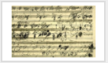
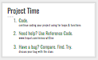
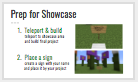

<header title='Showcase' subtitle='Lesson 7'/>

<notable>

<iconp src='/icons/activity.png'>### Overview</iconp>
Students finish their flower/sculpture garden and prepare to share their final projects as well as their creation process with peers and parents. Please note that you need to set up the teleporters prior to running this lesson. The Showcase will take place after this 45 minute lesson.

<iconp src='/icons/objectives.png'>### Objectives</iconp>
- I can code turtle to build my design using for loops and functions.
- I can create a showcase of my final design as well as my creation process.

<iconp src='/icons/agenda.png'>### Agenda</iconp>

#### Length: 45 minutes
Prep: Build Teleporters Before Lesson
1. Engage: Showcase Area (5 mins)
2. Elaborate: Project Time (20 mins)
3. Elaborate: Prep for Showcase (20 mins)
4. Student Showcase

<note>

<iconp src='/icons/materials.png'>### Materials</iconp>

#### Teacher Materials
- Computer
- MinecraftEdu
- Projector
- [Lesson 7 Slides][slides]
- [How to Make a Teleporter][howto]

#### Student Materials
- Computer
- Coding Journals
- MinecraftEdu
- PixelBots Account
- [Minecraft Project | Prototype (code: V88Z9)][PixelBots]
- [Minecraft Zine][minecraftzine]

<iconp src='/icons/vocab.png'>### Vocabulary</iconp>
- **For-Loop** - Specifies the number of times to repeat a sequence of instructions.
- **Function** -  A reusable chunk of code that performs a task.
- **Parameter** - An extra piece of information that is passed to a function to customize it for a specific need.

</note>
<pagebreak/>
#### 0. Build Teleporters Before Lesson
- [ ] **Prep for Lesson:** Before the lesson, build teleporters to and from Showcase Area and Graveyard. Teleporters will allow players to travel to and from these locations quickly. A teleporter in the Showcase Area will teleport players to a specified location in the Graveyard and vice versa. You can see a layout of the areas, teleporters, and locations players will be teleported to in the [How to Make a Teleporter slides][howto].
  - **Steps:** (see slides)
    1. Gather materials: white wool, signs, and pressure plates.
    1. Give yourself command blocks.
    1. Find the coordinates of where you want players to teleport to:
      1. Showcase Area Location (x,y,z)
      1. Graveyard Area Location (x,y,z)
    1. Locate place for teleporters, dig a hole, then place command block.
      1. Place the ‘go to Showcase Area’ teleporter somewhere near the Graveyard area
      1. Place the ‘go to Graveyard’ teleporter somewhere near the Showcase Area
    1. Set the console command of the command block. Type '**/tp @p x y z**'
      - **Note:** the coordinate values are separated by spaces.
    1. Cover hole with wool and place pressure plate on top. Then place a sign telling players where they will be teleported to. Ex: ‘Teleport to Graveyard’ or ‘Go to Showcase Area’

<pagebreak/>
#### 1. Engage: Showcase Area & Graveyard (5 minutes)
- [ ] **Motivate:** Get the students excited about sharing their project. Explain the two areas parents will get to explore: Showcase Area and the Graveyard. The Showcase Area is where all the students’ final projects will be built and on display. The Graveyard is the space where they did practice builds and ran and debug their code. Students and parents will use pressure plates to teleport back and forth from the two spaces.
  >>“Today you will share your Minecraft project with your parents and peers. You will all teleport and build your final flower/sculpture in our class Showcase Area. In our Showcase Area your parents will see your project. Then parents can teleport to the ‘Graveyard’  and see the space where you did all your practice builds.”

<note>
**Slides:**

</note>

- [ ] **Connect** previous Beethoven debugging story to student’s final design projects and their process. When Beethoven wrote Cello Sonata No. 3 in A major, he didn’t erase his mistakes, instead he would scribble them out and continue writing. Students will be able to show their parents their final project as well as all the builds/mistakes they did in order to help them lead up to their final project.
  >>“Last devY session we talked about Beethoven and how he composed/wrote his music. Here is Beethoven’s Cello Sonata No. 3 in A major, Op. 69. *play a short clip for students to listen to* and here is Beethoven’s sheet music of that same sonata you just heard.”

  <iconp type="question">What do you observe from hearing the final Sonata and seeing Beethoven’s sheet music?</iconp>
  <iconp type="question">How is similar to how we are showcasing our projects?</iconp>
  <iconp type="answer">Students should connect how a final project takes multiple iterations. Our practice and our mistakes helps to shape what our final product will be.</iconp>

<note>
**Slides:**

</note>

<pagebreak/>
#### 2. Elaborate: Project Time (20 mins)
- [ ] **Project Time:** Students finish coding their final projects.
  >>“You will have a short chunk of time to finish up your project before you all teleport to the Showcase Area to build your finished project.”

<note>

</note>

#### 3. Elaborate: Prep for Showcase (20 minutes)
- [ ] **Prepare for Showcase:** Students teleport to showcase area and build their final project and place a sign with their name next to their project.
	>>“Let’s all teleport to the Showcase Area. Find a space and build your project. Remember to add a sign next to your project with your name.”

<note type="tip">
Once all the students have teleported, they will need to be given a turtle, sign, and wool.
**Slides:**

</note>

- [ ] **Pep Talk before Parents Arrive:** Give students an encouraging word before they share their projects with their parents and peers.
	>>“In just a few minutes you’ll be sharing your projects. You should be very proud of your final designs, but remember to also share about your debugging process, the bugs you encountered, and how you fixed those bugs to help create your project.”

#### 4. Student Showcase
- [ ] Students share their project with parents and peers.
- [ ] Students teach parents how to move & build with turtle in Minecraft.

</notable>
[howto]:https://docs.google.com/presentation/d/1AfBfHMgYDuZOV-cDpQXPiNQmfMKKsXEteqzYS7fdZLw/edit?usp=sharing
[slides]: https://docs.google.com/presentation/d/1KEsBWSaNyYQR1ilXINmlz5gOC2_j-nU93wSCOC9BxYg/edit?usp=sharing
[PixelBots]:https://www.pixelbots.io/V88Z9
[minecraftzine]:https://www.tinyurl.com/minecraftzine
